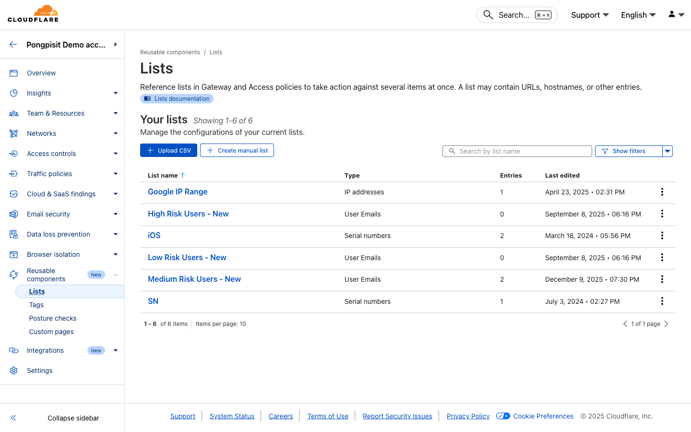
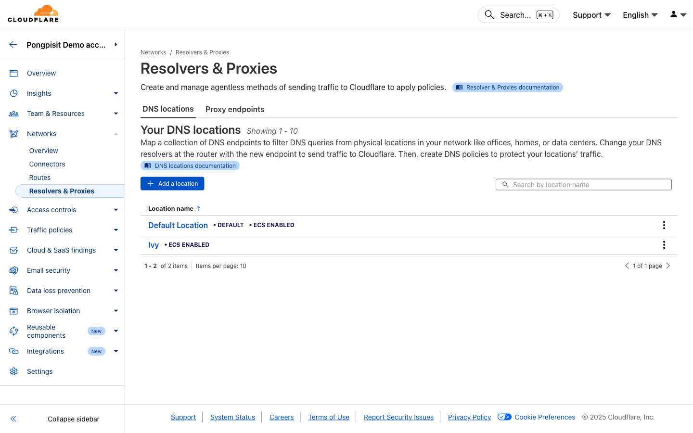
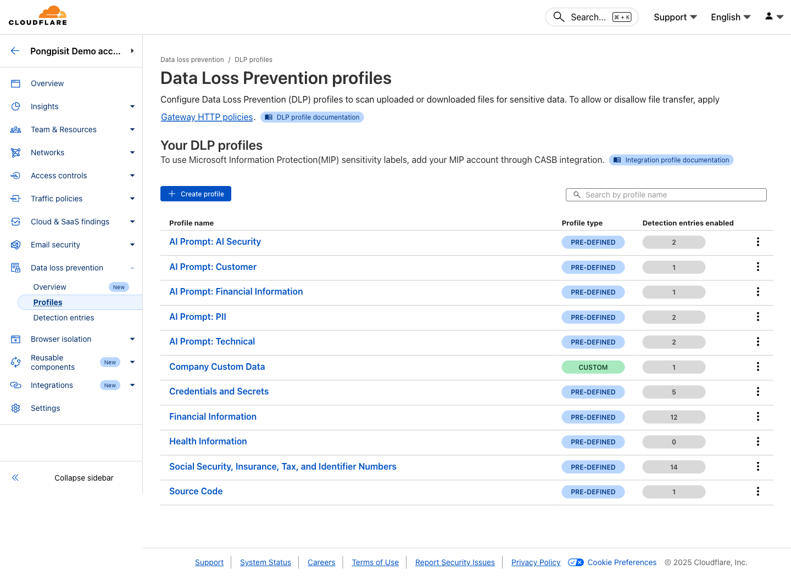
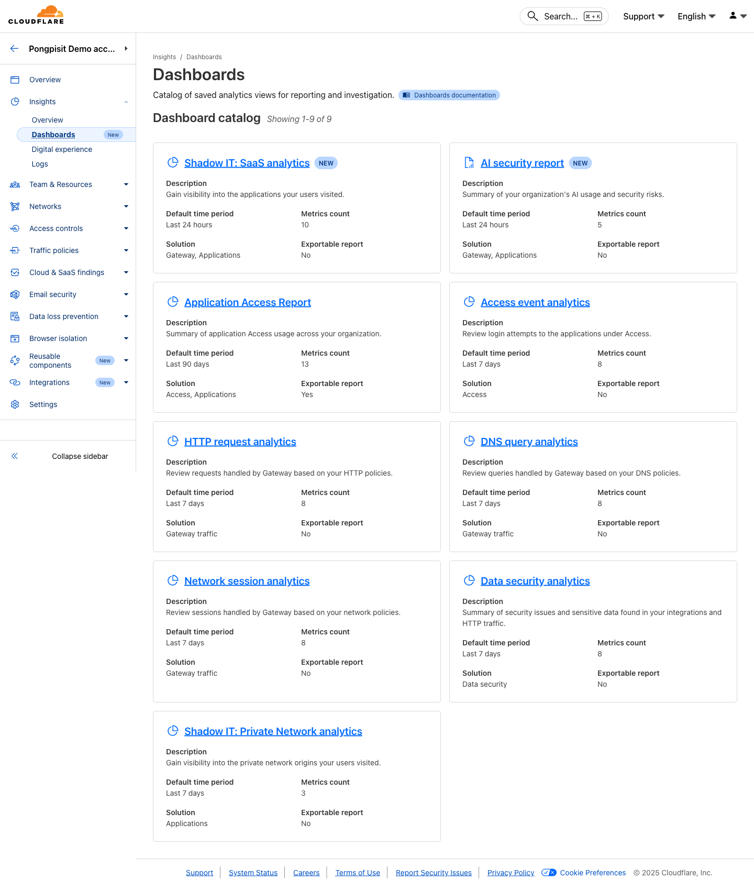
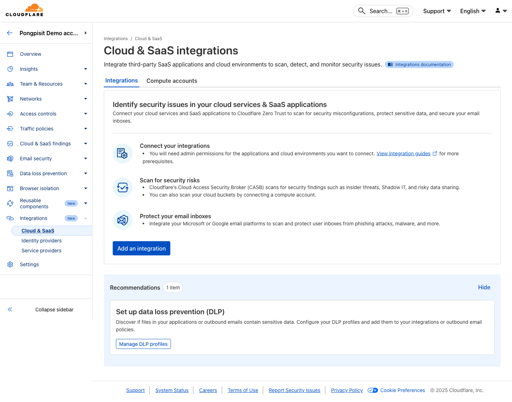
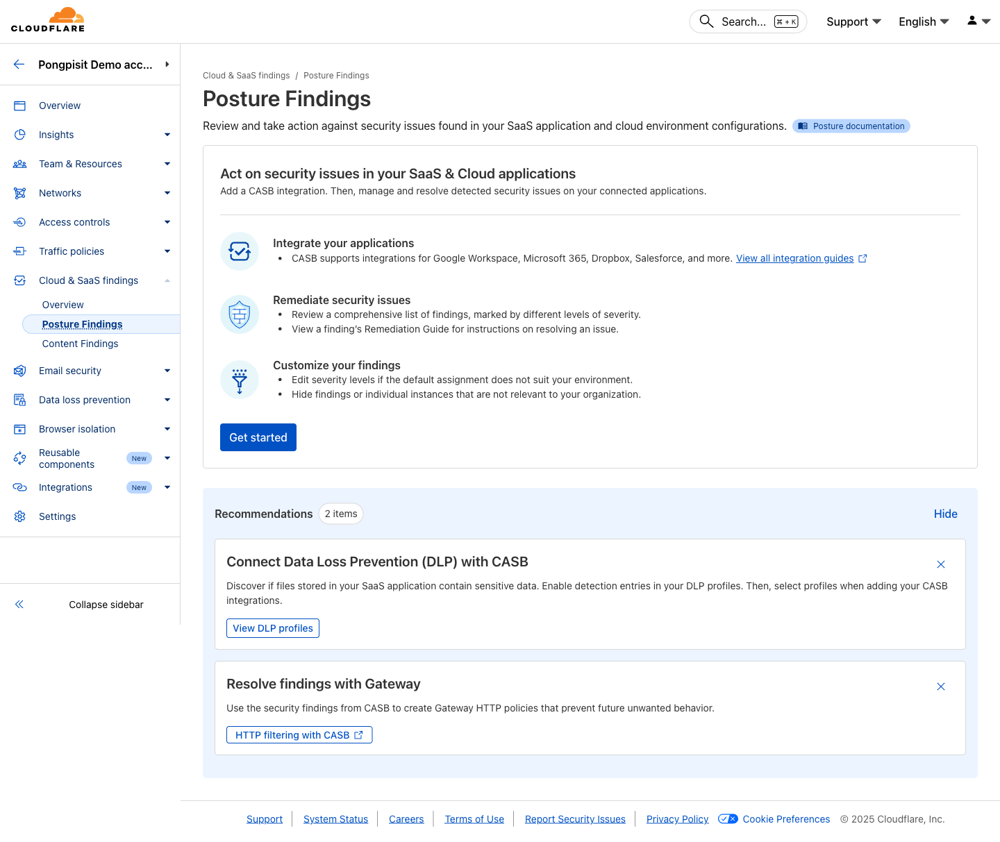

# Cloudflare Zero Trust Workshop (Modules 00-11)

This file is auto-generated from individual modules.


---

# Quick Start: Get Protected in 30 Minutes

**For those who want immediate protection before diving into detailed modules.**

This guide gets you basic Zero Trust protection as fast as possible.

---

## Checklist Overview

| Step | Time | Protection |
|------|------|------------|
| 1. Create Zero Trust org | 5 min | Account ready |
| 2. Install WARP client | 5 min | Device connected |
| 3. Block security threats (DNS) | 5 min | Malware/phishing blocked |
| 4. Block security threats (HTTP) | 5 min | Web threats blocked |
| 5. Enable AV scanning | 5 min | File protection |
| 6. Review logs | 5 min | Visibility |

**Total: 30 minutes to basic protection**

---

## Step 1: Create Zero Trust Organization (5 min)

### 1.1 Sign Up

1. Go to https://dash.cloudflare.com/sign-up
2. Create account with email and password
3. Verify your email

### 1.2 Set Up Zero Trust

1. Go to https://one.dash.cloudflare.com/
2. Choose a **team name** (e.g., `mycompany`)
3. Select **Zero Trust Free** plan
4. Complete setup

**Done!** Your Zero Trust organization is ready.

---

## Step 2: Install WARP Client (5 min)

### 2.1 Download

Go to: https://one.one.one.one/

Or direct links:
- **Windows:** https://install.appcenter.ms/orgs/cloudflare/apps/1.1.1.1-windows-1/distribution_groups/release
- **macOS:** https://install.appcenter.ms/orgs/cloudflare/apps/1.1.1.1-macos-1/distribution_groups/release

### 2.2 Install & Connect

1. Install the downloaded file
2. Open WARP client
3. Click **Settings** (gear icon)
4. Go to **Account**
5. Click **Login to Cloudflare Zero Trust**
6. Enter your **team name**
7. Authenticate with your email

**Done!** Your device is now connected to Zero Trust.

---

## Step 3: Block Security Threats - DNS (5 min)

### 3.1 Create DNS Policy

1. Go to https://one.dash.cloudflare.com/
2. Click **Traffic policies** > **Firewall policies**
3. Select **DNS** tab
4. Click **Add a policy**

### 3.2 Configure Policy

- **Name:** `Block All Security Threats`
- **Traffic:** 
  - Selector: `Security Categories`
  - Operator: `in`
  - Value: `All security risks`
- **Action:** `Block`

5. Click **Create policy**

**Done!** Malware, phishing, and other threats are now blocked at DNS level.

---

## Step 4: Block Security Threats - HTTP (5 min)

### 4.1 Enable TLS Inspection

1. Go to **Traffic policies** > **Traffic settings**
2. Turn on **Proxy**
3. Turn on **TLS decryption**

> **Note:** For full TLS inspection, install the root certificate (see Module 01).

### 4.2 Create HTTP Policy

1. Go to **Traffic policies** > **Firewall policies**
2. Select **HTTP** tab
3. Click **Add a policy**

### 4.3 Configure Policy

- **Name:** `Block Security Threats - HTTP`
- **Traffic:**
  - Selector: `Security Risks`
  - Operator: `in`
  - Value: `All security risks`
- **Action:** `Block`

4. Click **Create policy**

**Done!** Web-based threats are now blocked at HTTP level.

---

## Step 5: Enable Anti-Virus Scanning (5 min)

### 5.1 Turn On AV Scanning

1. Go to **Settings** > **Network**
2. Find **Anti-virus scanning** section
3. Turn on **Scan files for malware**
4. Enable both:
   - Scan uploads
   - Scan downloads

**Done!** Files are now scanned for malware in real-time.

---

## Step 6: Review Logs (5 min)

### 6.1 Check DNS Logs

1. Go to **Insights** > **Logs** > **Gateway** > **DNS**
2. Review recent queries
3. Look for blocked requests (red)

### 6.2 Check HTTP Logs

1. Go to **Insights** > **Logs** > **Gateway** > **HTTP**
2. Review recent requests
3. Look for blocked requests

### 6.3 Verify Protection

You should see:
- Your device's DNS queries
- Blocked security threats (if any encountered)
- Traffic flowing through Gateway

**Done!** You now have visibility into your traffic.

---

## What You Now Have

| Protection | Status |
|------------|--------|
| DNS filtering | Active - blocking malicious domains |
| HTTP filtering | Active - blocking web threats |
| Anti-virus | Active - scanning files |
| Logging | Active - full visibility |

---

## Immediate Next Steps

### Today
- [ ] Install root certificate for full TLS inspection (Module 01, Step 8)
- [ ] Test by visiting https://help.one.cloudflare.com/ (verify Zero Trust is working)

### This Week
- [ ] Roll out WARP to more devices
- [ ] Complete Module 02 for content filtering
- [ ] Complete Module 05 for DLP

### This Month
- [ ] Complete all modules
- [ ] Integrate identity provider
- [ ] Set up ZTNA for private apps

---

## Test Your Protection

### Test DNS Blocking

Visit the Cloudflare test page:
```
https://help.one.cloudflare.com/
```
This verifies your Zero Trust configuration is working.

### Test AV Scanning

1. Download EICAR test file from https://www.eicar.org/
2. Should be blocked by AV scanning

---

## Troubleshooting

### "WARP won't connect"
- Check internet connection
- Verify team name is correct
- Restart WARP client

### "Sites not being blocked"
- Verify WARP is connected (check status)
- Wait 60 seconds for policy propagation
- Check logs to see if traffic is flowing through Gateway

### "Need help"
- Community: https://community.cloudflare.com
- Docs: https://developers.cloudflare.com/cloudflare-one/

---

## Continue Learning

Now that you have basic protection, continue with the full workshop:

1. [Module 01: Prerequisites & Setup](./01-prerequisites.md) - Complete setup
2. [Module 02: DNS Filtering](./02-dns-filtering.md) - Advanced DNS policies
3. [Module 03: Secure Web Gateway](./03-secure-web-gateway.md) - HTTP policies
4. [Module 04: Anti-Virus](./04-antivirus-scanning.md) - File scanning
5. [Module 10: DLP (Optional)](./10-dlp-optional.md) - Data protection
6. [Module 05: Device Posture](./05-device-posture.md) - Device security
7. [Module 06: ZTNA](./06-ztna.md) - Private app access
8. [Module 08: Logs & Analytics](./08-logs-analytics.md) - Monitoring
9. [Module 09: Summary](./09-workshop-summary.md) - Review & next steps

**Optional:**
- [Module 11: CASB](./11-casb-optional.md) - SaaS security (requires integration)


---

# Module 01: Prerequisites & Setup

**Duration:** 30 minutes

## What You Will Learn

- Create a Cloudflare account
- Set up Zero Trust organization
- Install WARP client on your device
- Connect your device to Zero Trust

---

> **📚 Rule Expressions:** Before creating policies, learn how Cloudflare rule expressions work in [Module 01a: Understanding Rule Expressions](./01a-rule-expressions.md). This covers Traffic/Identity/Device signals, operators (`and`, `or`, `in`, `not in`), and Lists.

---

## Step 1: Create a Cloudflare Account

**If you already have a Cloudflare account, skip to Step 2.**

### 1.1 Sign Up

**Open your browser and go to:**
```
https://dash.cloudflare.com/sign-up
```

**Fill in the form:**
- Email address
- Password (at least 8 characters)

**Click "Sign Up"**

### 1.2 Verify Your Email

1. Check your email inbox
2. Find the email from Cloudflare
3. Click the **verification link** in the email

### 1.3 Log In to Dashboard

**Go to:**
```
https://dash.cloudflare.com/
```


You should see the Cloudflare Dashboard.

---

## Step 2: Create Zero Trust Organization

### 2.1 Access Zero Trust

**In the Cloudflare Dashboard:**

1. Look at the left sidebar
2. Click **"Zero Trust"**

Or go directly to:
```
https://one.dash.cloudflare.com/
```

### 2.2 Set Up Your Organization

**On the onboarding screen:**

1. **Choose a team name**
   - This is your organization's unique identifier
   - Users will enter this name when enrolling devices
   - Example: `mycompany` or `workshop-demo`
   - This becomes your subdomain: `mycompany.cloudflareaccess.com`

2. **Select a subscription plan**
   - Choose **"Zero Trust Free"** for this workshop
   - You can upgrade later if needed

3. **Enter payment details** (required even for free plan)
   - You will NOT be charged for the free plan

**Click "Proceed to Zero Trust"**

### 2.3 Verify Setup

You should now see the Zero Trust dashboard with:
- Overview page
- Quick actions menu
- Navigation sidebar

**Congratulations!** Your Zero Trust organization is ready.

---

## Step 3: Configure Authentication

Before users can enroll devices, you need to set up authentication.

### 3.1 Set Up One-Time PIN (Easiest)

**Go to:** Integrations > Identity providers


1. Open https://one.dash.cloudflare.com/
2. In the left sidebar, click **Integrations**
3. Click **Identity providers**
4. Click **Add new identity provider**
5. Select **"One-time PIN"**
6. Click **"Add"**

> **Note:** One-time PIN sends a code to the user's email. This is the simplest method for workshops.

### 3.2 (Optional) Add Identity Provider

> 💡 **3rd Party Integration:** For production environments, you can integrate with external identity providers. This is optional for the workshop.

Supported identity providers:
- Microsoft Azure AD / Entra ID
- Google Workspace
- Okta
- OneLogin
- SAML 2.0 providers
- And many more

**Go to:** Integrations > Identity providers > Add new identity provider


---

## Step 4: Configure Device Enrollment

Define who can enroll devices in your organization.

### 4.1 Create Enrollment Rule

**Go to:** Team & Resources > Devices > Management > Device enrollment


1. In the left sidebar, click **Team & Resources**
2. Click **Devices**
3. Click **Management** tab
4. Click **Device enrollment**
5. Click **Manage** to configure enrollment permissions

1. Click **"Add a rule"**
2. **Rule name:** `Allow all users` (for workshop)
3. **Rule action:** Allow
4. **Include:** Everyone
5. Click **"Save"**

> **For production:** Create specific rules based on email domain, user groups, or identity provider groups.

### 4.2 Example: Allow by Email Domain

To allow only users from your company:

| Selector | Operator | Value |
|----------|----------|-------|
| Emails ending in | matches regex | `@yourcompany\.com$` |

---

## Step 5: Install WARP Client

The WARP client connects your device to Cloudflare Zero Trust.

### 5.1 Download WARP Client

**Go to:** https://one.one.one.one/


Or download directly:

| Platform | Download Link |
|----------|---------------|
| Windows | https://install.appcenter.ms/orgs/cloudflare/apps/1.1.1.1-windows-1/distribution_groups/release |
| macOS | https://install.appcenter.ms/orgs/cloudflare/apps/1.1.1.1-macos-1/distribution_groups/release |
| iOS | App Store: "1.1.1.1: Faster Internet" |
| Android | Play Store: "1.1.1.1: Faster & Safer Internet" |
| Linux | https://pkg.cloudflareclient.com/ |

### 5.2 Install on Windows

1. Download the `.msi` installer
2. Double-click to run
3. Follow the installation wizard
4. Click **"Install"**
5. Wait for installation to complete
6. Click **"Finish"**

### 5.3 Install on macOS

1. Download the `.pkg` installer
2. Double-click to open
3. Follow the installation prompts
4. Enter your admin password when prompted
5. Click **"Close"** when done

---

## Step 6: Connect to Zero Trust

### 6.1 Open WARP Client

**Windows:** Click the WARP icon in the system tray (bottom right)

**macOS:** Click the WARP icon in the menu bar (top right)

### 6.2 Log In to Your Organization

1. Click the **gear icon** (Settings)
2. Go to **"Account"**
3. Click **"Login to Cloudflare Zero Trust"**
4. Enter your **team name** (from Step 2.2)
5. Click **"Done"**

### 6.3 Authenticate

1. A browser window will open
2. Enter your email address
3. Check your email for the one-time PIN
4. Enter the PIN code
5. Click **"Sign in"**

### 6.4 Verify Connection

Back in the WARP client:
- You should see **"Zero Trust"** or your organization name
- The toggle should show **"Connected"**
- Status should be **"Your Internet is private"**

---

## Step 7: Verify Device Enrollment

### 7.1 Check in Dashboard

**Go to:** Team & Resources > Devices


You should see your device listed with:
- Device name
- User email
- Last seen time
- WARP client version
- Operating system

---

## Step 8: Install Root Certificate (Required for HTTP Inspection)

To enable TLS inspection and HTTP filtering, install the Cloudflare root certificate.

### 8.1 Download Certificate

**Go to:** Traffic policies > Traffic settings > Certificates


Or download directly from:
```
https://developers.cloudflare.com/cloudflare-one/connections/connect-devices/warp/user-side-certificates/
```

### 8.2 Install on Windows

1. Download the certificate file (`.crt`)
2. Double-click the certificate
3. Click **"Install Certificate..."**
4. Select **"Local Machine"**
5. Click **"Next"**
6. Select **"Place all certificates in the following store"**
7. Click **"Browse"** and select **"Trusted Root Certification Authorities"**
8. Click **"Next"** then **"Finish"**
9. Click **"Yes"** to confirm

### 8.3 Install on macOS

1. Download the certificate file (`.crt`)
2. Double-click to open in Keychain Access
3. Select **"System"** keychain
4. Click **"Add"**
5. Find the certificate in the list
6. Double-click it
7. Expand **"Trust"**
8. Set **"When using this certificate"** to **"Always Trust"**
9. Close the window and enter your password

---

## Troubleshooting

### "Team name not found"

- Check spelling of your team name
- Ensure you completed Zero Trust setup
- Try the full URL: `https://your-team-name.cloudflareaccess.com`

### "Unable to connect"

1. Check your internet connection
2. Disable any VPN software
3. Restart the WARP client
4. Try disconnecting and reconnecting

### "Certificate errors"

- Ensure you installed the root certificate correctly
- Restart your browser after installing
- Check certificate is in "Trusted Root Certification Authorities"

### "Device not showing in dashboard"

- Wait a few minutes for sync
- Disconnect and reconnect WARP
- Check device enrollment rules

---

## What You Learned

| Skill | Done |
|-------|------|
| Create Cloudflare account | |
| Set up Zero Trust organization | |
| Configure authentication | |
| Create device enrollment rules | |
| Install WARP client | |
| Connect device to Zero Trust | |
| Install root certificate | |

---

## Quick Reference

| Item | Location |
|------|----------|
| Zero Trust Dashboard | https://one.dash.cloudflare.com |
| WARP Downloads | https://one.one.one.one |
| Team Name | Settings > General |
| Device List | Team & Resources > Devices |
| Identity Providers | Integrations > Identity providers |
| Enrollment Rules | Team & Resources > Devices > Management > Device enrollment |
| Certificates | Traffic policies > Traffic settings > Certificates |

---

## Next Module

Your device is now connected to Cloudflare Zero Trust!

**Next:** [Module 02: DNS Filtering](./02-dns-filtering.md)

In the next module, you will create DNS policies to block malicious websites and filter content.


---

# Module 01a: Understanding Cloudflare Rule Expressions

**Duration:** 20 minutes

## What You Will Learn

- Understand how Cloudflare Zero Trust rules work
- Master the three signal types: Traffic, Identity, Device
- Use logical operators: `and`, `or`, `not`
- Use comparison operators: `in`, `not in`, `matches regex`, `contains`
- Work with Lists for scalable policy management
- Build complex expressions with multiple conditions

---

## Why This Matters

Every security feature in Cloudflare Zero Trust uses the same rule-building pattern:

```
┌─────────────────────────────────────────────────────────────────────────────┐
│                     Cloudflare Zero Trust Rule Engine                        │
│                                                                              │
│   ┌─────────────┐    ┌─────────────┐    ┌─────────────┐                     │
│   │   Traffic   │    │  Identity   │    │   Device    │                     │
│   │   Signals   │    │   Signals   │    │   Signals   │                     │
│   └──────┬──────┘    └──────┬──────┘    └──────┬──────┘                     │
│          │                  │                  │                             │
│          └──────────────────┼──────────────────┘                             │
│                             │                                                │
│                             ▼                                                │
│                    ┌─────────────────┐                                       │
│                    │    Operators    │                                       │
│                    │  and, or, not   │                                       │
│                    │  in, contains   │                                       │
│                    └────────┬────────┘                                       │
│                             │                                                │
│                             ▼                                                │
│                    ┌─────────────────┐                                       │
│                    │     Action      │                                       │
│                    │ Allow/Block/... │                                       │
│                    └─────────────────┘                                       │
│                                                                              │
└─────────────────────────────────────────────────────────────────────────────┘
```

**Once you understand this pattern, you can build any policy.**

---

## The Three Signal Types

### 1. Traffic Signals (What is being accessed?)

Traffic signals describe the network request itself.

```
┌─────────────────────────────────────────────────────────────────┐
│                      Traffic Signals                             │
│                                                                  │
│   DNS Policies          HTTP Policies         Network Policies   │
│   ─────────────         ─────────────         ────────────────   │
│   • Domain              • URL                 • Destination IP   │
│   • Query Type          • Host                • Destination Port │
│   • Source IP           • URL Path            • Protocol         │
│   • Location            • HTTP Method         • SNI              │
│   • Resolver IP         • Application         │                  │
│                         • File Types          │                  │
│                         • Content Type        │                  │
│                                                                  │
│   Categories (shared across policy types):                       │
│   • Security Categories (Malware, Phishing, C2, etc.)           │
│   • Content Categories (Adult, Gambling, Social Media, etc.)    │
│                                                                  │
└─────────────────────────────────────────────────────────────────┘
```

**Examples:**
| Signal | Example Value | Use Case |
|--------|---------------|----------|
| Domain | `facebook.com` | Block specific sites |
| Security Categories | `Malware, Phishing` | Block threats |
| Content Categories | `Social Media` | Productivity filtering |
| Application | `Dropbox` | Control SaaS apps |
| Download File Types | `Executable` | Block risky downloads |

---

### 2. Identity Signals (Who is making the request?)

Identity signals describe the user making the request.

```
┌─────────────────────────────────────────────────────────────────┐
│                      Identity Signals                            │
│                                                                  │
│   ┌─────────────────┐                                           │
│   │  User Identity  │                                           │
│   │                 │                                           │
│   │  • User Email   │◄──── From WARP authentication             │
│   │  • Email Domain │      or Access login                      │
│   │  • User Groups  │                                           │
│   └────────┬────────┘                                           │
│            │                                                     │
│            ▼                                                     │
│   ┌─────────────────┐                                           │
│   │ Identity Provider│                                          │
│   │    Attributes    │                                          │
│   │                  │                                          │
│   │  • Azure AD Groups│◄──── From IdP integration               │
│   │  • Okta Groups    │                                         │
│   │  • SAML Attributes│                                         │
│   │  • OIDC Claims    │                                         │
│   └──────────────────┘                                          │
│                                                                  │
│   Access-Specific:                                               │
│   • Access Groups (reusable identity groups)                    │
│   • Service Tokens (for automated systems)                      │
│   • Login Methods (OTP, Azure, Google, etc.)                    │
│                                                                  │
└─────────────────────────────────────────────────────────────────┘
```

**Examples:**
| Signal | Example Value | Use Case |
|--------|---------------|----------|
| User Email | `john@company.com` | Allow specific user |
| Emails ending in | `@company.com` | Allow all company users |
| Access Groups | `Engineering` | Group-based access |
| Country | `Thailand` | Geo-based restrictions |

---

### 3. Device Signals (What device is being used?)

Device signals describe the endpoint making the request.

```
┌─────────────────────────────────────────────────────────────────┐
│                       Device Signals                             │
│                                                                  │
│   ┌─────────────────────────────────────────────────────────┐   │
│   │                    Device Posture                        │   │
│   │                                                          │   │
│   │   Operating System        Security Software              │   │
│   │   ─────────────────       ─────────────────              │   │
│   │   • OS Version            • Firewall Enabled             │   │
│   │   • OS Type               • Disk Encryption              │   │
│   │   • Architecture          • Antivirus Running            │   │
│   │                           • EDR Present                  │   │
│   │                                                          │   │
│   │   Compliance              Device Info                    │   │
│   │   ──────────              ───────────                    │   │
│   │   • Intune Compliance     • Serial Number                │   │
│   │   • Tanium Health         • Device ID                    │   │
│   │   • CrowdStrike Score     • Manufacturer                 │   │
│   │                                                          │   │
│   └─────────────────────────────────────────────────────────┘   │
│                                                                  │
│   WARP Client Info:                                              │
│   • WARP Client Version                                         │
│   • Gateway Status (connected/disconnected)                     │
│   • Enrolled Device (managed vs unmanaged)                      │
│                                                                  │
└─────────────────────────────────────────────────────────────────┘
```

**Examples:**
| Signal | Example Value | Use Case |
|--------|---------------|----------|
| Firewall | Enabled | Require firewall on |
| Disk Encryption | Encrypted | Require encryption |
| OS Version | >= 14.0 | Require updated OS |
| Device Platform | macOS, Windows | Limit to specific OS |

---

## Operators

### Comparison Operators

```
┌─────────────────────────────────────────────────────────────────┐
│                    Comparison Operators                          │
│                                                                  │
│   Operator          Description              Example             │
│   ────────          ───────────              ───────             │
│   is                Exact match              Domain is "x.com"   │
│   is not            Not exact match          Domain is not "x"   │
│   in                Value in set             Category in {A,B}   │
│   not in            Value not in set         App not in {X,Y}    │
│   contains          String contains          URL contains "api"  │
│   does not contain  String doesn't contain   URL !contain "test" │
│   matches regex     Regular expression       Domain ~ ".*\.cn$"  │
│   greater than      Numeric comparison       Port > 1024         │
│   less than         Numeric comparison       Risk Score < 50     │
│                                                                  │
└─────────────────────────────────────────────────────────────────┘
```

### Logical Operators

```
┌─────────────────────────────────────────────────────────────────┐
│                     Logical Operators                            │
│                                                                  │
│   ┌─────────────────────────────────────────────────────────┐   │
│   │  AND (all conditions must be true)                       │   │
│   │                                                          │   │
│   │  Condition A ──┐                                         │   │
│   │                ├──► AND ──► Result (true only if both)   │   │
│   │  Condition B ──┘                                         │   │
│   │                                                          │   │
│   │  Example: Domain is "dropbox.com" AND User not in IT     │   │
│   └─────────────────────────────────────────────────────────┘   │
│                                                                  │
│   ┌─────────────────────────────────────────────────────────┐   │
│   │  OR (any condition can be true)                          │   │
│   │                                                          │   │
│   │  Condition A ──┐                                         │   │
│   │                ├──► OR ──► Result (true if either)       │   │
│   │  Condition B ──┘                                         │   │
│   │                                                          │   │
│   │  Example: Category is "Malware" OR Category is "Phishing"│   │
│   └─────────────────────────────────────────────────────────┘   │
│                                                                  │
│   ┌─────────────────────────────────────────────────────────┐   │
│   │  NOT (invert condition)                                  │   │
│   │                                                          │   │
│   │  Condition ──► NOT ──► Inverted Result                   │   │
│   │                                                          │   │
│   │  Example: User NOT in "Contractors" group                │   │
│   └─────────────────────────────────────────────────────────┘   │
│                                                                  │
└─────────────────────────────────────────────────────────────────┘
```

---

## Working with Lists

Lists let you manage values centrally and reuse them across policies.

```
┌─────────────────────────────────────────────────────────────────┐
│                    Lists Architecture                            │
│                                                                  │
│   ┌─────────────────┐                                           │
│   │  Managed List   │                                           │
│   │                 │                                           │
│   │  allowed-saas   │                                           │
│   │  ─────────────  │                                           │
│   │  dropbox.com    │                                           │
│   │  slack.com      │◄──── Update once                          │
│   │  notion.so      │                                           │
│   │  figma.com      │                                           │
│   └────────┬────────┘                                           │
│            │                                                     │
│            │ Referenced by                                       │
│            ▼                                                     │
│   ┌─────────────────────────────────────────────────────────┐   │
│   │                                                          │   │
│   │  DNS Policy: "Allow SaaS"                                │   │
│   │  ─────────────────────────                               │   │
│   │  Domain in list "allowed-saas" → Allow                   │   │
│   │                                                          │   │
│   │  HTTP Policy: "Bypass Inspection for SaaS"               │   │
│   │  ──────────────────────────────────────────              │   │
│   │  Host in list "allowed-saas" → Do Not Inspect            │   │
│   │                                                          │   │
│   │  Access Policy: "Allow SaaS Apps"                        │   │
│   │  ─────────────────────────────────                       │   │
│   │  Application domain in list "allowed-saas" → Allow       │   │
│   │                                                          │   │
│   └─────────────────────────────────────────────────────────┘   │
│                                                                  │
│   Benefits:                                                      │
│   ✅ Single source of truth                                     │
│   ✅ Update once, apply everywhere                              │
│   ✅ Easier auditing                                            │
│   ✅ Reduces policy errors                                      │
│                                                                  │
└─────────────────────────────────────────────────────────────────┘
```

### List Types

| List Type | Contains | Use Case |
|-----------|----------|----------|
| **Domain** | Domain names | Allow/block specific sites |
| **URL** | Full URLs | Block specific pages |
| **IP** | IP addresses/CIDRs | Network-based rules |
| **Hostname** | Hostnames | Internal resources |
| **Serial Number** | Device serials | Device allowlisting |

### Creating a List

**Go to:** Reusable components > Lists



1. Click **Create a list**
2. Choose list type (Domain, URL, IP, etc.)
3. Enter values (one per line or upload CSV)
4. Save the list

---

## Building Complex Expressions

### Expression Structure

```
┌─────────────────────────────────────────────────────────────────┐
│                   Expression Structure                           │
│                                                                  │
│   ┌─────────────────────────────────────────────────────────┐   │
│   │                     Expression                           │   │
│   │                                                          │   │
│   │   ┌───────────────────────────────────────────────────┐ │   │
│   │   │  Condition Group 1 (OR within group)              │ │   │
│   │   │                                                    │ │   │
│   │   │  Selector: Security Categories                     │ │   │
│   │   │  Operator: in                                      │ │   │
│   │   │  Value: Malware, Phishing, Spyware                │ │   │
│   │   └───────────────────────────────────────────────────┘ │   │
│   │                         │                                │   │
│   │                        AND                               │   │
│   │                         │                                │   │
│   │   ┌───────────────────────────────────────────────────┐ │   │
│   │   │  Condition Group 2                                 │ │   │
│   │   │                                                    │ │   │
│   │   │  Selector: User Group                              │ │   │
│   │   │  Operator: not in                                  │ │   │
│   │   │  Value: Security Team                              │ │   │
│   │   └───────────────────────────────────────────────────┘ │   │
│   │                                                          │   │
│   │   Result: Block threats for everyone except Security    │   │
│   │                                                          │   │
│   └─────────────────────────────────────────────────────────┘   │
│                                                                  │
└─────────────────────────────────────────────────────────────────┘
```

---

## Practical Examples

### Example 1: DNS Policy - Block Threats Except for Security Team

**Goal:** Block malware/phishing for all users, but allow Security team to access for research.

```
┌─────────────────────────────────────────────────────────────────┐
│  Policy: "Block Security Threats"                                │
│                                                                  │
│  Traffic:                                                        │
│  ┌─────────────────────────────────────────────────────────┐    │
│  │  Security Categories  IN  { Malware, Phishing, C2 }     │    │
│  └─────────────────────────────────────────────────────────┘    │
│                              AND                                 │
│  ┌─────────────────────────────────────────────────────────┐    │
│  │  User Group  NOT IN  { Security Team }                  │    │
│  └─────────────────────────────────────────────────────────┘    │
│                                                                  │
│  Action: BLOCK                                                   │
│                                                                  │
└─────────────────────────────────────────────────────────────────┘
```

**In the Dashboard:**
1. Selector: `Security Categories` → Operator: `in` → Value: `Malware, Phishing, Command and Control`
2. Click **Add condition**
3. Selector: `User Group Identity` → Operator: `not in` → Value: `Security Team`
4. Action: `Block`

---

### Example 2: HTTP Policy - Block File Downloads on Unmanaged Devices

**Goal:** Prevent downloading executables on personal/unmanaged devices.

```
┌─────────────────────────────────────────────────────────────────┐
│  Policy: "Block Risky Downloads - Unmanaged"                     │
│                                                                  │
│  Traffic:                                                        │
│  ┌─────────────────────────────────────────────────────────┐    │
│  │  Download File Types  IN  { Executable, Script, Archive }│    │
│  └─────────────────────────────────────────────────────────┘    │
│                              AND                                 │
│  Device:                                                         │
│  ┌─────────────────────────────────────────────────────────┐    │
│  │  Passed Device Posture Checks  IS  false                │    │
│  └─────────────────────────────────────────────────────────┘    │
│                                                                  │
│  Action: BLOCK                                                   │
│                                                                  │
└─────────────────────────────────────────────────────────────────┘
```

---

### Example 3: Access Policy - Allow Employees on Compliant Devices

**Goal:** Only allow access to internal app for employees with compliant devices.

```
┌─────────────────────────────────────────────────────────────────┐
│  Policy: "Allow Compliant Employees"                             │
│                                                                  │
│  Include (who can access):                                       │
│  ┌─────────────────────────────────────────────────────────┐    │
│  │  Emails ending in  @company.com                         │    │
│  └─────────────────────────────────────────────────────────┘    │
│                                                                  │
│  Require (additional conditions):                                │
│  ┌─────────────────────────────────────────────────────────┐    │
│  │  Device Posture: Firewall  IS  Enabled                  │    │
│  └─────────────────────────────────────────────────────────┘    │
│                              AND                                 │
│  ┌─────────────────────────────────────────────────────────┐    │
│  │  Device Posture: Disk Encryption  IS  Encrypted         │    │
│  └─────────────────────────────────────────────────────────┘    │
│                                                                  │
│  Action: ALLOW                                                   │
│                                                                  │
└─────────────────────────────────────────────────────────────────┘
```

---

### Example 4: Using Lists - Block Personal Email on Work Devices

**Goal:** Block access to personal email providers.

**Step 1: Create a List**
- Name: `personal-email-domains`
- Type: Domain
- Values:
  ```
  gmail.com
  yahoo.com
  hotmail.com
  outlook.com
  protonmail.com
  ```

**Step 2: Create DNS Policy**

```
┌─────────────────────────────────────────────────────────────────┐
│  Policy: "Block Personal Email"                                  │
│                                                                  │
│  Traffic:                                                        │
│  ┌─────────────────────────────────────────────────────────┐    │
│  │  Domain  IN LIST  "personal-email-domains"              │    │
│  └─────────────────────────────────────────────────────────┘    │
│                                                                  │
│  Action: BLOCK                                                   │
│                                                                  │
└─────────────────────────────────────────────────────────────────┘
```

---

## Policy Evaluation Order

```
┌─────────────────────────────────────────────────────────────────┐
│                  Policy Evaluation Order                         │
│                                                                  │
│   Request comes in                                               │
│         │                                                        │
│         ▼                                                        │
│   ┌─────────────┐                                               │
│   │  Policy 1   │──► Match? ──► YES ──► Apply Action & STOP     │
│   │ (Priority 1)│              │                                │
│   └─────────────┘              NO                               │
│         │                      │                                │
│         ▼                      ▼                                │
│   ┌─────────────┐                                               │
│   │  Policy 2   │──► Match? ──► YES ──► Apply Action & STOP     │
│   │ (Priority 2)│              │                                │
│   └─────────────┘              NO                               │
│         │                      │                                │
│         ▼                      ▼                                │
│   ┌─────────────┐                                               │
│   │  Policy 3   │──► Match? ──► YES ──► Apply Action & STOP     │
│   │ (Priority 3)│              │                                │
│   └─────────────┘              NO                               │
│         │                      │                                │
│         ▼                      ▼                                │
│   ┌─────────────┐                                               │
│   │  Default    │──► Apply default action (usually Allow)       │
│   │   Action    │                                               │
│   └─────────────┘                                               │
│                                                                  │
│   ⚠️  First matching policy wins!                               │
│   ⚠️  Order your policies from most specific to least specific  │
│                                                                  │
└─────────────────────────────────────────────────────────────────┘
```

### Best Practice: Policy Order

1. **Allow exceptions first** (bypass rules for specific users/apps)
2. **Block high-risk** (security threats, malware)
3. **Block by policy** (content categories, applications)
4. **Allow everything else** (implicit or explicit)

---

## Quick Reference

### Signal Availability by Policy Type

| Signal Type | DNS | HTTP | Network | Access |
|-------------|-----|------|---------|--------|
| Domain | ✅ | ✅ | ❌ | ✅ |
| URL/Path | ❌ | ✅ | ❌ | ✅ |
| Application | ❌ | ✅ | ❌ | ❌ |
| File Types | ❌ | ✅ | ❌ | ❌ |
| User Identity | ✅ | ✅ | ✅ | ✅ |
| User Groups | ✅ | ✅ | ✅ | ✅ |
| Device Posture | ✅ | ✅ | ✅ | ✅ |
| Source IP | ✅ | ✅ | ✅ | ✅ |
| Country | ✅ | ✅ | ✅ | ✅ |

### Common Operator Patterns

| Pattern | Expression | Use Case |
|---------|------------|----------|
| Match any in set | `Category in {A, B, C}` | Block multiple categories |
| Exclude from rule | `User not in {Admins}` | Exempt specific users |
| Match pattern | `Domain matches regex ".*\.cn$"` | Block TLD |
| Use managed list | `Domain in list "blocklist"` | Scalable blocking |
| Combine conditions | `A and B and C` | All must match |
| Alternative conditions | `A or B` | Any can match |

---

## Next Steps

Now that you understand rule expressions, apply them in:

- **Module 02:** [DNS Filtering](./02-dns-filtering.md) - DNS policy expressions
- **Module 03:** [Secure Web Gateway](./03-secure-web-gateway.md) - HTTP policy expressions
- **Module 06:** [ZTNA](./06-ztna.md) - Access policy expressions
- **Module 07:** [Browser Isolation](./07-browser-isolation.md) - Isolation policy expressions

---

## Summary

| Concept | Key Points |
|---------|------------|
| **Signals** | Traffic (what), Identity (who), Device (how) |
| **Operators** | `and`, `or`, `not`, `in`, `not in`, `contains`, `matches regex` |
| **Lists** | Centralized value management, reusable across policies |
| **Evaluation** | First match wins, order matters |
| **Best Practice** | Specific exceptions first, then blocks, then allows |


---

# Module 02: DNS Filtering

**Duration:** 45 minutes

## What You Will Learn

- Understand how DNS filtering works
- Create DNS policies to block threats
- Filter content by category
- Enable Safe Search and YouTube Restricted Mode
- Use advanced selectors: Source IP, Domain, User Identity
- Use comparison and logical operators
- Configure DNSSEC validation
- Filter by DNS Record Type
- Test DNS filtering

> **📚 Rule Expressions:** New to Cloudflare policies? Start with [Module 01a: Understanding Rule Expressions](./01a-rule-expressions.md) to learn about signals, operators, and lists.

---

## How DNS Filtering Works

```
┌──────────┐     DNS Query      ┌─────────────────┐     Allowed     ┌──────────┐
│  User    │ ─────────────────► │   Cloudflare    │ ──────────────► │  Website │
│  Device  │                    │   Gateway DNS   │                 │          │
│  (WARP)  │ ◄───────────────── │                 │ ◄────────────── │          │
└──────────┘     DNS Response   │  ┌───────────┐  │     Response    └──────────┘
                                │  │  Policy   │  │
                                │  │  Engine   │  │
                                │  └───────────┘  │
                                │        │        │
                                │        ▼        │
                                │   Block Page    │
                                └─────────────────┘
```

**When a user visits a website:**
1. Device sends DNS query to Cloudflare Gateway
2. Gateway checks the domain against your policies
3. If allowed: Returns the IP address
4. If blocked: Returns block page or NXDOMAIN

---

## Step 1: Access DNS Policies

**Go to:** Traffic policies > Firewall policies


1. Open https://one.dash.cloudflare.com/
2. In the left sidebar, click **Traffic policies**
3. Click **Firewall policies**
4. Select the **DNS** tab

You will see the DNS policies page where you can create and manage policies.

---

## Step 2: Create Security Policy (Block Threats)

This policy blocks known malicious domains.

### 2.1 Add New Policy

1. Click **"Add a policy"**
2. **Name:** `Block Security Threats`
3. **Description:** `Block malware, phishing, and other security risks`

### 2.2 Configure Traffic Selector

**Build expression:**

| Selector | Operator | Value |
|----------|----------|-------|
| Security Categories | in | All security risks |

**Or select specific categories:**
- Malware
- Phishing
- Spyware
- Command and Control
- Cryptomining
- Spam
- Newly Seen Domains
- DGA Domains (Domain Generation Algorithm)

### 2.3 Set Action

**Action:** Block

### 2.4 Save Policy

Click **"Create policy"**

---

## Step 3: Create Content Filtering Policy

Block inappropriate or unwanted content categories.

### 3.1 Add New Policy

1. Click **"Add a policy"**
2. **Name:** `Block Adult Content`
3. **Description:** `Block adult and inappropriate websites`

### 3.2 Configure Traffic Selector

| Selector | Operator | Value |
|----------|----------|-------|
| Content Categories | in | Adult Themes |

**Common categories to block:**
- Adult Themes
- Gambling
- Drugs
- Violence
- Weapons
- Hate Speech

### 3.3 Set Action

**Action:** Block

### 3.4 Save Policy

Click **"Create policy"**

---

## Step 4: Block Specific Domains

Block specific domains that you want to restrict.

### 4.1 Add New Policy

1. Click **"Add a policy"**
2. **Name:** `Block Social Media`
3. **Description:** `Block social media during work hours`

### 4.2 Configure Traffic Selector

| Selector | Operator | Value |
|----------|----------|-------|
| Domain | in | facebook.com, instagram.com, tiktok.com |

**Or use Application selector:**

| Selector | Operator | Value |
|----------|----------|-------|
| Application | in | Facebook, Instagram, TikTok |

### 4.3 Set Action

**Action:** Block

### 4.4 Save Policy

Click **"Create policy"**

---

## Step 5: Allow Specific Domains (Bypass)

Create allow policies for domains that should never be blocked.

### 5.1 Add New Policy

1. Click **"Add a policy"**
2. **Name:** `Allow Business Critical`
3. **Description:** `Always allow critical business domains`

### 5.2 Configure Traffic Selector

| Selector | Operator | Value |
|----------|----------|-------|
| Domain | in | microsoft.com, google.com, cloudflare.com |

### 5.3 Set Action

**Action:** Allow

### 5.4 Set Priority

**Important:** Move this policy to the TOP of your policy list.

Policies are evaluated in order from top to bottom. Allow policies should be first.

Click and drag the policy to reorder, or use the priority number.

---

## Step 6: Enable Safe Search

Force Safe Search on popular search engines.

### 6.1 Add New Policy

1. Click **"Add a policy"**
2. **Name:** `Enforce Safe Search`
3. **Description:** `Enable Safe Search on all search engines`

### 6.2 Configure Traffic Selector

| Selector | Operator | Value |
|----------|----------|-------|
| Domain | matches regex | `.*` |

**Or leave empty to apply to all DNS queries**

### 6.3 Set Action

**Action:** Safe Search

This forces:
- Google Safe Search
- Bing Safe Search
- DuckDuckGo Safe Search
- YouTube Restricted Mode

---

## Step 7: Enable YouTube Restricted Mode

### 7.1 Add New Policy

1. Click **"Add a policy"**
2. **Name:** `YouTube Restricted Mode`
3. **Description:** `Enable YouTube Restricted Mode`

### 7.2 Configure Traffic Selector

| Selector | Operator | Value |
|----------|----------|-------|
| Application | is | YouTube |

### 7.3 Set Action

**Action:** YouTube Restricted Mode

Choose restriction level:
- **Strict:** Most restrictive
- **Moderate:** Balanced filtering

---

## Step 8: Configure Block Page

Customize the page users see when blocked.

### 8.1 Access Block Page Settings

**Go to:** Reusable components > Custom pages


### 8.2 Customize Block Page

**Options:**
- **Header text:** "Access Blocked"
- **Body text:** "This website has been blocked by your organization's security policy."
- **Logo:** Upload your company logo
- **Background color:** Choose your brand color
- **Support email:** helpdesk@yourcompany.com

### 8.3 Enable Block Page

**Go to:** Reusable components > Custom pages


Enable: **Display block page**

> **Note:** Block page requires TLS inspection to be enabled for HTTPS sites.

---

## Step 9: Test DNS Filtering

### 9.1 Test Security Blocking

**Try visiting the Cloudflare test page:**

```
https://help.one.cloudflare.com/
```

This official Cloudflare page helps you verify your Zero Trust configuration is working correctly.

### 9.2 Test Category Blocking

**Test URLs by Category:**

| Category | Test URL | Expected Result |
|----------|----------|----------------|
| **Gambling** | `bet365.com` | Blocked |
| **Gambling** | `pokerstars.com` | Blocked |
| **Adult Content** | `pornhub.com` | Blocked |
| **Social Media** | `facebook.com` | Blocked (if configured) |
| **Streaming** | `netflix.com` | Blocked (if configured) |

> **Note:** These are real sites. If you configured category blocking, they should be blocked.

### 9.3 Test Safe Search

1. Go to https://www.google.com
2. Search for something
3. Check if Safe Search is enabled (look for "SafeSearch is on")

### 9.4 Check DNS Logs

**Go to:** Insights > Logs (DNS tab)


You should see:
- Allowed queries (green)
- Blocked queries (red)
- Query details (domain, user, device, policy matched)

---

## Step 10: Create Location-Based Policies

Filter DNS for specific office locations.

### 10.1 Add DNS Location

**Go to:** Networks > Resolvers & Proxies > DNS Locations



1. **Name:** `Main Office`
2. **Note the DNS addresses provided:**
   - IPv4: `172.64.36.x`
   - IPv6: `2606:4700::`
   - DoH: `https://xxxxx.cloudflare-gateway.com/dns-query`

### 10.2 Configure Router/Network

Point your office router's DNS to the Cloudflare addresses.

### 10.3 Create Location-Specific Policy

1. Click **"Add a policy"**
2. **Name:** `Office - Block Streaming`
3. Add condition:

| Selector | Operator | Value |
|----------|----------|-------|
| Location | is | Main Office |
| AND | | |
| Application | in | Netflix, YouTube, Spotify |

4. **Action:** Block

---

## Step 11: Advanced DNS Features

### 11.1 Policy with Regular Expressions

Block domains matching a pattern:

1. Click **"Add a policy"**
2. **Name:** `Block Suspicious TLDs`
3. Configure:

| Selector | Operator | Value |
|----------|----------|-------|
| Domain | matches regex | `.*\.(xyz|top|club|work|loan)$` |

4. **Action:** Block

### 11.2 Policy by Geolocation

Block DNS queries from specific countries:

1. Click **"Add a policy"**
2. **Name:** `Block High-Risk Countries`
3. Configure:

| Selector | Operator | Value |
|----------|----------|-------|
| Source Country | in | [Select countries] |

4. **Action:** Block

### 11.3 Policy by User Identity

Create user-specific policies:

1. Click **"Add a policy"**
2. **Name:** `Allow Social Media for Marketing`
3. Configure:

| Selector | Operator | Value |
|----------|----------|-------|
| User Email | in | marketing@company.com |
| AND | | |
| Application | in | Facebook, Instagram, LinkedIn |

4. **Action:** Allow

### 11.4 Filter by DNS Record Type

Block specific DNS record types:

1. Click **"Add a policy"**
2. **Name:** `Block TXT Record Queries`
3. Configure:

| Selector | Operator | Value |
|----------|----------|-------|
| Query Record Type | is | TXT |

4. **Action:** Block

**Available Record Types:**
- A (IPv4 address)
- AAAA (IPv6 address)
- CNAME (Canonical name)
- MX (Mail exchange)
- TXT (Text record)
- PTR (Pointer record)
- NS (Name server)
- SRV (Service record)

### 11.5 Configure DNSSEC Validation

1. Go to **Settings** > **Network**
2. Find **DNSSEC** section
3. Enable **DNSSEC validation**

> **Warning:** Disabling DNSSEC validation may expose users to DNS spoofing attacks.

### 11.6 Security Categories

Create policy blocking all security categories:

| Selector | Operator | Value |
|----------|----------|-------|
| Security Categories | in | (select all below) |

**Recommended Security Categories:**
- Anonymizer
- Malware
- Phishing
- Command and Control & Botnet
- Brand Impersonation
- DGA Domains
- Newly Seen Domains

**Content Categories:**
- Adult Themes
- Login Screens

### 11.7 DNS Override Action

Redirect a domain to a different IP:

1. Click **"Add a policy"**
2. **Name:** `Override Internal Domain`
3. Configure:

| Selector | Operator | Value |
|----------|----------|-------|
| Domain | is | internal.company.com |

4. **Action:** Override
5. **Override with:** 10.0.0.100

---

## Policy Order Best Practices

Arrange policies in this order (top to bottom):

1. **Allow policies** - Critical business domains
2. **Block policies** - Security threats
3. **Block policies** - Content categories
4. **Block policies** - Specific domains/applications
5. **Safe Search** - Search engine filtering
6. **Default action** - Allow all other traffic

---

## Common DNS Policy Examples

### Block All Security Threats

```
Selector: Security Categories
Operator: in
Value: All security risks
Action: Block
```

### Block Newly Registered Domains

```
Selector: Security Categories
Operator: in
Value: Newly Seen Domains
Action: Block
```

### Block Specific TLDs

```
Selector: Domain
Operator: matches regex
Value: .*\.(xyz|top|club|work)$
Action: Block
```

### Allow Only Specific Domains (Allowlist Mode)

```
Policy 1:
Selector: Domain
Operator: in
Value: allowed-domain1.com, allowed-domain2.com
Action: Allow

Policy 2 (at bottom):
Selector: Domain
Operator: matches regex
Value: .*
Action: Block
```

---

## Troubleshooting

### "Block page not showing"

- TLS inspection must be enabled for HTTPS sites
- Root certificate must be installed on device
- Check if domain is in "Do Not Inspect" list

### "Policy not working"

- Check policy order (priority)
- Verify device is connected to Zero Trust
- Wait 60 seconds for policy to propagate
- Check DNS logs for the query

### "Safe Search not working"

- Some browsers have their own Safe Search settings
- Check if user is signed into Google account
- Verify policy is applied to the device

### "Can't access legitimate site"

- Check if site is miscategorized
- Create an Allow policy for the domain
- Submit recategorization request to Cloudflare

---

## What You Learned

| Skill | Done |
|-------|------|
| Create DNS security policy | |
| Block content categories | |
| Block specific domains | |
| Create allow policies | |
| Enable Safe Search | |
| Configure block page | |
| Test DNS filtering | |
| View DNS logs | |

---

## Quick Reference

| Action | Description |
|--------|-------------|
| Allow | Permit the DNS query |
| Block | Block and show block page |
| Override | Resolve to different IP |
| Safe Search | Force safe search on search engines |
| YouTube Restricted Mode | Enable YouTube restrictions |

### Common Security Categories

| Category | Description |
|----------|-------------|
| Malware | Known malware distribution |
| Phishing | Credential theft sites |
| Spyware | Spyware distribution |
| C2 | Command and Control servers |
| Cryptomining | Cryptocurrency mining |
| DGA | Domain Generation Algorithm |
| Newly Seen | Domains registered recently |

---

## Next Module

You have configured DNS filtering to protect users from threats!

**Next:** [Module 03: Secure Web Gateway](./03-secure-web-gateway.md)

In the next module, you will set up HTTP policies for deeper traffic inspection.


---

# Module 03: Secure Web Gateway (HTTP Policies)

**Duration:** 60 minutes

## What You Will Learn

- Understand Secure Web Gateway (SWG) architecture
- Enable TLS inspection
- Create HTTP filtering policies
- Block file downloads by type
- Control application access
- Configure Do Not Inspect policies

> **📚 Rule Expressions:** New to Cloudflare policies? Start with [Module 01a: Understanding Rule Expressions](./01a-rule-expressions.md) to learn about signals, operators, and lists.

---

## How Secure Web Gateway Works

```
┌──────────┐                    ┌─────────────────────────────────┐
│  User    │     HTTPS          │      Cloudflare Gateway         │
│  Device  │ ──────────────────►│                                 │
│  (WARP)  │                    │  ┌─────────────────────────┐    │
└──────────┘                    │  │    TLS Inspection       │    │
                                │  │  (Decrypt & Inspect)    │    │
                                │  └───────────┬─────────────┘    │
                                │              │                  │
                                │              ▼                  │
                                │  ┌─────────────────────────┐    │
                                │  │    HTTP Policy Engine   │    │
                                │  │  • URL Filtering        │    │
                                │  │  • File Type Control    │    │
                                │  │  • Application Control  │    │
                                │  │  • DLP Scanning         │    │
                                │  │  • AV Scanning          │    │
                                │  └───────────┬─────────────┘    │
                                │              │                  │
                                │              ▼                  │
                                │     Allow / Block / Isolate    │
                                └─────────────────────────────────┘
```

**SWG inspects:**
- Full URL path (not just domain)
- HTTP headers
- Request/response body
- File uploads and downloads
- Application-specific actions

---

## Step 1: Enable Gateway Proxy

### 1.1 Access Network Settings

**Go to:** Traffic policies > Traffic settings


1. Open https://one.dash.cloudflare.com/
2. In the left sidebar, click **Traffic policies**
3. Click **Traffic settings**

### 1.2 Enable Proxy

Turn on:
- **Proxy** - Enable Gateway proxy for TCP traffic
- **UDP** - Enable proxy for UDP traffic (optional, for QUIC)

### 1.3 Configure Proxy Settings

**Recommended settings:**

| Setting | Value | Description |
|---------|-------|-------------|
| Proxy | On | Enable HTTP/HTTPS inspection |
| UDP | On | Inspect QUIC traffic |
| WARP to WARP | Off | Unless needed for internal traffic |

---

## Step 2: Enable TLS Inspection

TLS inspection allows Gateway to decrypt and inspect HTTPS traffic.

### 2.1 Prerequisites

Before enabling TLS inspection:
- Root certificate must be installed on all devices (Module 01)
- Users must be connected via WARP client

### 2.2 Enable TLS Decryption

**Go to:** Traffic policies > Traffic settings


Under **Proxy and inspection settings**, turn on: **TLS decryption**

### 2.3 Configure TLS Settings

**Recommended settings:**

| Setting | Value |
|---------|-------|
| TLS decryption | On |
| Block requests with untrusted certificates | On |
| Block requests with expired certificates | On |

---

## Step 3: Create HTTP Security Policy

Block access to security threats at the HTTP level.

### 3.1 Access HTTP Policies

**Go to:** Traffic policies > Firewall policies


1. Open https://one.dash.cloudflare.com/
2. In the left sidebar, click **Traffic policies**
3. Click **Firewall policies**
4. Select the **HTTP** tab

### 3.2 Add New Policy

1. Click **"Add a policy"**
2. **Name:** `Block Security Threats - HTTP`
3. **Description:** `Block malicious URLs and security risks`

### 3.3 Configure Traffic Selector

| Selector | Operator | Value |
|----------|----------|-------|
| Security Risks | in | All security risks |

### 3.4 Set Action

**Action:** Block

### 3.5 Save Policy

Click **"Create policy"**

---

## Step 4: Block File Downloads by Type

Prevent users from downloading potentially dangerous files.

### 4.1 Add New Policy

1. Click **"Add a policy"**
2. **Name:** `Block Dangerous File Types`
3. **Description:** `Block executable and script downloads`

### 4.2 Configure Traffic Selector

| Selector | Operator | Value |
|----------|----------|-------|
| Download File Types | in | Executable, Script |

**Specific file types to block:**
- `.exe` - Windows executables
- `.msi` - Windows installers
- `.bat`, `.cmd` - Batch files
- `.ps1` - PowerShell scripts
- `.vbs`, `.js` - Script files
- `.dll` - Dynamic libraries
- `.scr` - Screensavers (often malware)

### 4.3 Set Action

**Action:** Block

### 4.4 Save Policy

Click **"Create policy"**

---

## Step 5: Block File Uploads

Prevent data exfiltration through file uploads.

### 5.1 Add New Policy

1. Click **"Add a policy"**
2. **Name:** `Block Uploads to File Sharing`
3. **Description:** `Prevent uploads to unauthorized file sharing sites`

### 5.2 Configure Traffic Selector

| Selector | Operator | Value |
|----------|----------|-------|
| Application | in | Dropbox, WeTransfer, MediaFire |
| AND | | |
| Upload File Types | in | All file types |

### 5.3 Set Action

**Action:** Block

---

## Step 6: Control Application Access

Block or restrict specific applications.

### 6.1 Block Unauthorized Cloud Storage

1. Click **"Add a policy"**
2. **Name:** `Block Personal Cloud Storage`

| Selector | Operator | Value |
|----------|----------|-------|
| Application | in | Google Drive (Personal), Dropbox, OneDrive (Personal) |

**Action:** Block

### 6.2 Block Social Media

1. Click **"Add a policy"**
2. **Name:** `Block Social Media`

| Selector | Operator | Value |
|----------|----------|-------|
| Application | in | Facebook, Instagram, TikTok, Twitter |

**Action:** Block

### 6.3 Allow Specific Application Actions

Allow read-only access to certain applications:

1. Click **"Add a policy"**
2. **Name:** `Allow YouTube View Only`

| Selector | Operator | Value |
|----------|----------|-------|
| Application | is | YouTube |
| AND | | |
| HTTP Method | is not | POST |

**Action:** Allow

---

## Step 7: URL Path Filtering

Block specific URL paths or patterns.

### 7.1 Block Login Pages on Untrusted Sites

1. Click **"Add a policy"**
2. **Name:** `Block Suspicious Login Pages`

| Selector | Operator | Value |
|----------|----------|-------|
| URL Path | matches regex | `.*(login|signin|auth).*` |
| AND | | |
| Security Risks | in | Phishing |

**Action:** Block

### 7.2 Block Specific URL Patterns

| Selector | Operator | Value |
|----------|----------|-------|
| URL | matches regex | `.*\.ru/.*download.*` |

**Action:** Block

---

## Step 8: Configure Do Not Inspect Policies

Some applications break when TLS is inspected. Create bypass rules.

### 8.1 Common Applications to Bypass

**Go to:** Traffic policies > Firewall policies > HTTP


1. Click **"Add a policy"**
2. **Name:** `Do Not Inspect - Certificate Pinned Apps`

| Selector | Operator | Value |
|----------|----------|-------|
| Application | in | Apple Services, Windows Update, Zoom |

**Action:** Do Not Inspect

### 8.2 Bypass by Domain

For specific domains that don't work with inspection:

| Selector | Operator | Value |
|----------|----------|-------|
| Host | in | *.apple.com, *.microsoft.com |

**Action:** Do Not Inspect

### 8.3 Common Do Not Inspect List

| Application/Domain | Reason |
|--------------------|--------|
| Apple Services | Certificate pinning |
| Windows Update | Certificate pinning |
| Zoom | Certificate pinning |
| Banking apps | Security requirements |
| Healthcare apps | Compliance |
| *.gov domains | Government compliance |

---

## Step 9: Enable Browser Isolation (Optional)

Isolate risky websites in a remote browser.

### 9.1 Add Isolation Policy

1. Click **"Add a policy"**
2. **Name:** `Isolate Risky Sites`

| Selector | Operator | Value |
|----------|----------|-------|
| Security Risks | in | Suspicious, Unknown |

**Action:** Isolate

### 9.2 Configure Isolation Settings

**Options:**
- Disable copy/paste
- Disable printing
- Disable file downloads
- Disable keyboard input

---

## Step 10: Test HTTP Policies

### 10.1 Test File Download Blocking

1. Try downloading an `.exe` file from a legitimate site
2. You should see the block page

### 10.2 Test Application Blocking

1. Try accessing a blocked application (e.g., Facebook)
2. You should see the block page

### 10.3 Check HTTP Logs

**Go to:** Insights > Logs (HTTP tab)


You should see:
- Request URL
- User and device
- Action taken (Allow/Block)
- Policy matched
- File type (if applicable)

---

## Policy Order Best Practices

Arrange HTTP policies in this order:

1. **Do Not Inspect** - Bypass TLS for specific apps
2. **Allow** - Critical business applications
3. **Block** - Security threats
4. **Block** - File type restrictions
5. **Block** - Application restrictions
6. **Isolate** - Risky but necessary sites
7. **Default** - Allow remaining traffic

---

## Common HTTP Policy Examples

### Block All Executable Downloads

```
Selector: Download File Types
Operator: in
Value: Executable
Action: Block
```

### Block Uploads Over 10MB

```
Selector: Upload File Size
Operator: greater than
Value: 10485760 (bytes)
Action: Block
```

### Block Access to Specific Country

```
Selector: Destination Country
Operator: in
Value: Russia, China, North Korea
Action: Block
```

### Allow Only Approved SaaS Apps

```
Policy 1:
Selector: Application
Operator: in
Value: Microsoft 365, Google Workspace, Salesforce
Action: Allow

Policy 2:
Selector: Content Categories
Operator: in
Value: SaaS
Action: Block
```

### Isolate Uncategorized Sites

```
Selector: Content Categories
Operator: not in
Value: (any category)
Action: Isolate
```

---

## Troubleshooting

### "Certificate errors on websites"

- Verify root certificate is installed
- Check if site is in Do Not Inspect list
- Some apps use certificate pinning - add to bypass

### "Application not working after enabling TLS"

- Add application to Do Not Inspect policy
- Check if application uses certificate pinning
- Verify WARP client is up to date

### "Policy not blocking as expected"

- Check policy order (priority)
- Verify TLS inspection is enabled
- Check if traffic matches Do Not Inspect rule
- Wait 60 seconds for policy propagation

### "Can't see full URL in logs"

- TLS inspection must be enabled
- Check if domain is in Do Not Inspect list

---

## What You Learned

| Skill | Done |
|-------|------|
| Enable Gateway proxy | |
| Enable TLS inspection | |
| Create HTTP security policies | |
| Block file downloads by type | |
| Control application access | |
| Configure Do Not Inspect | |
| Test HTTP filtering | |
| View HTTP logs | |

---

## Quick Reference

### HTTP Policy Actions

| Action | Description |
|--------|-------------|
| Allow | Permit the request |
| Block | Block and show block page |
| Isolate | Open in remote browser |
| Do Not Inspect | Bypass TLS inspection |
| Do Not Scan | Skip AV/DLP scanning |

### Common Selectors

| Selector | Use Case |
|----------|----------|
| Application | Block/allow specific apps |
| Host | Filter by domain |
| URL | Filter by full URL path |
| Download File Types | Control downloads |
| Upload File Types | Control uploads |
| HTTP Method | Control actions (GET/POST) |
| Content Categories | Filter by category |
| Security Risks | Block threats |

---

## Next Module

You have configured Secure Web Gateway for HTTP traffic inspection!

**Next:** [Module 04: Anti-Virus & File Scanning](./04-antivirus-scanning.md)

In the next module, you will enable anti-virus scanning to protect against malware.


---

# Module 04: Anti-Virus & File Scanning

**Duration:** 30 minutes

## What You Will Learn

- Enable anti-virus scanning in Gateway
- Configure scan settings for uploads and downloads
- Handle non-scannable files
- View malware detection logs
- Test AV scanning functionality

---

## How Anti-Virus Scanning Works

```
┌──────────┐                    ┌─────────────────────────────────┐
│  User    │     File           │      Cloudflare Gateway         │
│  Device  │ ──────────────────►│                                 │
│  (WARP)  │   Upload/Download  │  ┌─────────────────────────┐    │
└──────────┘                    │  │    AV Scanning Engine   │    │
                                │  │                         │    │
                                │  │  • Signature Detection  │    │
                                │  │  • Heuristic Analysis   │    │
                                │  │  • Threat Intelligence  │    │
                                │  └───────────┬─────────────┘    │
                                │              │                  │
                                │         ┌────┴────┐             │
                                │         │         │             │
                                │      Clean     Malware          │
                                │         │         │             │
                                │         ▼         ▼             │
                                │      Allow      Block           │
                                └─────────────────────────────────┘
```

**Cloudflare AV scanning:**
- Scans files in real-time during upload/download
- Uses multiple detection engines
- Integrates with Cloudflare threat intelligence
- Supports common file types and archives

---

## Prerequisites

Before enabling AV scanning:
- Gateway proxy must be enabled (Module 03)
- TLS inspection must be enabled (Module 03)
- WARP client connected to Zero Trust

---

## Step 1: Enable Anti-Virus Scanning

### 1.1 Access Traffic Settings

**Go to:** Traffic policies > Traffic settings


1. Open https://one.dash.cloudflare.com/
2. In the left sidebar, click **Traffic policies**
3. Click **Traffic settings**
4. Scroll to **Anti-virus scanning** section

### 1.2 Enable AV Scanning

Find the **"Anti-virus scanning"** section.

Turn on: **Scan files for malware**

> **Note:** Gateway cannot scan files that are encrypted, password-protected, or larger than 15MB.

### 1.3 Configure Scanning Behavior

Choose scanning options:

| Option | Description | Recommendation |
|--------|-------------|----------------|
| **Scan on file upload** | Scan files being uploaded | ✅ Enable |
| **Scan on file download** | Scan files being downloaded | ✅ Enable |
| **Block requests for files that cannot be scanned** | Block encrypted/corrupted files | ✅ Enable |
| **Display a blocked file notification from the WARP Client** | Show notification to users | ✅ Enable |

**Enable all options** for maximum protection.

---

## Step 2: Configure File Sandboxing (Beta)

### 2.1 Enable File Sandboxing

Turn on: **Open previously unseen files in a sandbox environment**

This allows you to create HTTP policies using the **'Quarantine'** action. Gateway will:
1. Scan files found in traffic matching these policies in a sandbox environment
2. If the sandbox detects malicious activity, Gateway will block the download

### 2.2 Non-Scannable Files

Some files cannot be scanned (encrypted, password-protected, corrupted, unsupported format, or larger than 15MB).

Turn on: **Block requests for files that cannot be scanned**

**Recommendation:** Enable this for high-security environments.

---

## Step 3: What Users See When Files Are Blocked

When a malicious file is blocked, users will see:
- Desktop notification from WARP client (if enabled)
- Block page in browser (if applicable)
- Details about why the file was blocked

---

## Step 4: Create AV-Specific Policies

### 4.1 Block Downloads from Untrusted Sources

**Go to:** Traffic policies > Firewall policies > HTTP


1. Click **"Add a policy"**
2. **Name:** `Block Downloads from Risky Sites`

| Selector | Operator | Value |
|----------|----------|-------|
| Security Risks | in | Suspicious, Unknown |
| AND | | |
| Download File Types | in | All file types |

**Action:** Block

### 4.2 Allow Downloads from Trusted Sources Only

1. Click **"Add a policy"**
2. **Name:** `Allow Downloads from Trusted Sites`

| Selector | Operator | Value |
|----------|----------|-------|
| Host | in | microsoft.com, adobe.com, cloudflare.com |
| AND | | |
| Download File Types | in | Executable |

**Action:** Allow

**Then create a block policy:**

| Selector | Operator | Value |
|----------|----------|-------|
| Download File Types | in | Executable |

**Action:** Block

---

## Step 5: Exclude Specific Files from Scanning

Some legitimate files may trigger false positives.

### 5.1 Create Do Not Scan Policy

**Go to:** Traffic policies > Firewall policies > HTTP


1. Click **"Add a policy"**
2. **Name:** `Do Not Scan - Development Tools`

| Selector | Operator | Value |
|----------|----------|-------|
| Host | in | github.com, npmjs.com, pypi.org |

**Action:** Do Not Scan

### 5.2 Exclude by File Type

| Selector | Operator | Value |
|----------|----------|-------|
| Download File Types | in | Source Code |
| AND | | |
| Host | in | github.com |

**Action:** Do Not Scan

---

## Step 6: Supported File Types

### 6.1 Scannable File Types

Cloudflare AV can scan:

| Category | Extensions |
|----------|------------|
| Executables | .exe, .dll, .msi, .com |
| Scripts | .bat, .cmd, .ps1, .vbs, .js |
| Documents | .pdf, .doc, .docx, .xls, .xlsx |
| Archives | .zip, .rar, .7z, .tar, .gz |
| Images | .jpg, .png, .gif, .bmp |
| Media | .mp3, .mp4, .avi, .mov |

### 6.2 Compressed File Handling

Cloudflare can scan inside compressed files:

| Format | Supported |
|--------|-----------|
| ZIP | Yes |
| RAR | Yes |
| 7Z | Yes |
| TAR | Yes |
| GZIP | Yes |

**Nested archives:** Scanned up to a certain depth.

### 6.3 Non-Scannable Files

Files that cannot be scanned:
- Password-protected archives
- Encrypted files
- Corrupted files
- Files over 15 MB
- Unsupported formats

---

## Step 7: View AV Scan Logs

### 7.1 Access Logs

**Go to:** Insights > Logs (HTTP tab)


### 7.2 Filter for AV Events

Use filters:
- **Action:** Block
- **Block Reason:** Malware

### 7.3 Log Details

Each blocked file shows:
- File name
- File type
- Malware name/signature
- User who attempted download
- Source URL
- Timestamp

### 7.4 Export Logs

Click **"Export"** to download logs as CSV for analysis.

---

## Step 8: Test AV Scanning

### 8.1 EICAR Test File

The EICAR test file is a safe way to test AV detection.

**Download from:** https://www.eicar.org/download-anti-malware-testfile/

Or create a text file with this content:
```
X5O!P%@AP[4\PZX54(P^)7CC)7}$EICAR-STANDARD-ANTIVIRUS-TEST-FILE!$H+H*
```

Save as `eicar.com` or `eicar.txt`

### 8.2 Test Download Blocking

1. Ensure WARP is connected
2. Try to download the EICAR test file from: `https://www.eicar.org/download-anti-malware-testfile/`
3. Gateway should block the download
4. Check logs for the blocked event

**Alternative test sites:**
- `https://www.wicar.org/test-malware.html` - Browser malware test
- `https://www.amtso.org/feature-settings-check/` - Security feature check

### 8.3 Test Upload Blocking

1. Create an EICAR test file locally
2. Try to upload it to a file sharing site
3. Gateway should block the upload
4. Check logs for the blocked event

### 8.4 Verify in Logs

**Go to:** Insights > Logs (HTTP tab)


Look for:
- Action: Block
- File name: eicar
- Threat: EICAR-Test-File

---

## Step 9: Handle False Positives

### 9.1 Identify False Positives

Check logs for:
- Legitimate software being blocked
- Known-good files flagged as malware
- Business-critical files blocked

### 9.2 Create Exception Policy

**Go to:** Traffic policies > Firewall policies > HTTP


1. Click **"Add a policy"**
2. **Name:** `Allow Known Good File`

| Selector | Operator | Value |
|----------|----------|-------|
| Host | is | trusted-vendor.com |
| AND | | |
| URL Path | contains | /downloads/legitimate-tool.exe |

**Action:** Do Not Scan

### 9.3 Report False Positives

Contact Cloudflare support to report false positives for signature updates.

---

## Best Practices

### 9.1 Defense in Depth

AV scanning is one layer. Combine with:
- DNS filtering (Module 02)
- HTTP policies (Module 03)
- DLP (Module 05)
- Endpoint protection

### 9.2 Regular Review

- Review blocked file logs weekly
- Investigate repeated blocks
- Update exception policies as needed

### 9.3 User Education

- Inform users about AV scanning
- Provide guidance on legitimate download sources
- Create process for requesting exceptions

---

## Troubleshooting

### "File not being scanned"

- Verify TLS inspection is enabled
- Check if domain is in Do Not Inspect list
- Verify file size is under 15 MB
- Check if file type is supported

### "Legitimate file blocked"

- Check malware signature in logs
- Create Do Not Scan policy for specific file/source
- Report false positive to Cloudflare

### "No AV events in logs"

- Verify AV scanning is enabled
- Check WARP client is connected
- Verify Gateway proxy is enabled
- Test with EICAR file

### "Large files not scanned"

- Files over 15 MB cannot be scanned
- Create HTTP policy to block large file downloads
- Consider alternative solutions for large file transfers

---

## What You Learned

| Skill | Done |
|-------|------|
| Enable AV scanning | |
| Configure scan settings | |
| Handle non-scannable files | |
| Create AV-specific policies | |
| View malware logs | |
| Test with EICAR file | |
| Handle false positives | |

---

## Quick Reference

### AV Scanning Settings

| Setting | Location |
|---------|----------|
| Enable AV | Traffic policies > Traffic settings |
| Scan uploads | Traffic policies > Traffic settings |
| Scan downloads | Traffic policies > Traffic settings |
| Block non-scannable | Traffic policies > Traffic settings |
| WARP notifications | Traffic policies > Traffic settings |

### File Size Limits

| Limit | Value |
|-------|-------|
| Maximum scannable size | 15 MB |
| Archive scan depth | Multiple levels |

### Common Malware Types Detected

| Type | Description |
|------|-------------|
| Virus | Self-replicating malware |
| Trojan | Disguised malicious software |
| Ransomware | Encryption-based extortion |
| Spyware | Data theft malware |
| Adware | Unwanted advertising software |
| PUP | Potentially Unwanted Programs |

---

## Next Module

You have enabled anti-virus scanning to protect against malware!

**Next:** [Module 05: Device Posture](./05-device-posture.md)

In the next module, you will configure device posture checks and WARP settings.

> **Optional:** [Module 10: Data Loss Prevention](./10-dlp-optional.md) - Configure DLP to detect and protect sensitive data (requires DLP license).


---

# Module 05: Device Posture & WARP Settings

**Duration:** 30 minutes

## What You Will Learn

- Configure device posture checks
- Require security compliance before access
- Configure WARP client settings
- Set up Split Tunnels
- Customize block pages
- Manage device profiles

> 💡 **3rd Party Integrations (Optional):** Device posture can integrate with endpoint security tools like CrowdStrike, SentinelOne, Carbon Black, and Tanium for advanced checks. These integrations are optional.

---

## Why Device Posture Matters

```
┌─────────────────────────────────────────────────────────────────┐
│                    Zero Trust Principle                         │
│                                                                 │
│   "Never trust, always verify"                                  │
│                                                                 │
│   User Identity    +    Device Security    =    Access Granted  │
│   ─────────────         ───────────────         ──────────────  │
│   Who you are           Is device secure?       Only if both    │
│                                                 are verified    │
│                                                                 │
│   Without Device Posture:                                       │
│   ❌ Compromised device can access resources                    │
│   ❌ Unpatched systems create vulnerabilities                   │
│   ❌ No visibility into device security                         │
│                                                                 │
│   With Device Posture:                                          │
│   ✅ Only secure devices can access resources                   │
│   ✅ Enforce security requirements automatically                │
│   ✅ Full visibility into device compliance                     │
│                                                                 │
└─────────────────────────────────────────────────────────────────┘
```

---

## Step 1: Access Device Posture Settings

### 1.1 Navigate to Device Posture

1. Open https://one.dash.cloudflare.com/
2. In the left sidebar, click **Reusable components**
3. Click **Posture checks**

---

## Step 2: Create Posture Checks

### 2.1 Available Posture Checks

| Check Type | What It Verifies |
|------------|------------------|
| Firewall | OS firewall is enabled |
| Disk Encryption | Drive is encrypted |
| OS Version | Minimum OS version |
| Domain Joined | Device is on corporate domain |
| Running Process | Specific software is running |
| File Exists | Required file is present |
| Certificate | Specific certificate installed |
| Crowdstrike | Crowdstrike agent status |
| Carbon Black | Carbon Black agent status |
| SentinelOne | SentinelOne agent status |
| Tanium | Tanium agent status |
| Intune | Microsoft Intune compliance |
| Kolide | Kolide agent status |

### 2.2 Create Firewall Check

1. Click **Add new**
2. Select **Firewall**
3. Configure:
   - **Name:** `Firewall Enabled`
   - **Operating System:** Windows, macOS
   - **Firewall:** Enabled
4. Click **Save**

### 2.3 Create Disk Encryption Check

1. Click **Add new**
2. Select **Disk encryption**
3. Configure:
   - **Name:** `Disk Encrypted`
   - **Operating System:** Windows, macOS
   - **Encryption:** Enabled
4. Click **Save**

### 2.4 Create OS Version Check

1. Click **Add new**
2. Select **OS version**
3. Configure:
   - **Name:** `Windows 10 or newer`
   - **Operating System:** Windows
   - **Operator:** Greater than or equal to
   - **Version:** 10.0.0
4. Click **Save**

### 2.5 Create Antivirus Check (Third-party)

For Crowdstrike:
1. Click **Add new**
2. Select **Crowdstrike**
3. Configure:
   - **Name:** `Crowdstrike Running`
   - **Client ID:** (from Crowdstrike)
   - **Client Secret:** (from Crowdstrike)
4. Click **Save**

---

## Step 3: Use Posture in Access Policies

### 3.1 Add Posture to Access Policy

1. Go to **Access** > **Applications**
2. Edit an existing application
3. Edit the policy
4. Add a **Require** rule:

| Rule Type | Selector | Value |
|-----------|----------|-------|
| Require | Device Posture | Firewall Enabled |
| Require | Device Posture | Disk Encrypted |

5. Click **Save**

### 3.2 Add Posture to Gateway Policy

1. Go to **Gateway** > **Firewall Policies** > **HTTP**
2. Create or edit a policy
3. Add condition:

| Selector | Operator | Value |
|----------|----------|-------|
| Passed Device Posture Checks | in | Firewall Enabled |

4. Set action as needed

---

## Step 4: Configure Device Profile Settings

### 4.1 Access Device Settings

1. Go to **Team & Resources** > **Devices**
2. Click **Device profiles** tab

### 4.2 Create Device Profile

1. Click **Create profile**
2. **Name:** `Default Profile`
3. Configure settings (see below)
4. Click **Save**

### 4.3 Profile Settings

| Setting | Recommended | Description |
|---------|-------------|-------------|
| Captive portal detection | On | Handle WiFi login pages |
| Mode switch | Off | Prevent users from disabling |
| Lock WARP switch | On | Prevent disconnect |
| Allow device to leave org | Off | Prevent unenrollment |
| Allow updates | On | Keep client updated |
| Auto connect | On | Connect automatically |
| Support URL | Your helpdesk URL | Where users get help |

---

## Step 5: Configure Split Tunnels

### 5.1 What are Split Tunnels?

```
┌─────────────────────────────────────────────────────────────────┐
│                    Split Tunnel Modes                           │
│                                                                 │
│   Include Mode (Recommended for security):                      │
│   ─────────────────────────────────────────                     │
│   Only specified traffic goes through Gateway                   │
│   Everything else goes direct to internet                       │
│                                                                 │
│   Exclude Mode (Default):                                       │
│   ───────────────────────                                       │
│   All traffic goes through Gateway                              │
│   Except specified exclusions                                   │
│                                                                 │
└─────────────────────────────────────────────────────────────────┘
```

### 5.2 Configure Split Tunnels

1. Go to **Team & Resources** > **Devices** > **Device profiles**
2. Edit your profile
3. Find **Split Tunnels**
4. Choose mode:
   - **Exclude IPs and domains** (default)
   - **Include IPs and domains**

### 5.3 Common Exclusions

Add these to **Exclude** list for compatibility:

| Domain/IP | Reason |
|-----------|--------|
| *.local | Local network |
| 10.0.0.0/8 | Private network |
| 172.16.0.0/12 | Private network |
| 192.168.0.0/16 | Private network |
| *.zoom.us | Video conferencing |
| *.teams.microsoft.com | Video conferencing |

### 5.4 Add Exclusion

1. Click **Manage** next to Split Tunnels
2. Click **Add new**
3. Enter domain or IP/CIDR
4. Click **Save**

---

## Step 6: Customize Block Pages

### 6.1 Access Custom Pages

**Go to:** Reusable components > Custom pages


### 6.2 Available Custom Pages

| Page Type | Description |
|-----------|-------------|
| **Gateway block page** | Displayed when Gateway policies block a destination |
| **App Launcher customization** | Add organization branding and custom landing page |
| **Access login page** | Displayed when users reach an application behind Access |
| **Access custom block pages** | Displayed when users fail Access authentication |

### 6.3 Configure Gateway Block Page

1. Click **Manage** next to **Gateway block page**
2. Customize the block page:
   - Upload company logo
   - Add custom header text
   - Add explanation message
   - Set background color
   - Add support email/URL

### 6.4 Example Block Page Content

**Header:** `Access Blocked`

**Body:**
```
This website has been blocked by your organization's security policy.

If you believe this is a mistake, please contact IT support.
```

**Support email:** `helpdesk@yourcompany.com`

> **Note:** Block page requires TLS inspection for HTTPS sites.

---

## Step 7: View Device Compliance

### 7.1 Check Device Status

1. Go to **Team & Resources** > **Devices**
2. Click on a device
3. View **Posture** tab

### 7.2 Device Information

| Field | Description |
|-------|-------------|
| Device name | Computer name |
| User | Enrolled user |
| Last seen | Last connection time |
| WARP version | Client version |
| OS | Operating system |
| Posture checks | Pass/fail status |

### 7.3 Filter Non-Compliant Devices

1. Go to **Team & Resources** > **Devices**
2. Add filter: **Posture** = **Failed**
3. Review non-compliant devices

---

## Step 8: Manage Users and Groups

### 8.1 View Users

1. Go to **Team & Resources** > **Users**
2. See all enrolled users

### 8.2 User Information

| Field | Description |
|-------|-------------|
| Email | User email |
| Status | Active/Inactive |
| Last login | Last authentication |
| Devices | Number of devices |
| Groups | Group memberships |

### 8.3 Revoke User Access

1. Go to **Team & Resources** > **Users**
2. Click on user
3. Click **Revoke all sessions**

This immediately logs out the user from all devices.

---

## Step 9: Configure Local Domain Fallback

### 9.1 What is Local Domain Fallback?

For internal domains that should resolve via internal DNS:

```
┌─────────────────────────────────────────────────────────────────┐
│                                                                 │
│   Query for "app.internal.company.com"                          │
│                                                                 │
│   Without Fallback:                                             │
│   ─────────────────                                             │
│   Query → Cloudflare DNS → NXDOMAIN (not found)                 │
│                                                                 │
│   With Fallback:                                                │
│   ────────────────                                              │
│   Query → Cloudflare DNS → Fallback to internal DNS → Resolved  │
│                                                                 │
└─────────────────────────────────────────────────────────────────┘
```

### 9.2 Configure Fallback

1. Go to **Team & Resources** > **Devices** > **Device profiles**
2. Edit your profile
3. Find **Local Domain Fallback**
4. Click **Manage**
5. Add your internal domains:
   - `internal.company.com`
   - `corp.local`
6. Specify DNS servers for these domains
7. Click **Save**

---

## Step 10: Best Practices

### 10.1 Recommended Posture Checks

| Check | Priority | Reason |
|-------|----------|--------|
| Firewall | High | Basic protection |
| Disk Encryption | High | Data protection |
| OS Version | Medium | Security patches |
| Antivirus | High | Malware protection |
| Domain Joined | Medium | Corporate devices |

### 10.2 Gradual Rollout

1. **Week 1:** Deploy posture checks in monitor mode
2. **Week 2:** Review compliance rates
3. **Week 3:** Notify non-compliant users
4. **Week 4:** Enforce posture requirements

### 10.3 User Communication

Before enforcing posture:
- Notify users of requirements
- Provide remediation instructions
- Set deadline for compliance
- Offer IT support

---

## Troubleshooting

### "Posture check failing"

1. Go to **Insights** > **Logs** > **Posture logs**
2. Find the device and check for specific failure
3. Alternatively, go to **Team & Resources** > **Devices**
4. Click on the device and check **Posture** tab
5. Remediate the issue on the device

### "User can't connect"

- Check device enrollment status
- Verify posture requirements
- Check WARP client version
- Review device profile settings

### "Split tunnel not working"

- Verify domain/IP is in the list
- Check for typos in entries
- Restart WARP client
- Check if traffic is being inspected

### "Block page not showing"

- Verify TLS inspection is enabled
- Check root certificate is installed
- Verify block page is enabled in settings

---

## What You Learned

| Skill | Done |
|-------|------|
| Create posture checks | |
| Use posture in policies | |
| Configure WARP settings | |
| Set up Split Tunnels | |
| Customize block pages | |
| View device compliance | |
| Manage users | |

---

## Quick Reference

### Posture Check Types

| Type | Platforms |
|------|-----------|
| Firewall | Windows, macOS |
| Disk Encryption | Windows, macOS |
| OS Version | All |
| Domain Joined | Windows |
| Running Process | Windows, macOS, Linux |
| File Exists | All |

### WARP Client Settings

| Setting | Security Impact |
|---------|-----------------|
| Lock WARP switch | Prevents bypass |
| Mode switch | Prevents downgrade |
| Auto connect | Ensures protection |
| Allow leave org | Prevents unenrollment |

### Split Tunnel Modes

| Mode | Use Case |
|------|----------|
| Exclude | Default, most traffic through Gateway |
| Include | Only specific traffic through Gateway |

---

## Next Module

You now have complete device posture and WARP configuration!

**Next:** [Module 06: Zero Trust Network Access](./06-ztna.md)

In the next module, you will set up ZTNA to provide secure access to private applications.


---

# Module 06: Zero Trust Network Access (ZTNA)

**Duration:** 60 minutes

## What You Will Learn

- Understand ZTNA concepts and architecture
- Set up Cloudflare Tunnel for private applications
- Create Access policies for application protection
- Configure identity-based access control
- Replace VPN with Zero Trust access
- Test and troubleshoot ZTNA setup

> **📚 Rule Expressions:** New to Cloudflare policies? Start with [Module 01a: Understanding Rule Expressions](./01a-rule-expressions.md) to learn about signals, operators, and lists.

---

## How ZTNA Works

```
                                    ┌─────────────────────────────────┐
┌──────────┐                        │      Cloudflare Network         │
│  Remote  │     WARP/Browser       │                                 │
│   User   │ ──────────────────────►│  ┌─────────────────────────┐    │
└──────────┘                        │  │    Access Policies      │    │
                                    │  │                         │    │
                                    │  │  • Identity Check       │    │
                                    │  │  • Device Posture       │    │
                                    │  │  • Location Check       │    │
                                    │  │  • Time-based Rules     │    │
                                    │  └───────────┬─────────────┘    │
                                    │              │                  │
                                    │              ▼                  │
                                    │     Authenticated Request       │
                                    │              │                  │
                                    └──────────────┼──────────────────┘
                                                   │
                                    ┌──────────────┼──────────────────┐
                                    │              │                  │
                                    │              ▼                  │
                                    │  ┌─────────────────────────┐    │
                                    │  │   Cloudflare Tunnel     │    │
                                    │  │      (cloudflared)      │    │
                                    │  └───────────┬─────────────┘    │
                                    │              │                  │
                                    │              ▼                  │
                                    │  ┌─────────────────────────┐    │
                                    │  │   Private Application   │    │
                                    │  │   (Internal Network)    │    │
                                    │  └─────────────────────────┘    │
                                    │         Your Network            │
                                    └─────────────────────────────────┘
```

**ZTNA Benefits:**
- No inbound firewall rules needed
- Identity-based access (not network-based)
- Per-application access control
- No VPN client required (browser access)
- Works from anywhere

---

## Prerequisites

Before configuring ZTNA:
- Zero Trust organization set up (Module 01)
- Authentication configured (Module 01)
- Access to a private application or server

---

## Step 1: Create a Tunnel via Dashboard (Recommended)

The easiest way to create a tunnel is through the Cloudflare dashboard, which provides installation commands tailored to your system.

### 1.1 Access Tunnel Creation

**Go to:** Networks > Connectors


1. Click **"Create a tunnel"**
2. Select **"Cloudflared"** as the connector type
3. Click **"Next"**

### 1.2 Name Your Tunnel

1. Enter a **tunnel name** (e.g., `my-tunnel`)
2. Click **"Save tunnel"**

### 1.3 Install and Run Connector

Cloudflare will display installation instructions. **Follow these steps:**

1. **Select your environment:**
   - Choose your **Operating System** (Windows, macOS, Linux, Docker)
   - Choose your **CPU Architecture** (64-bit, 32-bit, ARM, ARM64)

2. **Copy the command** provided by Cloudflare
   - The command includes your unique tunnel token
   - Example format: `cloudflared service install <your-token>`

3. **Run the command** on your server/machine
   - Open terminal/command prompt
   - Paste and execute the command

4. **Wait for connector to appear**
   - The dashboard will show your connector status
   - Status should change to **"Connected"**

5. Click **"Next"** to continue

> **Note:** The installation command is unique to your tunnel. Do not share your tunnel token.

### 1.4 Verify Connector Status

Once installed, your connector should show:
- **Status:** Connected (green)
- **Version:** Latest cloudflared version
- **Origin:** Your server's hostname

---

## Step 2: Add Public Hostname (Route Traffic)

After the connector is running, configure where traffic should go.

### 2.1 Add Public Hostname

In the tunnel configuration wizard (or click on your tunnel later):

1. Go to **"Public Hostname"** tab
2. Click **"Add a public hostname"**

### 2.2 Configure Hostname

| Field | Value | Example |
|-------|-------|--------|
| **Subdomain** | Your app subdomain | `app` |
| **Domain** | Select from your domains | `yourdomain.com` |
| **Path** | (Optional) Specific path | Leave empty |
| **Type** | Protocol type | `HTTP` |
| **URL** | Internal service address | `localhost:8080` |

3. Click **"Save hostname"**

### 2.3 Common Service Types

| Type | URL Format | Use Case |
|------|------------|----------|
| HTTP | `http://localhost:8080` | Web applications |
| HTTPS | `https://localhost:443` | Secure web apps |
| TCP | `tcp://localhost:22` | SSH, databases |
| RDP | `rdp://localhost:3389` | Remote desktop |
| SSH | `ssh://localhost:22` | SSH access |

### 2.4 Add Multiple Hostnames

Repeat the process to add more applications:
- `api.yourdomain.com` → `http://localhost:3000`
- `admin.yourdomain.com` → `http://192.168.1.100:80`

---

## Step 3: Verify Tunnel Status

**Go to:** Networks > Connectors


Your tunnel should show:
- **Status:** Healthy (green)
- **Connectors:** 1 (or more)
- **Public Hostnames:** Listed routes

---

## Step 4: Create Access Application

Protect your application with Access policies.

### 4.1 Add Application

**Go to:** Access controls > Applications


1. Click **"Add an application"**
2. Select **"Self-hosted"**

### 4.2 Configure Application

**Application Configuration:**
- **Name:** Internal App
- **Session Duration:** 24 hours
- **Application domain:** app.yourdomain.com

### 4.3 Identity Providers

Select which identity providers users can authenticate with:
- One-time PIN
- Azure AD
- Google Workspace
- Okta
- etc.

Click **"Next"**

---

## Step 5: Create Access Policy

### 5.1 Add Policy

1. **Policy name:** Allow Employees
2. **Action:** Allow

### 5.2 Configure Include Rules

Define who can access:

| Selector | Operator | Value |
|----------|----------|-------|
| Emails ending in | matches | @yourcompany.com |

**Or use groups:**

| Selector | Operator | Value |
|----------|----------|-------|
| Access Groups | in | Employees |

### 5.3 Add Additional Rules (Optional)

**Require specific conditions:**

| Rule Type | Selector | Value |
|-----------|----------|-------|
| Require | Country | United States, United Kingdom |
| Require | Device Posture | Firewall enabled |

### 5.4 Save Policy

Click **"Next"** then **"Add application"**

---

## Step 6: Create Access Groups

Reusable groups for policies.

### 6.1 Add Group

**Go to:** Access controls > Policies


1. Click **"Add a group"**
2. **Name:** Employees

### 6.2 Configure Group Rules

| Selector | Operator | Value |
|----------|----------|-------|
| Emails ending in | matches | @yourcompany.com |

### 6.3 Save Group

Click **"Save"**

### 6.4 Common Groups

| Group Name | Rule |
|------------|------|
| Employees | Email ends with @company.com |
| Contractors | Specific email list |
| Admins | Specific email list |
| Engineering | Email contains +eng@ |

---

## Step 7: Configure Device Posture (Optional)

Require device security checks.

### 7.1 Access Device Posture

**Go to:** Reusable components > Posture checks


### 7.2 Add Posture Check

1. Click **"Add new"**
2. Select check type:
   - Firewall
   - Disk encryption
   - OS version
   - Domain joined
   - Running process

### 7.3 Example: Require Firewall

1. **Name:** Firewall Enabled
2. **Type:** Firewall
3. **Operating System:** Windows, macOS
4. **Firewall status:** Enabled
5. Click **"Save"**

### 7.4 Use in Access Policy

Add to your Access policy:

| Rule Type | Selector | Value |
|-----------|----------|-------|
| Require | Device Posture | Firewall Enabled |

---

## Step 8: Test Access

### 8.1 Browser Access

1. Open browser
2. Go to: `https://app.yourdomain.com`
3. You should see the Cloudflare Access login page
4. Authenticate with your identity provider
5. After authentication, you should see your application

### 8.2 WARP Client Access

1. Connect WARP client to Zero Trust
2. Access the application URL
3. Authentication may be automatic if already logged in

### 8.3 Check Access Logs

**Go to:** Insights > Logs (Access tab)


View:
- Successful authentications
- Blocked attempts
- User details
- Device information

---

## Step 9: Private Network Access (Advanced)

Access entire private networks, not just specific apps.

### 9.1 Configure Private Network

**Go to:** Networks > Connectors > Your Tunnel


1. Go to **"Private Network"** tab
2. Click **"Add a private network"**
3. Enter CIDR range: `192.168.1.0/24`
4. Click **"Save"**

### 9.2 Configure Split Tunnel

**Go to:** Team & Resources > Devices


1. Edit your device profile
2. Go to **"Split Tunnels"**
3. Select **"Include IPs and domains"**
4. Add your private network CIDR

### 9.3 Access Private Resources

With WARP connected, users can now access:
- `http://192.168.1.100` (internal server)
- `ssh 192.168.1.50` (SSH to internal host)
- Any resource in the private network

---

## Common Use Cases

### Web Application Access

Add a public hostname in the dashboard:
- **Hostname:** `intranet.company.com`
- **Service:** `http://10.0.0.50:80`

### SSH Access

Add a public hostname:
- **Hostname:** `ssh.company.com`
- **Service:** `ssh://10.0.0.100:22`

Access via browser: `https://ssh.company.com`

### RDP Access

Add a public hostname:
- **Hostname:** `rdp.company.com`
- **Service:** `rdp://10.0.0.200:3389`

Access via browser with Cloudflare's RDP client.

### Database Access

Add a public hostname:
- **Hostname:** `db.company.com`
- **Service:** `tcp://10.0.0.150:5432`

Requires WARP client for TCP access.

---

## Troubleshooting

### "Tunnel not connecting"

- Check cloudflared service is running on your server
- Check firewall allows outbound port 443
- Go to **Networks > Connectors** to check connector status
- Restart the cloudflared service if needed

### "Access denied"

- Verify user matches policy rules
- Check identity provider configuration
- Go to **Insights > Logs (Access tab)** for denial reason
- Verify application domain matches

### "Application not loading"

- Verify tunnel is healthy in dashboard
- Check service URL in public hostname configuration
- Verify application is running locally
- Test local access to application

### "Certificate errors"

- Verify DNS is pointing to tunnel (CNAME record)
- Check hostname matches configuration
- Wait for DNS propagation

---

## What You Learned

| Skill | Done |
|-------|------|
| Create tunnel via dashboard | |
| Add public hostnames | |
| Create Access application | |
| Create Access policies | |
| Configure device posture | |
| Test ZTNA access | |
| Troubleshoot issues | |

---

## Quick Reference

### Dashboard Navigation

| Task | Location |
|------|----------|
| Create/manage tunnels | Networks > Connectors |
| Add public hostnames | Networks > Connectors > [Tunnel] > Public Hostname |
| Add private networks | Networks > Connectors > [Tunnel] > Private Network |
| Create Access apps | Access controls > Applications |
| Create Access policies | Access controls > Policies |
| View Access logs | Insights > Logs (Access tab) |

### Access Policy Actions

| Action | Description |
|--------|-------------|
| Allow | Grant access |
| Block | Deny access |
| Bypass | Skip authentication |
| Service Auth | Machine-to-machine |

### Common Selectors

| Selector | Use Case |
|----------|----------|
| Emails | Specific users |
| Emails ending in | Domain-based |
| Access Groups | Reusable groups |
| Country | Geographic restriction |
| IP ranges | Network-based |
| Device Posture | Security requirements |

---

## Next Module

You have configured Zero Trust Network Access!

**Next:** [Module 08: Logs & Analytics](./08-logs-analytics.md)

In the next module, you will learn how to monitor and troubleshoot your Zero Trust deployment.

---

## Workshop Almost Complete!

## What You Built

| Module | Feature |
|--------|---------|
| 01 | Zero Trust organization & WARP client |
| 02 | DNS filtering & content control |
| 03 | Secure Web Gateway & HTTP policies |
| 04 | Anti-virus & malware protection |
| 05 | Data Loss Prevention |
| 06 | Device Posture & WARP settings |
| 07 | Zero Trust Network Access |

## Next Steps

1. **Production Deployment**
   - Roll out WARP to all devices
   - Create comprehensive policies
   - Integrate with identity providers

2. **Advanced Features**
   - Browser Isolation
   - Email Security
   - Digital Experience Monitoring (DEX)

3. **Monitoring & Optimization**
   - Review logs regularly
   - Tune policies based on findings
   - Set up alerts and notifications

## Resources

- **Documentation:** https://developers.cloudflare.com/cloudflare-one/
- **Learning Paths:** https://developers.cloudflare.com/learning-paths/
- **Community:** https://community.cloudflare.com
- **Support:** https://support.cloudflare.com

---

**Thank you for completing this workshop!**

**Workshop Repository:** https://github.com/pongpisit/cloudflare-zero-trust-workshop


---

# Module 07: Browser Isolation (Agentless ZTNA)

**Duration:** 45 minutes

## What You Will Learn

- Understand Browser Isolation and Agentless ZTNA concepts
- **Access internal applications without installing WARP agent**
- Set up Clientless Web Isolation (no agent required)
- Configure access policies for isolated browsing
- Control browser permissions (copy, paste, print)
- Test isolated browsing experience

---

## Why Agentless ZTNA?

**Problem:** Not all users can install the WARP agent:
- Contractors on personal devices
- Partners with managed devices (can't install software)
- BYOD users who don't want corporate software
- Quick access needed without deployment

**Solution:** Browser Isolation provides **agentless ZTNA**:
- Access internal apps through any browser
- No software installation required
- Same Zero Trust security policies apply
- Works on any device (laptop, tablet, phone)

---

## How Browser Isolation Works

```
┌─────────────────────────────────────────────────────────────────┐
│                    Browser Isolation                            │
│                                                                 │
│   ┌──────────┐                      ┌──────────────────────┐   │
│   │  User's  │    Secure Stream     │  Cloudflare Edge     │   │
│   │ Browser  │ ◄──────────────────► │                      │   │
│   │          │    (Pixels only)     │  ┌────────────────┐  │   │
│   └──────────┘                      │  │ Isolated       │  │   │
│                                     │  │ Browser        │  │   │
│   User sees:                        │  │                │  │   │
│   - Safe visual stream              │  │ Executes code  │  │   │
│   - No malware can reach device     │  │ Renders page   │  │   │
│                                     │  └───────┬────────┘  │   │
│                                     │          │           │   │
│                                     │          ▼           │   │
│                                     │  ┌────────────────┐  │   │
│                                     │  │   Website      │  │   │
│                                     │  │   (Untrusted)  │  │   │
│                                     │  └────────────────┘  │   │
│                                     └──────────────────────┘   │
│                                                                 │
└─────────────────────────────────────────────────────────────────┘
```

**Benefits:**
- **Agentless ZTNA** - Access internal apps without WARP
- Zero-day threat protection
- No malware can reach user's device
- Safe access to risky websites
- No agent installation required (Clientless)
- Works on any device with a modern browser

---

## Step 1: Access Browser Isolation Settings

### 1.1 Navigate to Browser Isolation

1. Open https://one.dash.cloudflare.com/
2. In the left sidebar, click **Browser isolation**
3. Click **Browser isolation settings**

### 1.2 Verify License

Check that Browser Isolation is enabled for your account.

> **Note:** Clientless Web Isolation requires appropriate license.

---

## Step 2: Enable Clientless Web Isolation

### 2.1 Access Clientless Settings

1. Go to **Browser isolation** > **Browser isolation settings**
2. Find **Clientless Web Isolation** section
3. Toggle **Enable Clientless Web Isolation**

### 2.2 Note the Isolation URL

Your Clientless Web Isolation URL will be:
```
https://<your-team-name>.cloudflareaccess.com/browser
```

Example:
```
https://mycompany.cloudflareaccess.com/browser
```

---

## Step 3: Configure Access Policy

Control who can use Clientless Web Isolation.

### 3.1 Create Access Application

1. Go to **Access** > **Applications**
2. Click **Add an application**
3. Select **Self-hosted**

### 3.2 Configure Application

- **Name:** `Clientless Browser Isolation`
- **Session Duration:** 24 hours
- **Application domain:** `<team-name>.cloudflareaccess.com`
- **Path:** `/browser`

### 3.3 Create Access Policy

1. **Policy name:** `Allow Authenticated Users`
2. **Action:** Allow
3. **Include rules:**

| Selector | Operator | Value |
|----------|----------|-------|
| Emails ending in | matches | @yourcompany.com |

**Or use Identity Provider:**

| Selector | Operator | Value |
|----------|----------|-------|
| Login Methods | is | One-time PIN |

**Supported Authentication Methods:**
- ✅ Email OTP (One-time PIN)
- ✅ Microsoft (Azure AD)
- ✅ Google Workspace
- ✅ SAML (University/Enterprise IdP)

4. Click **Save**

---

## Step 4: Configure Browser Permissions

Control what users can do in isolated browser.

### 4.1 Access Permission Settings

1. Go to **Browser isolation** > **Browser isolation settings**
2. Find **Clientless Web Isolation** section
3. Click **Configure permissions**

### 4.2 Available Permissions

| Permission | Description | Recommended |
|------------|-------------|-------------|
| **Copy** | Allow copying text from isolated browser | Disable for sensitive |
| **Paste** | Allow pasting text into isolated browser | Disable for sensitive |
| **Print** | Allow printing pages | Disable for sensitive |
| **Keyboard** | Allow keyboard input | Enable (required) |
| **Upload** | Allow file uploads | Disable for sensitive |
| **Download** | Allow file downloads | Disable for sensitive |

### 4.3 Configure Restrictive Policy

For high-security access:

1. **Disable copy/paste** - Prevent data exfiltration
2. **Disable printing** - Prevent unauthorized copies
3. **Disable downloads** - Prevent file theft
4. **Enable keyboard** - Required for navigation

### 4.4 Save Settings

Click **Save**

---

## Step 5: Test Clientless Web Isolation

### 5.1 Access Isolation URL

1. Open a new browser window (Chrome, Edge, Firefox, or Safari)
2. Go to: `https://<team-name>.cloudflareaccess.com/browser`

### 5.2 Authenticate

1. Enter your email address
2. Receive OTP via email (or use IdP)
3. Enter OTP to authenticate

### 5.3 Use Isolated Browser

1. You should see the **Address Bar**
2. Enter a URL to visit: `https://www.google.com`
3. The website loads in isolated environment

### 5.4 Test Permissions

Try the following:
- **Copy text** - Should be blocked if disabled
- **Paste text** - Should be blocked if disabled
- **Print page** - Should be blocked if disabled
- **Type text** - Should work (keyboard enabled)

### 5.5 Test Multi-Language Keyboard

1. In isolated browser, go to a text input field
2. Switch keyboard language:
   - English
   - Thai (ไทย)
   - Chinese (中文)
   - Japanese (日本語)
   - Korean (한국어)
3. Type in different languages

---

## Step 6: Access Internal Applications

Access internal servers through Browser Isolation.

### 6.1 Prerequisites

- Cloudflare Tunnel configured (see Module 07)
- Internal DNS resolver configured

### 6.2 Configure DNS for Internal Hostnames

1. Go to **Settings** > **Network**
2. Find **Local Domain Fallback**
3. Add internal domains:
   - `internal.company.com`
   - `intranet.local`
4. Specify internal DNS server IP

### 6.3 Access Internal Application

1. Go to Clientless Web Isolation URL
2. In the address bar, enter internal hostname:
   ```
   https://intranet.company.com
   ```
3. The internal application loads through the secure tunnel

### 6.4 Benefits

- Access internal apps from any device
- No VPN required
- No agent installation needed
- Full isolation protection

---

## Step 7: Create Isolation Policies (Advanced)

Automatically isolate risky websites.

### 7.1 Create HTTP Policy for Isolation

1. Go to **Traffic policies** > **Firewall policies** > **HTTP**
2. Click **Add a policy**
3. **Name:** `Isolate Risky Categories`

### 7.2 Configure Traffic Selector

| Selector | Operator | Value |
|----------|----------|-------|
| Security Risk | in | Suspicious, Unknown |

**Or by Content Category:**

| Selector | Operator | Value |
|----------|----------|-------|
| Content Categories | in | Newly Seen Domains |

### 7.3 Set Action

**Action:** Isolate

### 7.4 Save Policy

Click **Create policy**

---

## Supported Browsers

| Browser | Support |
|---------|---------|
| Google Chrome | ✅ Full support |
| Microsoft Edge | ✅ Full support |
| Mozilla Firefox | ✅ Full support |
| Apple Safari | ✅ Full support |

---

## Use Cases

### 1. Agentless ZTNA (Primary Use Case)

**Access internal applications without WARP agent:**
- Contractors accessing internal tools
- Partners viewing shared dashboards
- Employees on personal devices
- Quick access from any browser

**How it works:**
1. User opens Browser Isolation URL
2. Authenticates with email OTP or IdP
3. Types internal app URL in isolated browser
4. Cloudflare Tunnel routes traffic to internal app
5. User sees the app - no agent needed!

### 2. Contractor/Guest Access

- Provide secure access without agent installation
- Time-limited access via Access policies
- No software installation required
- Revoke access instantly

### 3. BYOD (Bring Your Own Device)

- Secure access from personal devices
- No corporate software needed
- Isolation protects both user and company
- Users keep their privacy

### 4. Secure Access to Untrusted Sites

- Research on potentially malicious sites
- Accessing unknown links from emails
- Browsing newly registered domains

---

## Troubleshooting

### "Can't access isolation URL"

- Verify Clientless Web Isolation is enabled
- Check Access policy allows your email
- Try different browser
- Clear browser cache

### "Authentication failing"

- Check email is correct
- Verify OTP email received
- Check IdP configuration
- Try One-time PIN method

### "Can't access internal sites"

- Verify Cloudflare Tunnel is running
- Check DNS fallback configuration
- Verify internal hostname resolves
- Check tunnel routes

### "Keyboard not working"

- Ensure keyboard permission is enabled
- Try different browser
- Refresh the isolation session
- Check browser extensions

### "Copy/paste not working"

- This may be intentionally disabled
- Check permission settings
- Contact administrator

---

## What You Learned

| Skill | Done |
|-------|------|
| Enable Clientless Web Isolation | |
| Configure Access policies | |
| Set browser permissions | |
| Test isolated browsing | |
| Access internal applications | |
| Test multi-language keyboard | |

---

## Quick Reference

### Clientless Web Isolation URL

```
https://<team-name>.cloudflareaccess.com/browser
```

### Permission Options

| Permission | Default | Security |
|------------|---------|----------|
| Copy | Enabled | Disable for sensitive |
| Paste | Enabled | Disable for sensitive |
| Print | Enabled | Disable for sensitive |
| Keyboard | Enabled | Keep enabled |
| Upload | Enabled | Disable for sensitive |
| Download | Enabled | Disable for sensitive |

### Authentication Methods

| Method | Use Case |
|--------|----------|
| One-time PIN | Quick access, no IdP needed |
| Microsoft | Enterprise with Azure AD |
| Google | Google Workspace users |
| SAML | University/Enterprise IdP |

---

## Next Module

You have configured Clientless Web Isolation for secure browsing!

**Return to:** [Module 09: Workshop Summary](./09-workshop-summary.md)

Or explore other modules you may have skipped.


---

# Module 08: Logs, Analytics & Monitoring

**Duration:** 30 minutes

## What You Will Learn

- Navigate Gateway logs (DNS, HTTP, Network)
- Use Access logs for authentication events
- Understand Analytics dashboards
- Set up notifications and alerts
- Export logs for SIEM integration (optional)
- Configure log retention (90 days)
- Troubleshoot common issues using logs

---

## Why Logs Matter

```
┌─────────────────────────────────────────────────────────────────┐
│                    Security Visibility                          │
│                                                                 │
│   Without Logs              With Cloudflare Logs                │
│   ─────────────             ──────────────────────              │
│   ❌ Blind spots            ✅ Complete visibility              │
│   ❌ Slow investigation     ✅ Real-time insights               │
│   ❌ No audit trail         ✅ Full audit trail                 │
│   ❌ Reactive security      ✅ Proactive detection              │
│                                                                 │
└─────────────────────────────────────────────────────────────────┘
```

---

## Step 1: Access Gateway Logs

### 1.1 Navigate to Logs

1. Open https://one.dash.cloudflare.com/
2. In the left sidebar, click **Insights**
3. Click **Logs**
4. Select **Gateway**

### 1.2 Log Types

| Log Type | What It Shows |
|----------|---------------|
| **DNS** | All DNS queries and responses |
| **HTTP** | All HTTP/HTTPS requests |
| **Network** | TCP/UDP connections |

---

## Step 2: Understanding DNS Logs

### 2.1 Access DNS Logs

1. Go to **Insights** > **Logs** > **Gateway** > **DNS**

### 2.2 Log Fields

| Field | Description |
|-------|-------------|
| Timestamp | When the query occurred |
| User | Email of the user (if authenticated) |
| Device | Device name |
| Query | Domain being resolved |
| Query Type | A, AAAA, CNAME, etc. |
| Action | Allowed, Blocked, Override |
| Policy | Which policy matched |
| Categories | Content/security categories |

### 2.3 Filter DNS Logs

**Common filters:**

| Filter | Use Case |
|--------|----------|
| Action = Block | See what's being blocked |
| User = specific@email.com | Investigate specific user |
| Query contains "facebook" | Find specific domain queries |
| Categories = Malware | Security threat queries |

### 2.4 Example: Find Blocked Threats

1. Click **Add filter**
2. Select **Action** = **Block**
3. Select **Security Categories** = **Any**
4. Review blocked malicious domains

---

## Step 3: Understanding HTTP Logs

### 3.1 Access HTTP Logs

1. Go to **Insights** > **Logs** > **Gateway** > **HTTP**

### 3.2 Log Fields

| Field | Description |
|-------|-------------|
| Timestamp | When the request occurred |
| User | Email of the user |
| Device | Device name |
| URL | Full URL requested |
| Host | Domain name |
| Method | GET, POST, PUT, etc. |
| Action | Allowed, Blocked, Isolated |
| Policy | Which policy matched |
| File Type | If file download/upload |
| DLP Profile | If DLP matched |

### 3.3 Filter HTTP Logs

**Common filters:**

| Filter | Use Case |
|--------|----------|
| Action = Block | See blocked requests |
| File Type = Executable | Find .exe downloads |
| DLP Profile = any | Find DLP matches |
| Application = Facebook | Find app usage |

### 3.4 Example: Find DLP Violations

1. Click **Add filter**
2. Select **DLP Profiles** = **Any**
3. Review sensitive data detections

---

## Step 4: Access Logs (Authentication)

### 4.1 Navigate to Access Logs

1. Go to **Logs** > **Access**

### 4.2 Log Fields

| Field | Description |
|-------|-------------|
| Timestamp | When authentication occurred |
| User | Email of the user |
| Application | Which app was accessed |
| Action | Allowed, Blocked |
| Country | User's location |
| Device | Device information |
| Identity Provider | How user authenticated |

### 4.3 Example: Find Failed Logins

1. Click **Add filter**
2. Select **Action** = **Block**
3. Review blocked access attempts

---

## Step 5: Analytics Dashboards

### 5.1 Gateway Analytics

1. Go to **Analytics** > **Gateway**

**Available metrics:**
- Total DNS queries
- Blocked vs allowed
- Top blocked domains
- Top categories
- Traffic by location
- Traffic by user

### 5.2 Access Analytics

1. Go to **Analytics** > **Access**

**Available metrics:**
- Total logins
- Logins by application
- Logins by user
- Failed login attempts
- Login locations

### 5.3 Shadow IT Discovery

1. Go to **Analytics** > **Access** > **Shadow IT**

**See:**
- Discovered SaaS applications
- Usage by application
- Users per application
- Risk scores

---

## Step 6: Set Up Notifications

### 6.1 Access Notifications

1. Go to **Settings** > **Notifications**
2. Click **Add**

### 6.2 Notification Types

| Type | Triggers |
|------|----------|
| Gateway | DNS/HTTP policy matches |
| Access | Login events |
| CASB | Security findings |
| DEX | Performance issues |

### 6.3 Create Security Alert

**Example: Alert on malware blocks**

1. Click **Add**
2. **Name:** `Malware Block Alert`
3. **Product:** Gateway
4. **Event:** Block
5. **Filter:** Security Categories = Malware
6. **Delivery:** Email, Webhook, or PagerDuty
7. Click **Save**

### 6.4 Recommended Alerts

| Alert | Trigger | Priority |
|-------|---------|----------|
| Malware blocked | Security category = Malware | High |
| DLP violation | DLP profile matched | High |
| Failed Access login | Access action = Block | Medium |
| New CASB finding | CASB severity = Critical | High |
| Device offline | DEX device status | Low |

---

## Step 7: Export Logs

### 7.1 Manual Export

1. Go to **Logs** > **Gateway** > **DNS** (or HTTP)
2. Apply filters as needed
3. Click **Export**
4. Choose format: CSV or JSON
5. Download file

### 7.2 Logpush (Automated Export)

For continuous log export to SIEM:

1. Go to **Logs** > **Logpush**
2. Click **Create Logpush job**
3. Select log type (Gateway DNS, HTTP, etc.)
4. Choose destination:
   - Amazon S3
   - Google Cloud Storage
   - Azure Blob
   - Splunk
   - Datadog
   - Sumo Logic
5. Configure credentials
6. Click **Save**

### 7.3 Supported SIEM Integrations

| SIEM | Integration |
|------|-------------|
| Splunk | Direct integration |
| Microsoft Sentinel | Via Azure Blob |
| Datadog | Direct integration |
| Sumo Logic | Direct integration |
| Elastic | Via S3 or GCS |
| QRadar | Via S3 |

---

## Step 8: Troubleshooting with Logs

### 8.1 "User can't access a website"

**Steps:**
1. Go to **Logs** > **Gateway** > **DNS**
2. Filter by user email
3. Search for the domain
4. Check if blocked and which policy

**Resolution:**
- If blocked by policy: Create allow policy
- If blocked by category: Add to bypass list

### 8.2 "Application not working"

**Steps:**
1. Go to **Logs** > **Gateway** > **HTTP**
2. Filter by user and application
3. Look for blocked requests
4. Check if TLS inspection is causing issues

**Resolution:**
- Add to Do Not Inspect policy
- Check for certificate pinning

### 8.3 "User can't authenticate"

**Steps:**
1. Go to **Logs** > **Access**
2. Filter by user email
3. Check action and reason

**Resolution:**
- Verify user matches Access policy
- Check identity provider configuration
- Verify device posture requirements

### 8.4 "DLP false positive"

**Steps:**
1. Go to **Logs** > **Gateway** > **HTTP**
2. Filter by DLP profile
3. Find the specific match
4. Review matched content

**Resolution:**
- Adjust DLP pattern
- Create exception for specific destination
- Tune minimum match count

---

## Step 9: Log Retention

### 9.1 Default Retention

| Log Type | Free Plan | Paid Plans |
|----------|-----------|------------|
| Gateway DNS | 24 hours | 30 days |
| Gateway HTTP | 24 hours | 30 days |
| Access | 24 hours | 30 days |

### 9.2 Extended Retention to 90 Days

**Best practice: Retain logs for at least 90 days for compliance and forensics.**

To achieve 90-day retention, use **Logpush** to export logs to cloud storage:

#### Option 1: Cloudflare R2 Storage

1. Go to **Logs** > **Logpush**
2. Click **Create Logpush job**
3. Select log type: Gateway DNS, Gateway HTTP
4. Destination: **Cloudflare R2**
5. Configure R2 bucket
6. Set retention policy to 90+ days

#### Option 2: External Cloud Storage

Export to your preferred cloud storage:

| Provider | Retention |
|----------|-----------|
| Amazon S3 | Configure lifecycle policy |
| Google Cloud Storage | Configure retention policy |
| Azure Blob Storage | Configure retention policy |

#### Option 3: SIEM Integration

Export to SIEM with 90-day retention:
- Splunk
- Microsoft Sentinel
- Datadog
- Sumo Logic

### 9.3 Configure Logpush for 90-Day Retention

1. Go to **Logs** > **Logpush**
2. Click **Create Logpush job**
3. **Log type:** Gateway DNS
4. **Destination:** R2 or S3
5. **Frequency:** Every 5 minutes
6. Click **Save**

Repeat for Gateway HTTP logs.

### 9.4 Verify Log Storage

After configuring Logpush:
1. Wait for logs to be pushed (5-15 minutes)
2. Check destination storage for log files
3. Verify retention policy is set to 90+ days

---

## Step 10: Best Practices

### 10.1 Regular Review Schedule

| Frequency | Review |
|-----------|--------|
| Daily | Critical alerts, blocked threats |
| Weekly | Top blocked domains, DLP matches |
| Monthly | Trends, policy effectiveness |
| Quarterly | Full security review |

### 10.2 Key Metrics to Track

| Metric | Target | Action if Exceeded |
|--------|--------|-------------------|
| Malware blocks | Track trend | Investigate source |
| DLP violations | Minimize | User training |
| Failed logins | Track trend | Investigate attempts |
| Policy blocks | Review | Tune policies |

### 10.3 Create Dashboards

Export key metrics to your monitoring tools:
- Security operations dashboard
- Executive summary dashboard
- Compliance reporting dashboard

---

## Troubleshooting

### "No logs appearing"

- Verify WARP client is connected
- Check Gateway proxy is enabled
- Wait a few minutes for logs to appear
- Verify user is in your organization

### "Can't export logs"

- Check your plan supports export
- Verify destination credentials
- Check log volume limits

### "Missing user information"

- User must be authenticated via WARP
- Check device enrollment
- Verify identity provider integration

---

## What You Learned

| Skill | Done |
|-------|------|
| Navigate Gateway logs | |
| Filter and search logs | |
| Use Analytics dashboards | |
| Set up notifications | |
| Export logs to SIEM | |
| Troubleshoot using logs | |

---

## Quick Reference

### Log Locations

**Go to:** Insights > Logs


| Log Type | Description | Dataset |
|----------|-------------|--------|
| **Admin activity logs** | Monitor when a member creates, updates, or deletes configurations | Audit logs |
| **Access authentication logs** | Review login attempts to applications protected by Access | Access, Applications |
| **DNS query logs** | Review DNS queries inspected by Gateway | Gateway, DNS policies |
| **Network logs** | Review network traffic inspected by Gateway | Gateway, Network policies |
| **HTTP request logs** | Review HTTP requests inspected by Gateway | Gateway, HTTP logs |
| **SSH command logs** | Review SSH commands a user ran on a target | Access, Applications |
| **SCIM provisioning logs** | Monitor identity exchange between Access and IdPs (90 days retention) | Access, SCIM |
| **Posture logs** | Monitor device posture check results - failed checks may signal unmanaged/unhealthy devices | WARP, Devices |

### Common Filters

| Filter | Syntax |
|--------|--------|
| User | user.email = "user@company.com" |
| Action | action = "block" |
| Domain | query contains "domain.com" |
| Category | categories in {"Malware"} |

### Alert Priorities

| Priority | Response Time |
|----------|---------------|
| Critical | Immediate |
| High | Within 1 hour |
| Medium | Within 24 hours |
| Low | Weekly review |

---

## Next Module

You now have complete visibility into your Zero Trust deployment!

**Next:** [Module 09: Workshop Summary](./09-workshop-summary.md)

Review what you've built and learn about next steps.


---

# Module 09: Workshop Summary - Cloudflare Zero Trust Complete Security Platform

## What You Have Built

Congratulations! You have successfully configured a complete Zero Trust security platform using Cloudflare. Here's what you accomplished:

```
┌─────────────────────────────────────────────────────────────────────────────┐
│                    YOUR CLOUDFLARE ZERO TRUST DEPLOYMENT                    │
├─────────────────────────────────────────────────────────────────────────────┤
│                                                                             │
│  ┌─────────────┐     ┌─────────────────────────────────────────────────┐   │
│  │   Users &   │     │              Cloudflare Global Network          │   │
│  │   Devices   │     │                                                 │   │
│  │             │     │  ┌─────────┐ ┌─────────┐ ┌─────────┐           │   │
│  │  ┌───────┐  │     │  │   DNS   │ │   SWG   │ │  ZTNA   │           │   │
│  │  │ WARP  │◄─┼────►│  │ Filter  │ │  HTTP   │ │ Access  │           │   │
│  │  │Client │  │     │  └────┬────┘ └────┬────┘ └────┬────┘           │   │
│  │  └───────┘  │     │       │           │           │                │   │
│  │             │     │       ▼           ▼           ▼                │   │
│  └─────────────┘     │  ┌─────────────────────────────────────────┐   │   │
│                      │  │         Security Services               │   │   │
│                      │  │  ┌─────┐  ┌─────┐  ┌─────┐  ┌─────┐    │   │   │
│                      │  │  │ AV  │  │ DLP │  │CASB │  │ RBI │    │   │   │
│                      │  │  └─────┘  └─────┘  └─────┘  └─────┘    │   │   │
│                      │  └─────────────────────────────────────────┘   │   │
│                      │                      │                         │   │
│                      └──────────────────────┼─────────────────────────┘   │
│                                             │                             │
│  ┌─────────────────────────────────────────┼─────────────────────────┐   │
│  │                                         ▼                         │   │
│  │  ┌─────────────┐  ┌─────────────┐  ┌─────────────┐               │   │
│  │  │  Internet   │  │    SaaS     │  │   Private   │               │   │
│  │  │  & Public   │  │    Apps     │  │    Apps     │               │   │
│  │  │   Sites     │  │ (M365,GWS)  │  │  (Tunnel)   │               │   │
│  │  └─────────────┘  └─────────────┘  └─────────────┘               │   │
│  │                     Protected Resources                           │   │
│  └───────────────────────────────────────────────────────────────────┘   │
│                                                                             │
└─────────────────────────────────────────────────────────────────────────────┘
```

---

## Security Layers You Configured

| Layer | Module | Protection |
|-------|--------|------------|
| **DNS Security** | Module 02 | Block malicious domains before connection |
| **Web Gateway** | Module 03 | Inspect and filter HTTP/HTTPS traffic |
| **Malware Protection** | Module 04 | Scan files for viruses and threats |
| **Data Protection** | Module 05 | Prevent sensitive data leakage |
| **Device Security** | Module 06 | Ensure device compliance |
| **Access Control** | Module 07 | Zero Trust access to private apps |
| **Monitoring** | Module 08 | Logs, analytics, and alerts |

---

## Why Cloudflare Zero Trust is the Best Choice

### 1. Single Platform, Complete Protection

Unlike competitors that require multiple products:

| Competitor Approach | Cloudflare Approach |
|---------------------|---------------------|
| Separate DNS filtering product | Integrated DNS filtering |
| Separate SWG product | Integrated SWG |
| Separate CASB product | Integrated CASB |
| Separate ZTNA product | Integrated ZTNA |
| Multiple consoles to manage | **One dashboard for everything** |

### 2. Global Network Advantage

```
┌────────────────────────────────────────────────────────────────┐
│                 Cloudflare Global Network                      │
│                                                                │
│    330+ Cities  •  120+ Countries  •  <50ms to 95% of users   │
│                                                                │
│  ┌──────┐  ┌──────┐  ┌──────┐  ┌──────┐  ┌──────┐  ┌──────┐  │
│  │Tokyo │  │Seoul │  │ BKK  │  │ SIN  │  │ SYD  │  │ HKG  │  │
│  └──────┘  └──────┘  └──────┘  └──────┘  └──────┘  └──────┘  │
│  ┌──────┐  ┌──────┐  ┌──────┐  ┌──────┐  ┌──────┐  ┌──────┐  │
│  │ LON  │  │ FRA  │  │ PAR  │  │ NYC  │  │ LAX  │  │ SFO  │  │
│  └──────┘  └──────┘  └──────┘  └──────┘  └──────┘  └──────┘  │
│                                                                │
│  Every security check happens at the nearest data center       │
│  No backhauling traffic to central locations                   │
└────────────────────────────────────────────────────────────────┘
```

**Benefits:**
- Faster user experience (security at the edge)
- Lower latency than competitors
- No single point of failure
- Automatic failover

### 3. Easy to Deploy and Manage

| Task | Time Required |
|------|---------------|
| Create Zero Trust organization | 5 minutes |
| Deploy WARP client | 10 minutes |
| Create first DNS policy | 2 minutes |
| Enable TLS inspection | 5 minutes |
| Set up ZTNA tunnel | 15 minutes |

**Total time to basic protection: Under 1 hour**

### 4. Cost Effective

| Plan | Users | Features |
|------|-------|----------|
| **Free** | Up to 50 | DNS filtering, basic Gateway, Access |
| **Pay-as-you-go** | Unlimited | All features, usage-based pricing |
| **Contract** | Unlimited | Volume discounts, support |

**Free tier includes:**
- DNS filtering
- HTTP filtering
- Access for up to 50 users
- Basic CASB
- Basic DLP

---

## Security Posture Before vs After

### Before Cloudflare Zero Trust

```
❌ Users connect directly to internet
❌ No visibility into DNS queries
❌ No inspection of encrypted traffic
❌ VPN required for remote access
❌ No protection against data leakage
❌ Shadow IT unknown
❌ SaaS misconfigurations undetected
```

### After Cloudflare Zero Trust

```
✅ All traffic inspected at Cloudflare edge
✅ Malicious domains blocked before connection
✅ TLS inspection for deep visibility
✅ Zero Trust access replaces VPN
✅ DLP prevents sensitive data leakage
✅ Shadow IT discovered and controlled
✅ SaaS security findings remediated
✅ Complete audit trail and logging
```

---

## Key Metrics to Track

### Security Metrics

| Metric | Where to Find | Target |
|--------|---------------|--------|
| DNS blocks | Insights > Logs (DNS tab) | Track trends |
| HTTP blocks | Insights > Logs (HTTP tab) | Track trends |
| Malware detected | Insights > Logs (HTTP tab) | 0 infections |
| DLP matches | Insights > Logs (HTTP tab) | Review all |
| CASB findings | Cloud & SaaS findings > Posture Findings | Remediate critical |
| Access denials | Insights > Logs (Access tab) | Investigate |

### User Experience Metrics

| Metric | Where to Find | Target |
|--------|---------------|--------|
| WARP connection time | Insights > Digital experience | <2 seconds |
| Application latency | Insights > Digital experience | <100ms |
| User satisfaction | Insights > Digital experience | >90% |

---

## Recommended Next Steps

### Immediate (This Week)

1. **Roll out WARP to all devices**
   - Use MDM for managed deployment
   - Configure auto-connect policies

2. **Review and tune policies**
   - Check for false positives
   - Add exceptions as needed

3. **Enable notifications**
   - Critical security alerts
   - CASB findings
   - DLP matches

### Short Term (This Month)

1. **Integrate identity provider**
   - Azure AD / Entra ID
   - Google Workspace
   - Okta

2. **Configure device posture**
   - Require disk encryption
   - Require firewall enabled
   - Check OS version

3. **Expand ZTNA coverage**
   - Add more private applications
   - Remove VPN dependencies

### Long Term (This Quarter)

1. **Enable Browser Isolation**
   - Isolate risky websites
   - Protect against zero-day threats

2. **Implement Email Security**
   - Protect against phishing
   - Scan attachments

3. **Deploy Digital Experience Monitoring**
   - Monitor user experience
   - Proactive troubleshooting

---

## Comparison with Competitors

### Cloudflare vs Zscaler

| Feature | Cloudflare | Zscaler |
|---------|------------|---------|
| Global network | 330+ cities | 150+ cities |
| DNS filtering | Included | Separate product |
| CASB | Included | Separate SKU |
| Pricing | Transparent | Complex |
| Free tier | Yes (50 users) | No |
| Deployment | Minutes | Hours/Days |

### Cloudflare vs Netskope

| Feature | Cloudflare | Netskope |
|---------|------------|----------|
| Network size | Largest | Smaller |
| Latency | Lower | Higher |
| ZTNA | Included | Included |
| DLP | Included | Included |
| Ease of use | Simpler | Complex |
| Cost | Lower | Higher |

### Cloudflare vs Palo Alto Prisma

| Feature | Cloudflare | Prisma Access |
|---------|------------|---------------|
| Architecture | Cloud-native | Hybrid |
| Deployment | Simple | Complex |
| Integration | API-first | Legacy focus |
| Innovation | Rapid | Slower |
| Support | Excellent | Variable |

---

## Resources for Continued Learning

### Documentation
- **Zero Trust Docs:** https://developers.cloudflare.com/cloudflare-one/
- **Learning Paths:** https://developers.cloudflare.com/learning-paths/
- **API Reference:** https://developers.cloudflare.com/api/

### Community
- **Community Forum:** https://community.cloudflare.com
- **Discord:** https://discord.cloudflare.com
- **Blog:** https://blog.cloudflare.com

### Training
- **Cloudflare University:** https://www.cloudflare.com/learning/
- **Certification:** https://www.cloudflare.com/certification/

### Support
- **Support Portal:** https://support.cloudflare.com
- **Status Page:** https://www.cloudflarestatus.com

---

## Workshop Feedback

We hope this workshop demonstrated how easy and powerful Cloudflare Zero Trust is!

**Key Takeaways:**

1. **Complete Protection** - One platform for all security needs
2. **Easy Deployment** - Up and running in under an hour
3. **Global Performance** - Security without sacrificing speed
4. **Cost Effective** - Free tier available, transparent pricing
5. **Future Ready** - Continuous innovation and new features

---

## Thank You!

Thank you for completing the Cloudflare Zero Trust Workshop!

**Your organization is now protected by:**
- DNS filtering blocking malicious domains
- Secure Web Gateway inspecting all traffic
- Anti-virus scanning files in real-time
- DLP protecting sensitive data
- CASB securing SaaS applications
- ZTNA providing secure access to private apps

**All managed from a single dashboard, powered by the world's largest network.**

---

**Workshop Repository:** https://github.com/pongpisit/cloudflare-zero-trust-workshop

**Questions?** Contact your Cloudflare representative or visit https://www.cloudflare.com/zero-trust/


---

# Module 10: Data Loss Prevention (DLP) - Optional

**Duration:** 45 minutes

> ⚠️ **Optional Module:** This module requires a DLP license. Skip if not available.

## What You Will Learn

- Understand DLP concepts and use cases
- Create DLP profiles for sensitive data
- Configure DLP policies for HTTP traffic
- Detect credit cards, SSN, and other PII
- Create custom detection patterns
- View DLP logs and alerts

> **📚 Rule Expressions:** New to Cloudflare policies? Start with [Module 01a: Understanding Rule Expressions](./01a-rule-expressions.md) to learn about signals, operators, and lists.

---

## How DLP Works

```
┌──────────┐                    ┌─────────────────────────────────┐
│  User    │     HTTP Traffic   │      Cloudflare Gateway         │
│  Device  │ ──────────────────►│                                 │
│  (WARP)  │                    │  ┌─────────────────────────┐    │
└──────────┘                    │  │      DLP Engine         │    │
                                │  │                         │    │
                                │  │  • Pattern Matching     │    │
                                │  │  • Regex Detection      │    │
                                │  │  • ML Classification    │    │
                                │  │  • Context Analysis     │    │
                                │  └───────────┬─────────────┘    │
                                │              │                  │
                                │      ┌───────┴───────┐          │
                                │      │               │          │
                                │   No Match      Match Found     │
                                │      │               │          │
                                │      ▼               ▼          │
                                │    Allow      Log/Block/Alert   │
                                └─────────────────────────────────┘
```

**DLP scans:**
- HTTP request/response bodies
- File uploads and downloads
- Form submissions
- Chat messages
- Email content (with Email Security)

---

## Prerequisites

Before configuring DLP:
- Gateway proxy enabled (Module 03)
- TLS inspection enabled (Module 03)
- WARP client connected

---

## Step 1: Access DLP Settings

**Go to:** Data loss prevention > Profiles



1. Open https://one.dash.cloudflare.com/
2. In the left sidebar, click **Data loss prevention**
3. Click **Profiles**

---

## Step 2: Explore Predefined DLP Profiles

Cloudflare provides built-in detection profiles.

### 2.1 Available Predefined Profiles

| Profile | Detects |
|---------|---------|
| Financial Information | Credit cards, bank accounts |
| Social Security Numbers | US SSN patterns |
| Credentials | API keys, passwords, tokens |
| Source Code | Programming language patterns |
| Health Information | Medical record numbers |

### 2.2 View Profile Details

1. Click on a predefined profile
2. Review the detection entries
3. Note the patterns being detected

---

## Step 3: Enable Predefined Profiles

### 3.1 Enable Financial Information Profile

1. Click **"Financial Information"** profile
2. Review detection entries:
   - Credit Card Numbers
   - Bank Account Numbers
   - IBAN Numbers
3. Toggle **"Enabled"** for entries you want to detect
4. Click **"Save"**

### 3.2 Enable Credentials Profile

1. Click **"Credentials"** profile
2. Enable detection entries:
   - API Keys
   - AWS Access Keys
   - GitHub Tokens
   - Private Keys
3. Click **"Save"**

---

## Step 4: Create Custom DLP Profile

Create a profile for your organization's specific data.

### 4.1 Add New Profile

1. Click **"Create profile"**
2. **Name:** `Company Confidential Data`
3. **Description:** `Detect company-specific sensitive information`

### 4.2 Add Detection Entry - Employee ID

1. Click **"Add detection entry"**
2. **Name:** `Employee ID`
3. **Type:** Custom regex
4. **Regular expression:** `EMP-[0-9]{6}`
5. Click **"Add"**

### 4.3 Add Detection Entry - Project Codes

1. Click **"Add detection entry"**
2. **Name:** `Project Codes`
3. **Type:** Custom regex
4. **Regular expression:** `PROJ-[A-Z]{3}-[0-9]{4}`
5. Click **"Add"**

### 4.4 Add Detection Entry - Custom Keywords

1. Click **"Add detection entry"**
2. **Name:** `Confidential Keywords`
3. **Type:** Custom wordlist
4. **Words:** 
   - CONFIDENTIAL
   - TOP SECRET
   - INTERNAL ONLY
   - DO NOT DISTRIBUTE
5. Click **"Add"**

### 4.5 Save Profile

Click **"Save profile"**

---

## Step 5: Create DLP Policy

Apply DLP profiles to HTTP traffic.

### 5.1 Access HTTP Policies

**Go to:** Traffic policies > Firewall policies > HTTP


### 5.2 Create Block Policy for Credit Cards

1. Click **"Add a policy"**
2. **Name:** `Block Credit Card Uploads`
3. **Description:** `Prevent credit card data from being uploaded`

### 5.3 Configure Traffic Selector

| Selector | Operator | Value |
|----------|----------|-------|
| DLP Profiles | in | Financial Information |
| AND | | |
| HTTP Method | is | POST |

### 5.4 Set Action

**Action:** Block

### 5.5 Save Policy

Click **"Create policy"**

---

## Step 6: Create Log-Only DLP Policy

Monitor sensitive data without blocking.

### 6.1 Add New Policy

1. Click **"Add a policy"**
2. **Name:** `Log Sensitive Data Transfers`
3. **Description:** `Log but allow sensitive data for monitoring`

### 6.2 Configure Traffic Selector

| Selector | Operator | Value |
|----------|----------|-------|
| DLP Profiles | in | Company Confidential Data |

### 6.3 Set Action

**Action:** Allow

**Enable:** Log this request

### 6.4 Save Policy

Click **"Create policy"**

---

## Step 7: Block Uploads to Specific Destinations

Prevent sensitive data from going to unauthorized locations.

### 7.1 Add New Policy

1. Click **"Add a policy"**
2. **Name:** `Block Sensitive Data to Personal Email`

### 7.2 Configure Traffic Selector

| Selector | Operator | Value |
|----------|----------|-------|
| DLP Profiles | in | Financial Information, Credentials |
| AND | | |
| Application | in | Gmail (Personal), Yahoo Mail, Outlook (Personal) |

### 7.3 Set Action

**Action:** Block

---

## Step 8: Allow Sensitive Data to Approved Destinations

### 8.1 Add Allow Policy (Higher Priority)

1. Click **"Add a policy"**
2. **Name:** `Allow Sensitive Data to Corporate Systems`

### 8.2 Configure Traffic Selector

| Selector | Operator | Value |
|----------|----------|-------|
| DLP Profiles | in | Financial Information |
| AND | | |
| Host | in | *.yourcompany.com, salesforce.com |

### 8.3 Set Action

**Action:** Allow

### 8.4 Set Priority

Move this policy ABOVE the block policy.

---

## Step 9: Configure Payload Logging

Log the actual content that triggered DLP.

### 9.1 Enable Payload Logging

**Go to:** Traffic policies > Traffic settings


Under **Payload logging**, turn on: **Enable payload logging**

### 9.2 Configure Retention

Set how long to retain payload logs:
- 24 hours
- 7 days
- 30 days

### 9.3 Access Payload Logs

**Go to:** Insights > Logs (HTTP tab)


Click on a DLP event to see:
- Matched pattern
- Surrounding context
- Full payload (if enabled)

---

## Step 10: Test DLP Policies

### 10.1 Test Credit Card Detection

1. Open a web form (e.g., pastebin.com)
2. Enter a test credit card number: `4111 1111 1111 1111`
3. Try to submit
4. Should be blocked if policy is active

### 10.2 Test Custom Pattern Detection

1. Create a document with your custom pattern (e.g., `EMP-123456`)
2. Try to upload to a file sharing site
3. Check if detected/blocked

### 10.3 Check DLP Logs

**Go to:** Insights > Logs (HTTP tab)


Filter by:
- DLP Profile matched
- Action: Block or Allow

---

## Step 11: View DLP Analytics

### 11.1 Access Analytics

**Go to:** Insights > Dashboards



### 11.2 DLP Metrics

View:
- Total DLP matches
- Matches by profile
- Matches by user
- Matches by destination
- Trend over time

### 11.3 Create Reports

Export DLP data for compliance reporting.

---

## Common DLP Patterns

### Credit Card Numbers

```regex
\b(?:4[0-9]{12}(?:[0-9]{3})?|5[1-5][0-9]{14}|3[47][0-9]{13}|6(?:011|5[0-9]{2})[0-9]{12})\b
```

### US Social Security Numbers

```regex
\b[0-9]{3}-[0-9]{2}-[0-9]{4}\b
```

### Email Addresses

```regex
\b[A-Za-z0-9._%+-]+@[A-Za-z0-9.-]+\.[A-Z|a-z]{2,}\b
```

### AWS Access Keys

```regex
\b(AKIA|ABIA|ACCA|ASIA)[0-9A-Z]{16}\b
```

### GitHub Personal Access Tokens

```regex
\bghp_[a-zA-Z0-9]{36}\b
```

### Private Keys

```regex
-----BEGIN (RSA |EC |DSA |OPENSSH )?PRIVATE KEY-----
```

### API Keys (Generic)

```regex
\b[a-zA-Z0-9]{32,}\b
```

---

## Best Practices

### 10.1 Start with Logging

1. Enable DLP profiles in log-only mode first
2. Review logs for false positives
3. Tune patterns before blocking

### 10.2 Layer Your Policies

1. Allow policies for approved destinations
2. Block policies for unauthorized destinations
3. Log policies for monitoring

### 10.3 Regular Review

- Review DLP logs weekly
- Update patterns as needed
- Add new detection entries for emerging data types

### 10.4 User Communication

- Inform users about DLP policies
- Provide guidance on handling sensitive data
- Create process for legitimate data transfers

---

## Troubleshooting

### "DLP not detecting data"

- Verify TLS inspection is enabled
- Check if destination is in Do Not Inspect list
- Verify DLP profile is enabled
- Check pattern syntax

### "Too many false positives"

- Review and refine regex patterns
- Add context requirements
- Use minimum match count
- Create exceptions for specific destinations

### "Legitimate transfer blocked"

- Create allow policy for specific destination
- Add destination to approved list
- Review policy priority order

### "Can't see payload in logs"

- Enable payload logging in settings
- Check log retention settings
- Verify user has permission to view payloads

---

## What You Learned

| Skill | Done |
|-------|------|
| Understand DLP concepts | |
| Enable predefined profiles | |
| Create custom DLP profile | |
| Create DLP policies | |
| Configure payload logging | |
| Test DLP detection | |
| View DLP analytics | |

---

## Quick Reference

### DLP Profile Types

| Type | Description |
|------|-------------|
| Predefined | Built-in Cloudflare profiles |
| Custom | Your own detection patterns |
| Integration | Third-party (e.g., Microsoft MIP) |

### DLP Actions

| Action | Description |
|--------|-------------|
| Allow | Permit and optionally log |
| Block | Block the request |
| Log | Record without blocking |

### Predefined Profiles

| Profile | Use Case |
|---------|----------|
| Financial Information | PCI compliance |
| Social Security Numbers | PII protection |
| Credentials | Secret detection |
| Source Code | IP protection |
| Health Information | HIPAA compliance |

---

## Next Module

You have configured Data Loss Prevention to protect sensitive data!

**Next:** [Module 05: Device Posture](./05-device-posture.md)

In the next module, you will configure device posture checks to ensure device security.


---

# Module 11: CASB (Cloud Access Security Broker) - Optional

> ⚠️ **Optional Module:** This module requires API integration with SaaS applications (Microsoft 365, Google Workspace, Salesforce, etc.). Skip if you don't have these integrations available.

**Duration:** 45 minutes

## What You Will Learn

- Understand CASB concepts and use cases
- Integrate SaaS applications with CASB
- Detect misconfigurations in SaaS apps
- Identify shadow IT and unauthorized apps
- Scan for sensitive data in cloud storage
- Review and remediate security findings

---

## How CASB Works

```
┌─────────────────────────────────────────────────────────────────┐
│                    Cloudflare CASB                              │
│                                                                 │
│  ┌─────────────┐  ┌─────────────┐  ┌─────────────┐             │
│  │  Microsoft  │  │   Google    │  │  Salesforce │  ...        │
│  │    365      │  │  Workspace  │  │             │             │
│  └──────┬──────┘  └──────┬──────┘  └──────┬──────┘             │
│         │                │                │                     │
│         └────────────────┼────────────────┘                     │
│                          │                                      │
│                          ▼                                      │
│              ┌───────────────────────┐                          │
│              │    API Integration    │                          │
│              │                       │                          │
│              │  • Configuration Scan │                          │
│              │  • User Activity      │                          │
│              │  • File Scanning      │                          │
│              │  • DLP Integration    │                          │
│              └───────────┬───────────┘                          │
│                          │                                      │
│                          ▼                                      │
│              ┌───────────────────────┐                          │
│              │   Security Findings   │                          │
│              │   & Recommendations   │                          │
│              └───────────────────────┘                          │
└─────────────────────────────────────────────────────────────────┘
```

**CASB provides:**
- API-based integration with SaaS apps
- Configuration and security scanning
- Shadow IT discovery
- Data at rest scanning (with DLP)
- Compliance monitoring

---

## Supported SaaS Applications

| Application | Features |
|-------------|----------|
| Microsoft 365 | Users, files, sharing, mailboxes |
| Google Workspace | Users, Drive files, sharing settings |
| Salesforce | Users, objects, permissions |
| GitHub | Repositories, users, secrets |
| Slack | Users, channels, files |
| Box | Users, files, sharing |
| Dropbox | Users, files, sharing |
| Zoom | Users, meetings, settings |

---

## Step 1: Access CASB Settings

**Go to:** Integrations > Cloud & SaaS



1. Open https://one.dash.cloudflare.com/
2. In the left sidebar, click **Integrations**
3. Click **Cloud & SaaS**

---

## Step 2: Integrate Microsoft 365

### 2.1 Add Integration

1. Click **"Add integration"**
2. Select **"Microsoft 365"**
3. Click **"Add integration"**

### 2.2 Authorize Access

1. Click **"Authorize"**
2. Sign in with Microsoft 365 admin account
3. Review permissions requested:
   - Read directory data
   - Read all users' full profiles
   - Read files in all site collections
4. Click **"Accept"**

### 2.3 Configure Scan Settings

**Select what to scan:**

| Option | Description |
|--------|-------------|
| Users | Scan user accounts and settings |
| Files | Scan OneDrive and SharePoint files |
| Mailboxes | Scan email settings |
| Teams | Scan Teams settings |

### 2.4 Enable Integration

Click **"Save"**

The initial scan may take several hours depending on data volume.

---

## Step 3: Integrate Google Workspace

### 3.1 Add Integration

1. Click **"Add integration"**
2. Select **"Google Workspace"**
3. Click **"Add integration"**

### 3.2 Authorize Access

1. Click **"Authorize"**
2. Sign in with Google Workspace admin account
3. Review permissions:
   - View users on your domain
   - View groups on your domain
   - See and download all Google Drive files
4. Click **"Allow"**

### 3.3 Configure Scan Settings

**Select what to scan:**
- Users and groups
- Drive files
- Sharing settings
- Admin settings

### 3.4 Enable Integration

Click **"Save"**

---

## Step 4: View Security Findings

### 4.1 Access Findings

**Go to:** Cloud & SaaS findings > Posture Findings



Or click on an integration to see its findings.

### 4.2 Finding Categories

| Category | Examples |
|----------|----------|
| User Security | MFA not enabled, inactive accounts |
| File Sharing | Public files, external sharing |
| Configuration | Weak settings, missing policies |
| Compliance | Policy violations, risky settings |

### 4.3 Finding Severity

| Severity | Description |
|----------|-------------|
| Critical | Immediate action required |
| High | Should be addressed soon |
| Medium | Review and plan remediation |
| Low | Informational, best practice |

---

## Step 5: Review Microsoft 365 Findings

### 5.1 Common M365 Findings

| Finding | Risk | Remediation |
|---------|------|-------------|
| User without MFA | High | Enable MFA for user |
| Mailbox forwarding to external | High | Remove forwarding rule |
| Files shared with everyone | Medium | Restrict sharing |
| Inactive admin account | Medium | Disable or remove |
| Legacy authentication enabled | High | Disable legacy auth |

### 5.2 Investigate a Finding

1. Click on a finding
2. Review details:
   - Affected resource (user, file, setting)
   - Risk description
   - Recommended action
3. Click **"View in Microsoft 365"** to remediate

### 5.3 Dismiss Finding

If finding is acceptable:
1. Click **"Dismiss"**
2. Select reason:
   - False positive
   - Accepted risk
   - Already remediated
3. Add notes
4. Click **"Dismiss"**

---

## Step 6: Review Google Workspace Findings

### 6.1 Common Google Findings

| Finding | Risk | Remediation |
|---------|------|-------------|
| 2-Step verification not enforced | High | Enforce 2SV |
| File shared publicly | High | Remove public access |
| External sharing enabled | Medium | Restrict external sharing |
| Super admin without 2SV | Critical | Enable 2SV immediately |
| Suspended user with active sessions | Medium | Revoke sessions |

### 6.2 File Sharing Findings

Review files that are:
- Shared with "Anyone with the link"
- Shared with external domains
- Shared with personal Gmail accounts

---

## Step 7: Enable DLP Scanning for CASB

Scan files in SaaS apps for sensitive data.

### 7.1 Prerequisites

- DLP profiles configured (Module 05)
- CASB integration active

### 7.2 Enable DLP for Integration

1. Go to the CASB integration
2. Click **"Edit"**
3. Enable **"DLP scanning"**
4. Select DLP profiles to use:
   - Financial Information
   - Credentials
   - Custom profiles
5. Click **"Save"**

### 7.3 View DLP Findings

**Go to:** Cloud & SaaS findings > Posture Findings


Filter by: **DLP**

You'll see files containing:
- Credit card numbers
- Social security numbers
- API keys
- Custom patterns

---

## Step 8: Shadow IT Discovery

Identify unauthorized SaaS applications.

### 8.1 How Shadow IT Detection Works

Gateway analyzes HTTP traffic to identify:
- SaaS applications being accessed
- Usage frequency
- Users accessing each app
- Data transferred

### 8.2 View Shadow IT Report

**Go to:** Insights > Dashboards


### 8.3 Review Discovered Apps

For each application, see:
- Application name and category
- Number of users
- Total requests
- Data uploaded/downloaded
- Risk score

### 8.4 Take Action on Shadow IT

| Action | When to Use |
|--------|-------------|
| Sanction | Approve for business use |
| Unsanction | Mark as unauthorized |
| Block | Create policy to block access |
| Monitor | Continue monitoring usage |

### 8.5 Block Unauthorized Apps

1. Identify high-risk unauthorized app
2. Go to Traffic policies > Firewall policies > HTTP
3. Create block policy:

| Selector | Operator | Value |
|----------|----------|-------|
| Application | is | [Unauthorized App] |

**Action:** Block

---

## Step 9: Create CASB Alerts

Get notified of new security findings.

Skip this section if Notifications are not available in your plan/UI.

---

## Step 10: Remediation Workflows

### 10.1 Manual Remediation

1. Review finding in CASB
2. Click link to SaaS admin console
3. Make necessary changes
4. Return to CASB and verify

### 10.2 Bulk Actions

For multiple similar findings:
1. Select multiple findings
2. Click **"Bulk actions"**
3. Choose action:
   - Dismiss all
   - Export to CSV
   - Create policy

### 10.3 Automated Remediation (Future)

Some integrations support automated remediation:
- Revoke file sharing
- Disable user account
- Remove external access

---

## Best Practices

### 10.1 Regular Reviews

- Review critical findings daily
- Review high findings weekly
- Full review monthly

### 10.2 Prioritize Remediation

1. Critical findings first
2. High-risk users (admins, executives)
3. Publicly shared sensitive data
4. Configuration weaknesses

### 10.3 Document Exceptions

- Document accepted risks
- Review exceptions quarterly
- Remove stale exceptions

### 10.4 Integrate with Workflows

- Export findings to ticketing system
- Create remediation SLAs
- Track remediation metrics

---

## Troubleshooting

### "Integration not syncing"

- Check API credentials are valid
- Verify admin permissions
- Re-authorize integration
- Check for API rate limits

### "Missing findings"

- Wait for initial scan to complete
- Check scan scope settings
- Verify integration has necessary permissions

### "Too many findings"

- Focus on critical/high severity first
- Use filters to prioritize
- Create policies to prevent new issues
- Bulk dismiss accepted risks

### "Can't access SaaS admin console"

- Verify you have admin access
- Check SSO configuration
- Contact SaaS administrator

---

## What You Learned

| Skill | Done |
|-------|------|
| Understand CASB concepts | |
| Integrate Microsoft 365 | |
| Integrate Google Workspace | |
| Review security findings | |
| Enable DLP for CASB | |
| Discover shadow IT | |
| Create CASB alerts | |
| Remediate findings | |

---

## Quick Reference

### Supported Integrations

| Application | API Scans | DLP Support |
|-------------|-----------|-------------|
| Microsoft 365 | Yes | Yes |
| Google Workspace | Yes | Yes |
| Salesforce | Yes | Yes |
| GitHub | Yes | Yes |
| Slack | Yes | Yes |
| Box | Yes | Yes |
| Dropbox | Yes | Yes |
| Zoom | Yes | No |

### Finding Severities

| Severity | Response Time |
|----------|---------------|
| Critical | Immediate |
| High | Within 24 hours |
| Medium | Within 1 week |
| Low | As resources allow |

### Common Remediation Actions

| Finding Type | Action |
|--------------|--------|
| MFA not enabled | Enable MFA |
| Public sharing | Restrict access |
| External forwarding | Remove rule |
| Inactive account | Disable account |
| Sensitive data exposed | Remove file or restrict |

---

## Next Steps

You have configured CASB to secure your SaaS applications!

**Return to:** [Workshop Summary](./09-workshop-summary.md)

Or continue with other modules you may have skipped.

