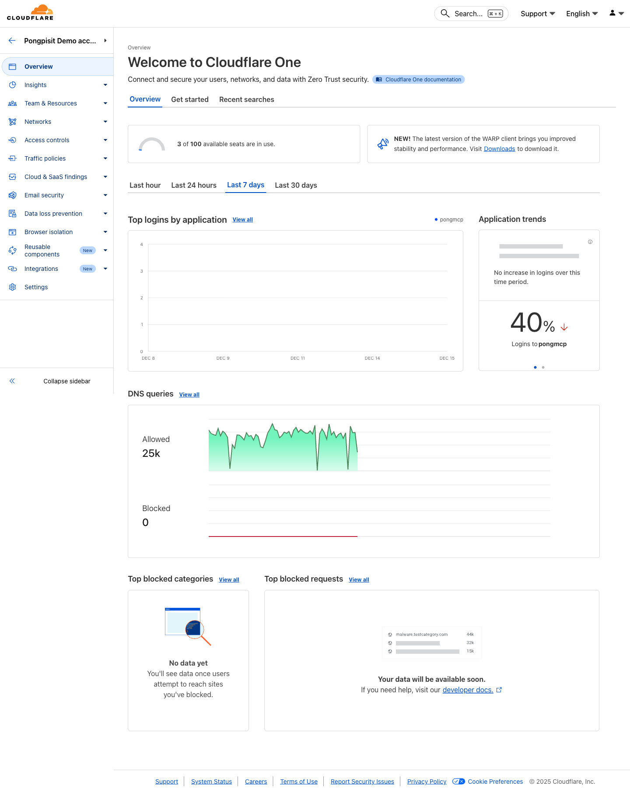
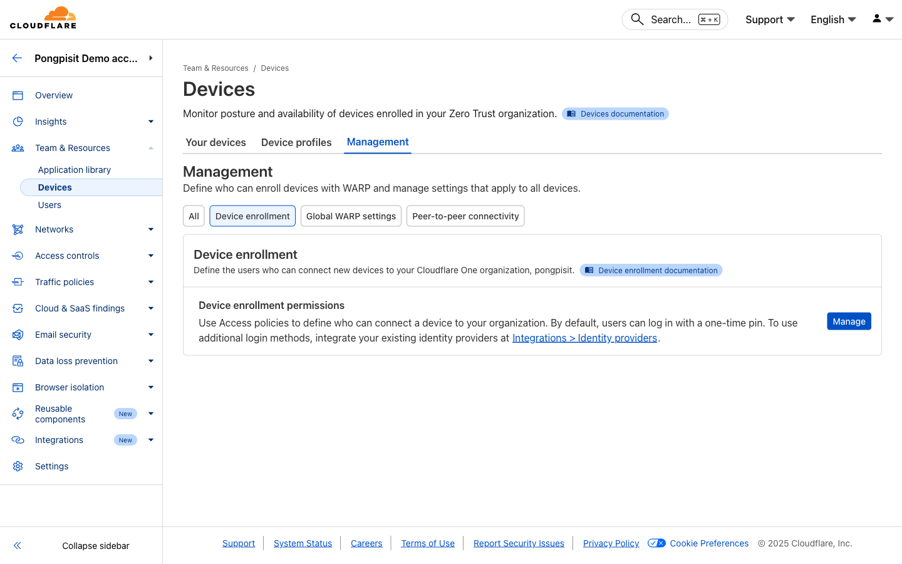
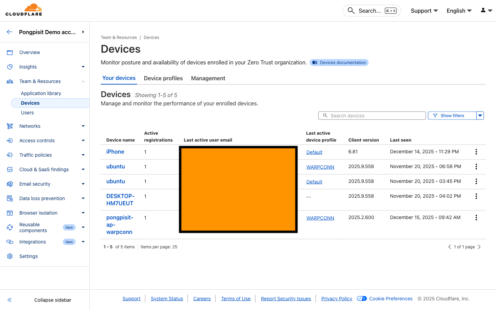
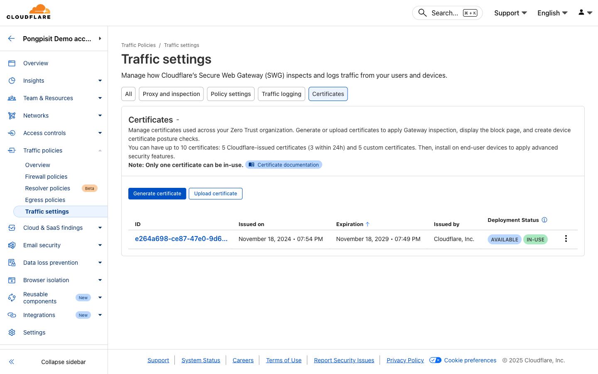

# Module 01: Prerequisites & Setup

**Duration:** 30 minutes

## What You Will Learn

- Create a Cloudflare account
- Set up Zero Trust organization
- Install WARP client on your device
- Connect your device to Zero Trust

---

> **📚 Rule Expressions:** Before creating policies, learn how Cloudflare rule expressions work in [Module 01a: Understanding Rule Expressions](./01a-rule-expressions.md). This covers Traffic/Identity/Device signals, operators (`and`, `or`, `in`, `not in`), and Lists.

---

## Step 1: Create a Cloudflare Account

**If you already have a Cloudflare account, skip to Step 2.**

### 1.1 Sign Up

**Open your browser and go to:**
```
https://dash.cloudflare.com/sign-up
```

**Fill in the form:**
- Email address
- Password (at least 8 characters)

**Click "Sign Up"**

### 1.2 Verify Your Email

1. Check your email inbox
2. Find the email from Cloudflare
3. Click the **verification link** in the email

### 1.3 Access Zero Trust Dashboard

**Go to:**
```
https://one.dash.cloudflare.com/
```



You should see the Zero Trust Dashboard.

---

## Step 2: Create Zero Trust Organization

### 2.1 Set Up Your Organization

**On the onboarding screen:**

1. **Choose a team name**
   - This is your organization's unique identifier
   - Users will enter this name when enrolling devices
   - Example: `mycompany` or `workshop-demo`
   - This becomes your subdomain: `mycompany.cloudflareaccess.com`

2. **Select a subscription plan**
   - Choose **"Zero Trust Free"** for this workshop
   - You can upgrade later if needed

3. **Enter payment details** (required even for free plan)
   - You will NOT be charged for the free plan

**Click "Proceed to Zero Trust"**

### 2.2 View Teams Name
   - Go to Settings > Team Name
   - Copy Team Domain e.g. <slug-name.cloudflareaccess.com>

### 2.3 Verify Setup

You should now see the Zero Trust dashboard with:
- Overview page
- Quick actions menu
- Navigation sidebar

**Congratulations!** Your Zero Trust organization is ready.

---

## Step 3: Configure Authentication

Before users can enroll devices, you need to set up authentication.

### 3.1 Set Up One-Time PIN (Easiest)

**Go to:** Integrations > Identity providers


1. Open https://one.dash.cloudflare.com/
2. In the left sidebar, click **Integrations**
3. Click **Identity providers**
4. Click **Add new identity provider**
5. Select **"One-time PIN"**
6. Click **"Add"**

> **Note:** One-time PIN sends a code to the user's email. This is the simplest method for workshops.

### 3.2 (Optional) Add Identity Provider

> 💡 **3rd Party Integration:** For production environments, you can integrate with external identity providers. This is optional for the workshop.

Supported identity providers:
- Microsoft Azure AD / Entra ID
- Google Workspace
- Okta
- OneLogin
- SAML 2.0 providers
- And many more

**Go to:** Integrations > Identity providers > Add new identity provider


---

## Step 4: Configure Device Enrollment

Define who can enroll devices in your organization.

### 4.1 Create Enrollment Rule

**Go to:** Team & Resources > Devices > Management > Device enrollment



1. In the left sidebar, click **Team & Resources**
2. Click **Devices**
3. Click **Management** tab
4. Click **Device enrollment**
5. Click **Manage** to configure enrollment permissions

1. Click **"Add a rule"**
2. **Rule name:** `Allow all users` (for workshop)
3. **Rule action:** Allow
4. **Include:** Everyone
5. Click **"Save"**

> **For production:** Create specific rules based on email domain, user groups, or identity provider groups.

### 4.2 Example: Allow by Email Domain

To allow only users from your company:

| Selector | Operator | Value |
|----------|----------|-------|
| Emails ending in | matches regex | `@yourcompany\.com$` |

---

## Step 5: Install WARP Client

The WARP client connects your device to Cloudflare Zero Trust.

### 5.1 Download WARP Client

**Go to:** https://developers.cloudflare.com/cloudflare-one/team-and-resources/devices/warp/download-warp/

Or download directly:

| Platform | Download Link |
|----------|---------------|
| Windows | https://downloads.cloudflareclient.com/v1/download/windows/ga |
| macOS | https://downloads.cloudflareclient.com/v1/download/macos/ga |
| iOS | App Store: "Cloudflare One Agent" |
| Android | Play Store: "Cloudflare One Agent" |
| Linux | https://pkg.cloudflareclient.com/ |
| ChromeOS | Play Store: "Cloudflare One Agent" (Android app) |

> **Note:** The legacy 1.1.1.1 apps have been replaced by the **Cloudflare One Agent**. If you have the old app installed, refer to the [migration guide](https://developers.cloudflare.com/cloudflare-one/team-and-resources/devices/warp/download-warp/cloudflare-one-agent-migration/).

### 5.2 Install on Windows

1. Download the `.msi` installer
2. Double-click to run
3. Follow the installation wizard
4. Click **"Install"**
5. Wait for installation to complete
6. Click **"Finish"**

### 5.3 Install on macOS

1. Download the `.pkg` installer
2. Double-click to open
3. Follow the installation prompts
4. Enter your admin password when prompted
5. Click **"Close"** when done

---

## Step 6: Connect to Zero Trust

### 6.1 Open WARP Client

**Windows:** Click the WARP icon in the system tray (bottom right)

**macOS:** Click the WARP icon in the menu bar (top right)

### 6.2 Log In to Your Organization

1. Click the **gear icon** (Settings)
2. Go to **"Account"**
3. Click **"Login to Cloudflare Zero Trust"**
4. Enter your **team name** (from Step 2.2)
5. Click **"Done"**

### 6.3 Authenticate

1. A browser window will open
2. Enter your email address
3. Check your email for the one-time PIN
4. Enter the PIN code
5. Click **"Sign in"**

### 6.4 Verify Connection

Back in the WARP client:
- You should see **"Zero Trust"** or your organization name
- The toggle should show **"Connected"**
- Status should be **"Your Internet is private"**

---

## Step 7: Verify Device Enrollment

### 7.1 Check in Dashboard

**Go to:** Team & Resources > Devices



You should see your device listed with:
- Device name
- User email
- Last seen time
- WARP client version
- Operating system

---

## Step 8: Install Root Certificate (Required for HTTP Inspection)

To enable TLS inspection and HTTP filtering, install the Cloudflare root certificate.

### 8.1 Download Certificate

**Go to:** Traffic policies > Traffic settings > Certificates




### 8.2 Install on Windows

1. Download the certificate file (`.crt`)
2. Double-click the certificate
3. Click **"Install Certificate..."**
4. Select **"Local Machine"**
5. Click **"Next"**
6. Select **"Place all certificates in the following store"**
7. Click **"Browse"** and select **"Trusted Root Certification Authorities"**
8. Click **"Next"** then **"Finish"**
9. Click **"Yes"** to confirm

### 8.3 Install on macOS

1. Download the certificate file (`.crt`)
2. Double-click to open in Keychain Access
3. Select **"System"** keychain
4. Click **"Add"**
5. Find the certificate in the list
6. Double-click it
7. Expand **"Trust"**
8. Set **"When using this certificate"** to **"Always Trust"**
9. Close the window and enter your password

---

## Troubleshooting

### "Team name not found"

- Check spelling of your team name
- Ensure you completed Zero Trust setup
- Try the full URL: `https://your-team-name.cloudflareaccess.com`

### "Unable to connect"

1. Check your internet connection
2. Disable any VPN software
3. Restart the WARP client
4. Try disconnecting and reconnecting

### "Certificate errors"

- Ensure you installed the root certificate correctly
- Restart your browser after installing
- Check certificate is in "Trusted Root Certification Authorities"

### "Device not showing in dashboard"

- Wait a few minutes for sync
- Disconnect and reconnect WARP
- Check device enrollment rules

---

## What You Learned

| Skill | Done |
|-------|------|
| Create Cloudflare account | |
| Set up Zero Trust organization | |
| Configure authentication | |
| Create device enrollment rules | |
| Install WARP client | |
| Connect device to Zero Trust | |
| Install root certificate | |

---

## Quick Reference

| Item | Location |
|------|----------|
| Zero Trust Dashboard | https://one.dash.cloudflare.com |
| WARP Downloads | https://developers.cloudflare.com/cloudflare-one/team-and-resources/devices/warp/download-warp/ |
| Team Name | Settings > General |
| Device List | Team & Resources > Devices |
| Identity Providers | Integrations > Identity providers |
| Enrollment Rules | Team & Resources > Devices > Management > Device enrollment |
| Certificates | Traffic policies > Traffic settings > Certificates |

---

## Next Module

Your device is now connected to Cloudflare Zero Trust!

**Next:** [Module 02: DNS Filtering](./02-dns-filtering.md)

In the next module, you will create DNS policies to block malicious websites and filter content.
