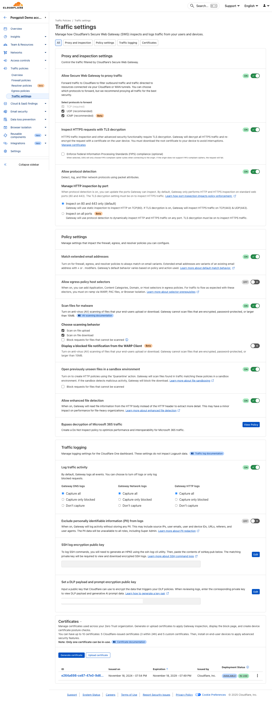
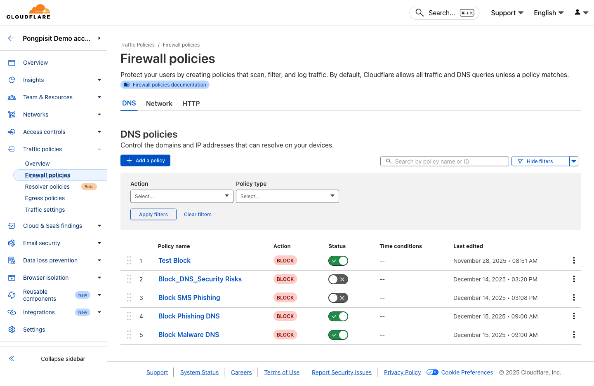
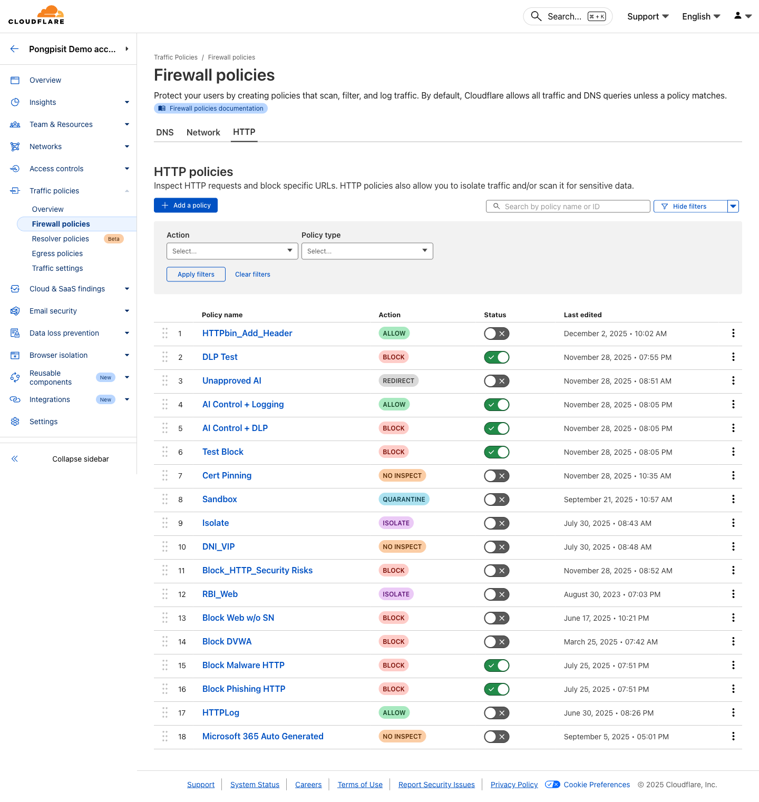

# Module 03: Secure Web Gateway (HTTP Policies)

**Duration:** 60 minutes

## What You Will Learn

- Understand Secure Web Gateway (SWG) architecture
- Enable TLS inspection
- Create HTTP filtering policies
- Block file downloads by type
- Control application access
- Configure Do Not Inspect policies

> **📚 Rule Expressions:** New to Cloudflare policies? Start with [Module 01a: Understanding Rule Expressions](./01a-rule-expressions.md) to learn about signals, operators, and lists.

---

## How Secure Web Gateway Works

```
┌──────────┐                    ┌─────────────────────────────────┐
│  User    │     HTTPS          │      Cloudflare Gateway         │
│  Device  │ ──────────────────►│                                 │
│  (WARP)  │                    │  ┌─────────────────────────┐    │
└──────────┘                    │  │    TLS Inspection       │    │
                                │  │  (Decrypt & Inspect)    │    │
                                │  └───────────┬─────────────┘    │
                                │              │                  │
                                │              ▼                  │
                                │  ┌─────────────────────────┐    │
                                │  │    HTTP Policy Engine   │    │
                                │  │  • URL Filtering        │    │
                                │  │  • File Type Control    │    │
                                │  │  • Application Control  │    │
                                │  │  • DLP Scanning         │    │
                                │  │  • AV Scanning          │    │
                                │  └───────────┬─────────────┘    │
                                │              │                  │
                                │              ▼                  │
                                │     Allow / Block / Isolate    │
                                └─────────────────────────────────┘
```

**SWG inspects:**
- Full URL path (not just domain)
- HTTP headers
- Request/response body
- File uploads and downloads
- Application-specific actions

---

## Step 1: Enable Gateway Proxy

### 1.1 Access Network Settings

**Go to:** Traffic policies > Traffic settings



1. Open https://one.dash.cloudflare.com/
2. In the left sidebar, click **Traffic policies**
3. Click **Traffic settings**

### 1.2 Enable Proxy

Turn on:
- **Proxy** - Enable Gateway proxy for TCP traffic
- **UDP** - Enable proxy for UDP traffic (optional, for QUIC)

### 1.3 Configure Proxy Settings

**Recommended settings:**

| Setting | Value | Description |
|---------|-------|-------------|
| Proxy | On | Enable HTTP/HTTPS inspection |
| UDP | On | Inspect QUIC traffic |
| WARP to WARP | Off | Unless needed for internal traffic |

---

## Step 2: Enable TLS Inspection

TLS inspection allows Gateway to decrypt and inspect HTTPS traffic.

### 2.1 Prerequisites

Before enabling TLS inspection:
- Root certificate must be installed on all devices (Module 01)
- Users must be connected via WARP client

### 2.2 Enable TLS Decryption

**Go to:** Traffic policies > Traffic settings


Under **Proxy and inspection settings**, turn on: **TLS decryption**

### 2.3 Configure TLS Settings

**Recommended settings:**

| Setting | Value |
|---------|-------|
| TLS decryption | On |
| Block requests with untrusted certificates | On |
| Block requests with expired certificates | On |

---

## Step 3: Create HTTP Security Policy

Block access to security threats at the HTTP level.

### 3.1 Access HTTP Policies

**Go to:** Traffic policies > Firewall policies



1. Open https://one.dash.cloudflare.com/
2. In the left sidebar, click **Traffic policies**
3. Click **Firewall policies**
4. Select the **HTTP** tab

### 3.2 Add New Policy

1. Click **"Add a policy"**
2. **Name:** `Block Security Threats - HTTP`
3. **Description:** `Block malicious URLs and security risks`

### 3.3 Configure Traffic Selector

| Selector | Operator | Value |
|----------|----------|-------|
| Security Risks | in | All security risks |

### 3.4 Set Action

**Action:** Block

### 3.5 Save Policy

Click **"Create policy"**

---

## Step 4: Block File Downloads by Type

Prevent users from downloading potentially dangerous files.

### 4.1 Add New Policy

1. Click **"Add a policy"**
2. **Name:** `Block Dangerous File Types`
3. **Description:** `Block executable and script downloads`

### 4.2 Configure Traffic Selector

| Selector | Operator | Value |
|----------|----------|-------|
| Download File Types | in | Executable, Script |

**Specific file types to block:**
- `.exe` - Windows executables
- `.msi` - Windows installers
- `.bat`, `.cmd` - Batch files
- `.ps1` - PowerShell scripts
- `.vbs`, `.js` - Script files
- `.dll` - Dynamic libraries
- `.scr` - Screensavers (often malware)

### 4.3 Set Action

**Action:** Block

### 4.4 Save Policy

Click **"Create policy"**

---

## Step 5: Block File Uploads

Prevent data exfiltration through file uploads.

### 5.1 Add New Policy

1. Click **"Add a policy"**
2. **Name:** `Block Uploads to File Sharing`
3. **Description:** `Prevent uploads to unauthorized file sharing sites`

### 5.2 Configure Traffic Selector

| Selector | Operator | Value |
|----------|----------|-------|
| Application | in | Dropbox, WeTransfer, MediaFire |
| AND | | |
| Upload File Types | in | All file types |

### 5.3 Set Action

**Action:** Block

---

## Step 6: Control Application Access

Block or restrict specific applications.

### 6.1 Block Unauthorized Cloud Storage

1. Click **"Add a policy"**
2. **Name:** `Block Personal Cloud Storage`

| Selector | Operator | Value |
|----------|----------|-------|
| Application | in | Google Drive (Personal), Dropbox, OneDrive (Personal) |

**Action:** Block

### 6.2 Block Social Media

1. Click **"Add a policy"**
2. **Name:** `Block Social Media`

| Selector | Operator | Value |
|----------|----------|-------|
| Application | in | Facebook, Instagram, TikTok, Twitter |

**Action:** Block

### 6.3 Allow Specific Application Actions

Allow read-only access to certain applications:

1. Click **"Add a policy"**
2. **Name:** `Allow YouTube View Only`

| Selector | Operator | Value |
|----------|----------|-------|
| Application | is | YouTube |
| AND | | |
| HTTP Method | is not | POST |

**Action:** Allow

---

## Step 7: URL Path Filtering

Block specific URL paths or patterns.

### 7.1 Block Login Pages on Untrusted Sites

1. Click **"Add a policy"**
2. **Name:** `Block Suspicious Login Pages`

| Selector | Operator | Value |
|----------|----------|-------|
| URL Path | matches regex | `.*(login|signin|auth).*` |
| AND | | |
| Security Risks | in | Phishing |

**Action:** Block

### 7.2 Block Specific URL Patterns

| Selector | Operator | Value |
|----------|----------|-------|
| URL | matches regex | `.*\.ru/.*download.*` |

**Action:** Block

---

## Step 8: Configure Do Not Inspect Policies

Some applications break when TLS is inspected. Create bypass rules.

### 8.1 Common Applications to Bypass

**Go to:** Traffic policies > Firewall policies > HTTP



1. Click **"Add a policy"**
2. **Name:** `Do Not Inspect - Certificate Pinned Apps`

| Selector | Operator | Value |
|----------|----------|-------|
| Application | in | Apple Services, Windows Update, Zoom |

**Action:** Do Not Inspect

### 8.2 Bypass by Domain

For specific domains that don't work with inspection:

| Selector | Operator | Value |
|----------|----------|-------|
| Host | in | *.apple.com, *.microsoft.com |

**Action:** Do Not Inspect

### 8.3 Common Do Not Inspect List

| Application/Domain | Reason |
|--------------------|--------|
| Apple Services | Certificate pinning |
| Windows Update | Certificate pinning |
| Zoom | Certificate pinning |
| Banking apps | Security requirements |
| Healthcare apps | Compliance |
| *.gov domains | Government compliance |

---

## Step 9: Enable Browser Isolation (Optional)

Isolate risky websites in a remote browser.

### 9.1 Add Isolation Policy

1. Click **"Add a policy"**
2. **Name:** `Isolate Risky Sites`

| Selector | Operator | Value |
|----------|----------|-------|
| Security Risks | in | Suspicious, Unknown |

**Action:** Isolate

### 9.2 Configure Isolation Settings

**Options:**
- Disable copy/paste
- Disable printing
- Disable file downloads
- Disable keyboard input

---

## Step 10: Test HTTP Policies

### 10.1 Test File Download Blocking

1. Try downloading an `.exe` file from a legitimate site
2. You should see the block page

### 10.2 Test Application Blocking

1. Try accessing a blocked application (e.g., Facebook)
2. You should see the block page

### 10.3 Check HTTP Logs

**Go to:** Insights > Logs (HTTP tab)


You should see:
- Request URL
- User and device
- Action taken (Allow/Block)
- Policy matched
- File type (if applicable)

---

## Policy Order Best Practices

Arrange HTTP policies in this order:

1. **Do Not Inspect** - Bypass TLS for specific apps
2. **Allow** - Critical business applications
3. **Block** - Security threats
4. **Block** - File type restrictions
5. **Block** - Application restrictions
6. **Isolate** - Risky but necessary sites
7. **Default** - Allow remaining traffic

---

## Common HTTP Policy Examples

### Block All Executable Downloads

```
Selector: Download File Types
Operator: in
Value: Executable
Action: Block
```

### Block Uploads Over 10MB

```
Selector: Upload File Size
Operator: greater than
Value: 10485760 (bytes)
Action: Block
```

### Block Access to Specific Country

```
Selector: Destination Country
Operator: in
Value: Russia, China, North Korea
Action: Block
```

### Allow Only Approved SaaS Apps

```
Policy 1:
Selector: Application
Operator: in
Value: Microsoft 365, Google Workspace, Salesforce
Action: Allow

Policy 2:
Selector: Content Categories
Operator: in
Value: SaaS
Action: Block
```

### Isolate Uncategorized Sites

```
Selector: Content Categories
Operator: not in
Value: (any category)
Action: Isolate
```

---

## Troubleshooting

### "Certificate errors on websites"

- Verify root certificate is installed
- Check if site is in Do Not Inspect list
- Some apps use certificate pinning - add to bypass

### "Application not working after enabling TLS"

- Add application to Do Not Inspect policy
- Check if application uses certificate pinning
- Verify WARP client is up to date

### "Policy not blocking as expected"

- Check policy order (priority)
- Verify TLS inspection is enabled
- Check if traffic matches Do Not Inspect rule
- Wait 60 seconds for policy propagation

### "Can't see full URL in logs"

- TLS inspection must be enabled
- Check if domain is in Do Not Inspect list

---

## What You Learned

| Skill | Done |
|-------|------|
| Enable Gateway proxy | |
| Enable TLS inspection | |
| Create HTTP security policies | |
| Block file downloads by type | |
| Control application access | |
| Configure Do Not Inspect | |
| Test HTTP filtering | |
| View HTTP logs | |

---

## Quick Reference

### HTTP Policy Actions

| Action | Description |
|--------|-------------|
| Allow | Permit the request |
| Block | Block and show block page |
| Isolate | Open in remote browser |
| Do Not Inspect | Bypass TLS inspection |
| Do Not Scan | Skip AV/DLP scanning |

### Common Selectors

| Selector | Use Case |
|----------|----------|
| Application | Block/allow specific apps |
| Host | Filter by domain |
| URL | Filter by full URL path |
| Download File Types | Control downloads |
| Upload File Types | Control uploads |
| HTTP Method | Control actions (GET/POST) |
| Content Categories | Filter by category |
| Security Risks | Block threats |

---

## Next Module

You have configured Secure Web Gateway for HTTP traffic inspection!

**Next:** [Module 04: Anti-Virus & File Scanning](./04-antivirus-scanning.md)

In the next module, you will enable anti-virus scanning to protect against malware.
