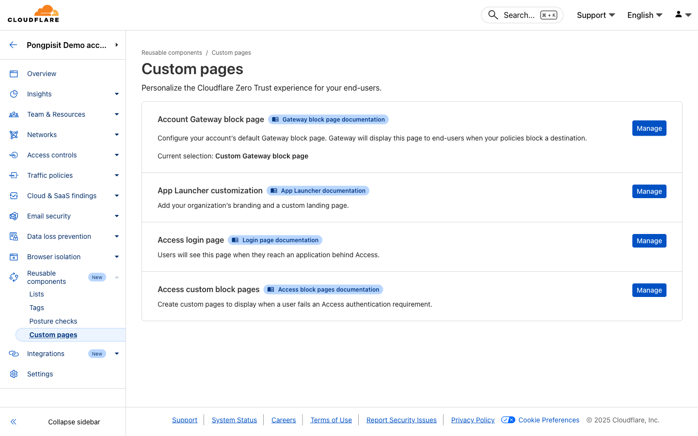

# Module 05: Device Posture & WARP Settings

**Duration:** 30 minutes

## What You Will Learn

- Configure device posture checks
- Require security compliance before access
- Configure WARP client settings
- Set up Split Tunnels
- Customize block pages
- Manage device profiles

> 💡 **3rd Party Integrations (Optional):** Device posture can integrate with endpoint security tools like CrowdStrike, SentinelOne, Carbon Black, and Tanium for advanced checks. These integrations are optional.

---

## Why Device Posture Matters

```
┌─────────────────────────────────────────────────────────────────┐
│                    Zero Trust Principle                         │
│                                                                 │
│   "Never trust, always verify"                                  │
│                                                                 │
│   User Identity    +    Device Security    =    Access Granted  │
│   ─────────────         ───────────────         ──────────────  │
│   Who you are           Is device secure?       Only if both    │
│                                                 are verified    │
│                                                                 │
│   Without Device Posture:                                       │
│   ❌ Compromised device can access resources                    │
│   ❌ Unpatched systems create vulnerabilities                   │
│   ❌ No visibility into device security                         │
│                                                                 │
│   With Device Posture:                                          │
│   ✅ Only secure devices can access resources                   │
│   ✅ Enforce security requirements automatically                │
│   ✅ Full visibility into device compliance                     │
│                                                                 │
└─────────────────────────────────────────────────────────────────┘
```

---

## Step 1: Access Device Posture Settings

### 1.1 Navigate to Device Posture

1. Open https://one.dash.cloudflare.com/
2. In the left sidebar, click **Reusable components**
3. Click **Posture checks**

---

## Step 2: Create Posture Checks

### 2.1 Available Posture Checks

| Check Type | What It Verifies |
|------------|------------------|
| Firewall | OS firewall is enabled |
| Disk Encryption | Drive is encrypted |
| OS Version | Minimum OS version |
| Domain Joined | Device is on corporate domain |
| Running Process | Specific software is running |
| File Exists | Required file is present |
| Certificate | Specific certificate installed |
| Crowdstrike | Crowdstrike agent status |
| Carbon Black | Carbon Black agent status |
| SentinelOne | SentinelOne agent status |
| Tanium | Tanium agent status |
| Intune | Microsoft Intune compliance |
| Kolide | Kolide agent status |

### 2.2 Create Firewall Check

1. Click **Add new**
2. Select **Firewall**
3. Configure:
   - **Name:** `Firewall Enabled`
   - **Operating System:** Windows, macOS
   - **Firewall:** Enabled
4. Click **Save**

### 2.3 Create Disk Encryption Check

1. Click **Add new**
2. Select **Disk encryption**
3. Configure:
   - **Name:** `Disk Encrypted`
   - **Operating System:** Windows, macOS
   - **Encryption:** Enabled
4. Click **Save**

### 2.4 Create OS Version Check

1. Click **Add new**
2. Select **OS version**
3. Configure:
   - **Name:** `Windows 10 or newer`
   - **Operating System:** Windows
   - **Operator:** Greater than or equal to
   - **Version:** 10.0.0
4. Click **Save**

### 2.5 Create Antivirus Check (Third-party)

For Crowdstrike:
1. Click **Add new**
2. Select **Crowdstrike**
3. Configure:
   - **Name:** `Crowdstrike Running`
   - **Client ID:** (from Crowdstrike)
   - **Client Secret:** (from Crowdstrike)
4. Click **Save**

---

## Step 3: Use Posture in Access Policies

### 3.1 Add Posture to Access Policy

1. Go to **Access** > **Applications**
2. Edit an existing application
3. Edit the policy
4. Add a **Require** rule:

| Rule Type | Selector | Value |
|-----------|----------|-------|
| Require | Device Posture | Firewall Enabled |
| Require | Device Posture | Disk Encrypted |

5. Click **Save**

### 3.2 Add Posture to Gateway Policy

1. Go to **Gateway** > **Firewall Policies** > **HTTP**
2. Create or edit a policy
3. Add condition:

| Selector | Operator | Value |
|----------|----------|-------|
| Passed Device Posture Checks | in | Firewall Enabled |

4. Set action as needed

---

## Step 4: Configure Device Profile Settings

### 4.1 Access Device Settings

1. Go to **Team & Resources** > **Devices**
2. Click **Device profiles** tab

### 4.2 Create Device Profile

1. Click **Create profile**
2. **Name:** `Default Profile`
3. Configure settings (see below)
4. Click **Save**

### 4.3 Profile Settings

| Setting | Recommended | Description |
|---------|-------------|-------------|
| Captive portal detection | On | Handle WiFi login pages |
| Mode switch | Off | Prevent users from disabling |
| Lock WARP switch | On | Prevent disconnect |
| Allow device to leave org | Off | Prevent unenrollment |
| Allow updates | On | Keep client updated |
| Auto connect | On | Connect automatically |
| Support URL | Your helpdesk URL | Where users get help |

---

## Step 5: Configure Split Tunnels

### 5.1 What are Split Tunnels?

```
┌─────────────────────────────────────────────────────────────────┐
│                    Split Tunnel Modes                           │
│                                                                 │
│   Include Mode (Recommended for security):                      │
│   ─────────────────────────────────────────                     │
│   Only specified traffic goes through Gateway                   │
│   Everything else goes direct to internet                       │
│                                                                 │
│   Exclude Mode (Default):                                       │
│   ───────────────────────                                       │
│   All traffic goes through Gateway                              │
│   Except specified exclusions                                   │
│                                                                 │
└─────────────────────────────────────────────────────────────────┘
```

### 5.2 Configure Split Tunnels

1. Go to **Team & Resources** > **Devices** > **Device profiles**
2. Edit your profile
3. Find **Split Tunnels**
4. Choose mode:
   - **Exclude IPs and domains** (default)
   - **Include IPs and domains**

### 5.3 Common Exclusions

Add these to **Exclude** list for compatibility:

| Domain/IP | Reason |
|-----------|--------|
| *.local | Local network |
| 10.0.0.0/8 | Private network |
| 172.16.0.0/12 | Private network |
| 192.168.0.0/16 | Private network |
| *.zoom.us | Video conferencing |
| *.teams.microsoft.com | Video conferencing |

### 5.4 Add Exclusion

1. Click **Manage** next to Split Tunnels
2. Click **Add new**
3. Enter domain or IP/CIDR
4. Click **Save**

---

## Step 6: Customize Block Pages

### 6.1 Access Custom Pages

**Go to:** Reusable components > Custom pages



### 6.2 Available Custom Pages

| Page Type | Description |
|-----------|-------------|
| **Gateway block page** | Displayed when Gateway policies block a destination |
| **App Launcher customization** | Add organization branding and custom landing page |
| **Access login page** | Displayed when users reach an application behind Access |
| **Access custom block pages** | Displayed when users fail Access authentication |

### 6.3 Configure Gateway Block Page

1. Click **Manage** next to **Gateway block page**
2. Customize the block page:
   - Upload company logo
   - Add custom header text
   - Add explanation message
   - Set background color
   - Add support email/URL

### 6.4 Example Block Page Content

**Header:** `Access Blocked`

**Body:**
```
This website has been blocked by your organization's security policy.

If you believe this is a mistake, please contact IT support.
```

**Support email:** `helpdesk@yourcompany.com`

> **Note:** Block page requires TLS inspection for HTTPS sites.

---

## Step 7: View Device Compliance

### 7.1 Check Device Status

1. Go to **Team & Resources** > **Devices**
2. Click on a device
3. View **Posture** tab

### 7.2 Device Information

| Field | Description |
|-------|-------------|
| Device name | Computer name |
| User | Enrolled user |
| Last seen | Last connection time |
| WARP version | Client version |
| OS | Operating system |
| Posture checks | Pass/fail status |

### 7.3 Filter Non-Compliant Devices

1. Go to **Team & Resources** > **Devices**
2. Add filter: **Posture** = **Failed**
3. Review non-compliant devices

---

## Step 8: Manage Users and Groups

### 8.1 View Users

1. Go to **Team & Resources** > **Users**
2. See all enrolled users

### 8.2 User Information

| Field | Description |
|-------|-------------|
| Email | User email |
| Status | Active/Inactive |
| Last login | Last authentication |
| Devices | Number of devices |
| Groups | Group memberships |

### 8.3 Revoke User Access

1. Go to **Team & Resources** > **Users**
2. Click on user
3. Click **Revoke all sessions**

This immediately logs out the user from all devices.

---

## Step 9: Configure Local Domain Fallback

### 9.1 What is Local Domain Fallback?

For internal domains that should resolve via internal DNS:

```
┌─────────────────────────────────────────────────────────────────┐
│                                                                 │
│   Query for "app.internal.company.com"                          │
│                                                                 │
│   Without Fallback:                                             │
│   ─────────────────                                             │
│   Query → Cloudflare DNS → NXDOMAIN (not found)                 │
│                                                                 │
│   With Fallback:                                                │
│   ────────────────                                              │
│   Query → Cloudflare DNS → Fallback to internal DNS → Resolved  │
│                                                                 │
└─────────────────────────────────────────────────────────────────┘
```

### 9.2 Configure Fallback

1. Go to **Team & Resources** > **Devices** > **Device profiles**
2. Edit your profile
3. Find **Local Domain Fallback**
4. Click **Manage**
5. Add your internal domains:
   - `internal.company.com`
   - `corp.local`
6. Specify DNS servers for these domains
7. Click **Save**

---

## Step 10: Best Practices

### 10.1 Recommended Posture Checks

| Check | Priority | Reason |
|-------|----------|--------|
| Firewall | High | Basic protection |
| Disk Encryption | High | Data protection |
| OS Version | Medium | Security patches |
| Antivirus | High | Malware protection |
| Domain Joined | Medium | Corporate devices |

### 10.2 Gradual Rollout

1. **Week 1:** Deploy posture checks in monitor mode
2. **Week 2:** Review compliance rates
3. **Week 3:** Notify non-compliant users
4. **Week 4:** Enforce posture requirements

### 10.3 User Communication

Before enforcing posture:
- Notify users of requirements
- Provide remediation instructions
- Set deadline for compliance
- Offer IT support

---

## Troubleshooting

### "Posture check failing"

1. Go to **Insights** > **Logs** > **Posture logs**
2. Find the device and check for specific failure
3. Alternatively, go to **Team & Resources** > **Devices**
4. Click on the device and check **Posture** tab
5. Remediate the issue on the device

### "User can't connect"

- Check device enrollment status
- Verify posture requirements
- Check WARP client version
- Review device profile settings

### "Split tunnel not working"

- Verify domain/IP is in the list
- Check for typos in entries
- Restart WARP client
- Check if traffic is being inspected

### "Block page not showing"

- Verify TLS inspection is enabled
- Check root certificate is installed
- Verify block page is enabled in settings

---

## What You Learned

| Skill | Done |
|-------|------|
| Create posture checks | |
| Use posture in policies | |
| Configure WARP settings | |
| Set up Split Tunnels | |
| Customize block pages | |
| View device compliance | |
| Manage users | |

---

## Quick Reference

### Posture Check Types

| Type | Platforms |
|------|-----------|
| Firewall | Windows, macOS |
| Disk Encryption | Windows, macOS |
| OS Version | All |
| Domain Joined | Windows |
| Running Process | Windows, macOS, Linux |
| File Exists | All |

### WARP Client Settings

| Setting | Security Impact |
|---------|-----------------|
| Lock WARP switch | Prevents bypass |
| Mode switch | Prevents downgrade |
| Auto connect | Ensures protection |
| Allow leave org | Prevents unenrollment |

### Split Tunnel Modes

| Mode | Use Case |
|------|----------|
| Exclude | Default, most traffic through Gateway |
| Include | Only specific traffic through Gateway |

---

## Next Module

You now have complete device posture and WARP configuration!

**Next:** [Module 06: Zero Trust Network Access](./06-ztna.md)

In the next module, you will set up ZTNA to provide secure access to private applications.
