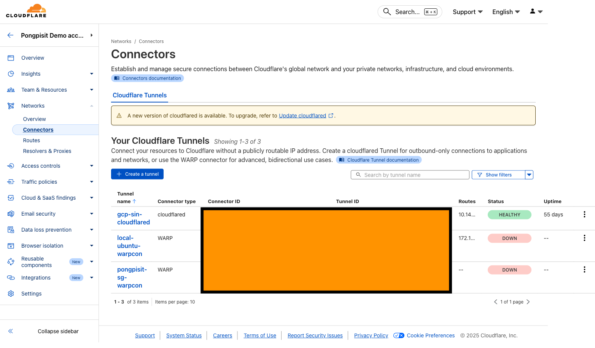
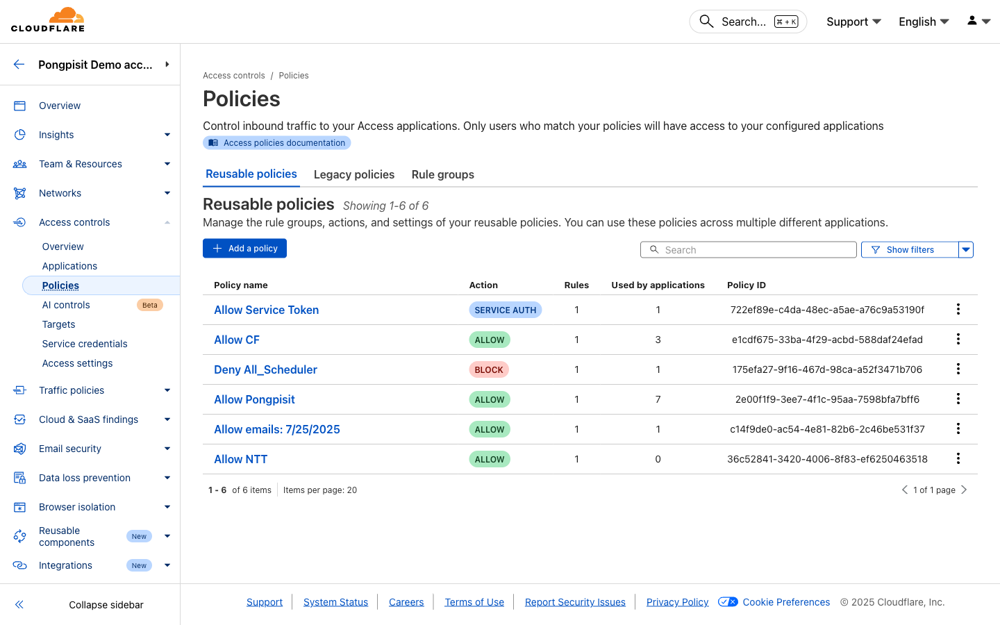
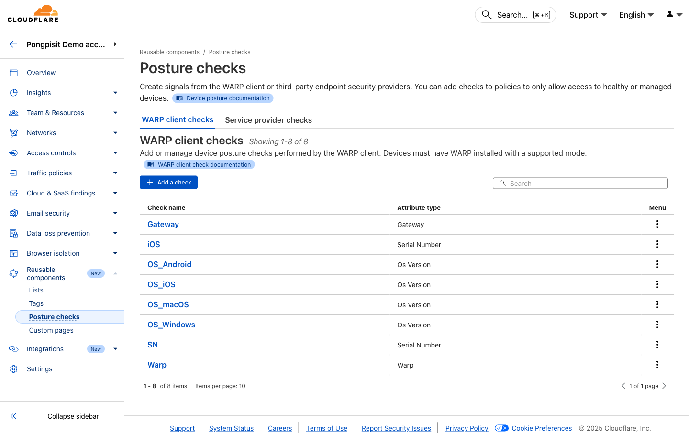

# Module 06: Zero Trust Network Access (ZTNA)

**Duration:** 60 minutes

## What You Will Learn

- Understand ZTNA concepts and architecture
- Set up Cloudflare Tunnel for private applications
- Create Access policies for application protection
- Configure identity-based access control
- Replace VPN with Zero Trust access
- Test and troubleshoot ZTNA setup

> **📚 Rule Expressions:** New to Cloudflare policies? Start with [Module 01a: Understanding Rule Expressions](./01a-rule-expressions.md) to learn about signals, operators, and lists.

---

## How ZTNA Works

```
                                    ┌─────────────────────────────────┐
┌──────────┐                        │      Cloudflare Network         │
│  Remote  │     WARP/Browser       │                                 │
│   User   │ ──────────────────────►│  ┌─────────────────────────┐    │
└──────────┘                        │  │    Access Policies      │    │
                                    │  │                         │    │
                                    │  │  • Identity Check       │    │
                                    │  │  • Device Posture       │    │
                                    │  │  • Location Check       │    │
                                    │  │  • Time-based Rules     │    │
                                    │  └───────────┬─────────────┘    │
                                    │              │                  │
                                    │              ▼                  │
                                    │     Authenticated Request       │
                                    │              │                  │
                                    └──────────────┼──────────────────┘
                                                   │
                                    ┌──────────────┼──────────────────┐
                                    │              │                  │
                                    │              ▼                  │
                                    │  ┌─────────────────────────┐    │
                                    │  │   Cloudflare Tunnel     │    │
                                    │  │      (cloudflared)      │    │
                                    │  └───────────┬─────────────┘    │
                                    │              │                  │
                                    │              ▼                  │
                                    │  ┌─────────────────────────┐    │
                                    │  │   Private Application   │    │
                                    │  │   (Internal Network)    │    │
                                    │  └─────────────────────────┘    │
                                    │         Your Network            │
                                    └─────────────────────────────────┘
```

**ZTNA Benefits:**
- No inbound firewall rules needed
- Identity-based access (not network-based)
- Per-application access control
- No VPN client required (browser access)
- Works from anywhere

---

## Prerequisites

Before configuring ZTNA:
- Zero Trust organization set up (Module 01)
- Authentication configured (Module 01)
- Access to a private application or server

---

## Step 1: Create a Tunnel via Dashboard (Recommended)

The easiest way to create a tunnel is through the Cloudflare dashboard, which provides installation commands tailored to your system.

### 1.1 Access Tunnel Creation

**Go to:** Networks > Connectors



1. Click **"Create a tunnel"**
2. Select **"Cloudflared"** as the connector type
3. Click **"Next"**

### 1.2 Name Your Tunnel

1. Enter a **tunnel name** (e.g., `my-tunnel`)
2. Click **"Save tunnel"**

### 1.3 Install and Run Connector

Cloudflare will display installation instructions. **Follow these steps:**

1. **Select your environment:**
   - Choose your **Operating System** (Windows, macOS, Linux, Docker)
   - Choose your **CPU Architecture** (64-bit, 32-bit, ARM, ARM64)

2. **Copy the command** provided by Cloudflare
   - The command includes your unique tunnel token
   - Example format: `cloudflared service install <your-token>`

3. **Run the command** on your server/machine
   - Open terminal/command prompt
   - Paste and execute the command

4. **Wait for connector to appear**
   - The dashboard will show your connector status
   - Status should change to **"Connected"**

5. Click **"Next"** to continue

> **Note:** The installation command is unique to your tunnel. Do not share your tunnel token.

### 1.4 Verify Connector Status

Once installed, your connector should show:
- **Status:** Connected (green)
- **Version:** Latest cloudflared version
- **Origin:** Your server's hostname

---

## Step 2: Add Public Hostname (Route Traffic)

After the connector is running, configure where traffic should go.

### 2.1 Add Public Hostname

In the tunnel configuration wizard (or click on your tunnel later):

1. Go to **"Public Hostname"** tab
2. Click **"Add a public hostname"**

### 2.2 Configure Hostname

| Field | Value | Example |
|-------|-------|--------|
| **Subdomain** | Your app subdomain | `app` |
| **Domain** | Select from your domains | `yourdomain.com` |
| **Path** | (Optional) Specific path | Leave empty |
| **Type** | Protocol type | `HTTP` |
| **URL** | Internal service address | `localhost:8080` |

3. Click **"Save hostname"**

### 2.3 Common Service Types

| Type | URL Format | Use Case |
|------|------------|----------|
| HTTP | `http://localhost:8080` | Web applications |
| HTTPS | `https://localhost:443` | Secure web apps |
| TCP | `tcp://localhost:22` | SSH, databases |
| RDP | `rdp://localhost:3389` | Remote desktop |
| SSH | `ssh://localhost:22` | SSH access |

### 2.4 Add Multiple Hostnames

Repeat the process to add more applications:
- `api.yourdomain.com` → `http://localhost:3000`
- `admin.yourdomain.com` → `http://192.168.1.100:80`

---

## Step 3: Verify Tunnel Status

**Go to:** Networks > Connectors


Your tunnel should show:
- **Status:** Healthy (green)
- **Connectors:** 1 (or more)
- **Public Hostnames:** Listed routes

---

## Step 4: Create Access Application

Protect your application with Access policies.

### 4.1 Add Application

**Go to:** Access controls > Applications


1. Click **"Add an application"**
2. Select **"Self-hosted"**

### 4.2 Configure Application

**Application Configuration:**
- **Name:** Internal App
- **Session Duration:** 24 hours
- **Application domain:** app.yourdomain.com

### 4.3 Identity Providers

Select which identity providers users can authenticate with:
- One-time PIN
- Azure AD
- Google Workspace
- Okta
- etc.

Click **"Next"**

---

## Step 5: Create Access Policy

### 5.1 Add Policy

1. **Policy name:** Allow Employees
2. **Action:** Allow

### 5.2 Configure Include Rules

Define who can access:

| Selector | Operator | Value |
|----------|----------|-------|
| Emails ending in | matches | @yourcompany.com |

**Or use groups:**

| Selector | Operator | Value |
|----------|----------|-------|
| Access Groups | in | Employees |

### 5.3 Add Additional Rules (Optional)

**Require specific conditions:**

| Rule Type | Selector | Value |
|-----------|----------|-------|
| Require | Country | United States, United Kingdom |
| Require | Device Posture | Firewall enabled |

### 5.4 Save Policy

Click **"Next"** then **"Add application"**

---

## Step 6: Create Access Groups

Reusable groups for policies.

### 6.1 Add Group

**Go to:** Access controls > Policies



1. Click **"Add a group"**
2. **Name:** Employees

### 6.2 Configure Group Rules

| Selector | Operator | Value |
|----------|----------|-------|
| Emails ending in | matches | @yourcompany.com |

### 6.3 Save Group

Click **"Save"**

### 6.4 Common Groups

| Group Name | Rule |
|------------|------|
| Employees | Email ends with @company.com |
| Contractors | Specific email list |
| Admins | Specific email list |
| Engineering | Email contains +eng@ |

---

## Step 7: Configure Device Posture (Optional)

Require device security checks.

### 7.1 Access Device Posture

**Go to:** Reusable components > Posture checks



### 7.2 Add Posture Check

1. Click **"Add new"**
2. Select check type:
   - Firewall
   - Disk encryption
   - OS version
   - Domain joined
   - Running process

### 7.3 Example: Require Firewall

1. **Name:** Firewall Enabled
2. **Type:** Firewall
3. **Operating System:** Windows, macOS
4. **Firewall status:** Enabled
5. Click **"Save"**

### 7.4 Use in Access Policy

Add to your Access policy:

| Rule Type | Selector | Value |
|-----------|----------|-------|
| Require | Device Posture | Firewall Enabled |

---

## Step 8: Test Access

### 8.1 Browser Access

1. Open browser
2. Go to: `https://app.yourdomain.com`
3. You should see the Cloudflare Access login page
4. Authenticate with your identity provider
5. After authentication, you should see your application

### 8.2 WARP Client Access

1. Connect WARP client to Zero Trust
2. Access the application URL
3. Authentication may be automatic if already logged in

### 8.3 Check Access Logs

**Go to:** Insights > Logs (Access tab)


View:
- Successful authentications
- Blocked attempts
- User details
- Device information

---

## Step 9: Private Network Access (Advanced)

Access entire private networks, not just specific apps.

### 9.1 Configure Private Network

**Go to:** Networks > Connectors > Your Tunnel


1. Go to **"Private Network"** tab
2. Click **"Add a private network"**
3. Enter CIDR range: `192.168.1.0/24`
4. Click **"Save"**

### 9.2 Configure Split Tunnel

**Go to:** Team & Resources > Devices


1. Edit your device profile
2. Go to **"Split Tunnels"**
3. Select **"Include IPs and domains"**
4. Add your private network CIDR

### 9.3 Access Private Resources

With WARP connected, users can now access:
- `http://192.168.1.100` (internal server)
- `ssh 192.168.1.50` (SSH to internal host)
- Any resource in the private network

---

## Common Use Cases

### Web Application Access

Add a public hostname in the dashboard:
- **Hostname:** `intranet.company.com`
- **Service:** `http://10.0.0.50:80`

### SSH Access

Add a public hostname:
- **Hostname:** `ssh.company.com`
- **Service:** `ssh://10.0.0.100:22`

Access via browser: `https://ssh.company.com`

### RDP Access

Add a public hostname:
- **Hostname:** `rdp.company.com`
- **Service:** `rdp://10.0.0.200:3389`

Access via browser with Cloudflare's RDP client.

### Database Access

Add a public hostname:
- **Hostname:** `db.company.com`
- **Service:** `tcp://10.0.0.150:5432`

Requires WARP client for TCP access.

---

## Troubleshooting

### "Tunnel not connecting"

- Check cloudflared service is running on your server
- Check firewall allows outbound port 443
- Go to **Networks > Connectors** to check connector status
- Restart the cloudflared service if needed

### "Access denied"

- Verify user matches policy rules
- Check identity provider configuration
- Go to **Insights > Logs (Access tab)** for denial reason
- Verify application domain matches

### "Application not loading"

- Verify tunnel is healthy in dashboard
- Check service URL in public hostname configuration
- Verify application is running locally
- Test local access to application

### "Certificate errors"

- Verify DNS is pointing to tunnel (CNAME record)
- Check hostname matches configuration
- Wait for DNS propagation

---

## What You Learned

| Skill | Done |
|-------|------|
| Create tunnel via dashboard | |
| Add public hostnames | |
| Create Access application | |
| Create Access policies | |
| Configure device posture | |
| Test ZTNA access | |
| Troubleshoot issues | |

---

## Quick Reference

### Dashboard Navigation

| Task | Location |
|------|----------|
| Create/manage tunnels | Networks > Connectors |
| Add public hostnames | Networks > Connectors > [Tunnel] > Public Hostname |
| Add private networks | Networks > Connectors > [Tunnel] > Private Network |
| Create Access apps | Access controls > Applications |
| Create Access policies | Access controls > Policies |
| View Access logs | Insights > Logs (Access tab) |

### Access Policy Actions

| Action | Description |
|--------|-------------|
| Allow | Grant access |
| Block | Deny access |
| Bypass | Skip authentication |
| Service Auth | Machine-to-machine |

### Common Selectors

| Selector | Use Case |
|----------|----------|
| Emails | Specific users |
| Emails ending in | Domain-based |
| Access Groups | Reusable groups |
| Country | Geographic restriction |
| IP ranges | Network-based |
| Device Posture | Security requirements |

---

## Next Module

You have configured Zero Trust Network Access!

**Next:** [Module 08: Logs & Analytics](./08-logs-analytics.md)

In the next module, you will learn how to monitor and troubleshoot your Zero Trust deployment.

---

## Workshop Almost Complete!

## What You Built

| Module | Feature |
|--------|---------|
| 01 | Zero Trust organization & WARP client |
| 02 | DNS filtering & content control |
| 03 | Secure Web Gateway & HTTP policies |
| 04 | Anti-virus & malware protection |
| 05 | Data Loss Prevention |
| 06 | Device Posture & WARP settings |
| 07 | Zero Trust Network Access |

## Next Steps

1. **Production Deployment**
   - Roll out WARP to all devices
   - Create comprehensive policies
   - Integrate with identity providers

2. **Advanced Features**
   - Browser Isolation
   - Email Security
   - Digital Experience Monitoring (DEX)

3. **Monitoring & Optimization**
   - Review logs regularly
   - Tune policies based on findings
   - Set up alerts and notifications

## Resources

- **Documentation:** https://developers.cloudflare.com/cloudflare-one/
- **Learning Paths:** https://developers.cloudflare.com/learning-paths/
- **Community:** https://community.cloudflare.com
- **Support:** https://support.cloudflare.com

---

**Thank you for completing this workshop!**

**Workshop Repository:** https://github.com/pongpisit/cloudflare-zero-trust-workshop
